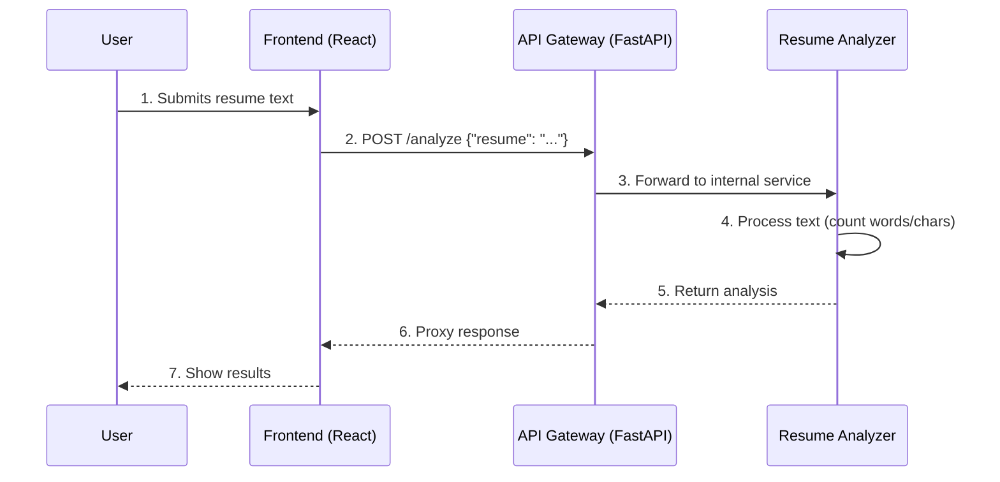

/spartex_ai/
│
├── services/
│   ├── auth_service/
│   │   ├── src/
│   │   │   ├── api/
│   │   │   ├── models/
│   │   │   ├── services/
│   │   │   ├── utils/
│   │   │   ├── tests/
│   │   │   └── main.py
│   │   └── Dockerfile
│   │
│   ├── data_ingestion_service/
│   │   ├── src/
│   │   │   ├── api/
│   │   │   ├── processors/
│   │   │   ├── storage/
│   │   │   ├── services/
│   │   │   ├── tests/
│   │   │   └── main.py
│   │   └── Dockerfile
│   │
│   ├── annotation_service/
│   │   ├── src/
│   │   │   ├── api/
│   │   │   ├── controllers/
│   │   │   ├── models/
│   │   │   ├── services/
│   │   │   ├── workers/
│   │   │   ├── tests/
│   │   │   └── main.py
│   │   └── Dockerfile
│   │
│   ├── quality_control_service/
│   │   ├── src/
│   │   │   ├── api/
│   │   │   ├── models/
│   │   │   ├── services/
│   │   │   ├── tests/
│   │   │   └── main.py
│   │   └── Dockerfile
│   │
│   ├── ml_training_service/
│   │   ├── src/
│   │   │   ├── api/
│   │   │   ├── pipelines/
│   │   │   ├── trainers/
│   │   │   ├── evaluators/
│   │   │   ├── models/
│   │   │   ├── tests/
│   │   │   └── main.py
│   │   └── Dockerfile
│
├── platform_api_gateway/
│   ├── src/
│   │   ├── routes/
│   │   ├── middleware/
│   │   ├── utils/
│   │   ├── tests/
│   │   └── main.py
│   └── Dockerfile
│
├── frontend/
│   ├── public/
│   ├── src/
│   │   ├── components/
│   │   ├── pages/
│   │   ├── services/
│   │   ├── utils/
│   │   ├── styles/
│   │   └── index.js
│   ├── Dockerfile
│   └── package.json
│
├── infra/
│   ├── k8s/
│   ├── terraform/
│   └── scripts/
│
├── docs/
│
├── docker-compose.yml
├── README.md
└── .gitignore
===========================================================================================
1.
Perfect! Since you're going to store the documentation in a `.md` (Markdown) file, here is the full structure explanation formatted **cleanly in Markdown** so you can directly copy and save it as `README.md` or `PROJECT_STRUCTURE.md`:

---

# 📁 Spartex AI – Project Folder Structure Documentation

This document explains the purpose of each folder and subfolder within the `spartex_ai/` monorepo architecture.

---

## 🧩 Root Structure

```
/spartex_ai/
├── services/
├── platform_api_gateway/
├── frontend/
├── infra/
├── docs/
├── docker-compose.yml
├── README.md
└── .gitignore
```

### 🔹 `services/`

Contains all the core backend microservices. Each microservice has its own isolated environment with Docker, source code, tests, and business logic.

---

## 🔒 1. `services/auth_service/`

* **Purpose**: Manages authentication and user management (login, signup, tokens).

```
auth_service/
├── src/
│   ├── api/           # FastAPI or Flask route definitions (e.g., /login, /signup)
│   ├── models/        # Pydantic or ORM models (User, Token, etc.)
│   ├── services/      # Business logic (e.g., user validation, token generation)
│   ├── utils/         # Helpers like password hashing, JWT utilities
│   ├── tests/         # Unit and integration tests
│   └── main.py        # App entrypoint (e.g., FastAPI/Flask app)
└── Dockerfile         # Docker container for the auth service
```

---

## 📥 2. `services/data_ingestion_service/`

* **Purpose**: Handles ingesting datasets, documents, or files into the platform.

```
data_ingestion_service/
├── src/
│   ├── api/           # Upload endpoints for files or data
│   ├── processors/    # Preprocessing logic (e.g., file format normalization)
│   ├── storage/       # File storage logic (e.g., S3, local disk)
│   ├── services/      # Coordination logic between ingestion and storage
│   ├── tests/         # Test cases for ingestion logic
│   └── main.py        # Entry point for ingestion microservice
└── Dockerfile
```

---

## ✍️ 3. `services/annotation_service/`

* **Purpose**: Manages manual or semi-automated annotation of data.

```
annotation_service/
├── src/
│   ├── api/           # Annotation-related endpoints
│   ├── controllers/   # Orchestrates annotation logic and workers
│   ├── models/        # Annotation models (label, bounding box, etc.)
│   ├── services/      # Handles labeling, reviewing, status updates
│   ├── workers/       # Background tasks (e.g., label autosuggestions)
│   ├── tests/
│   └── main.py
└── Dockerfile
```

---

## ✅ 4. `services/quality_control_service/`

* **Purpose**: Checks for annotation quality, redundancy, and conflicts.

```
quality_control_service/
├── src/
│   ├── api/           # Endpoints to submit/review quality issues
│   ├── models/        # Quality report schema
│   ├── services/      # Quality rules, scoring logic
│   ├── tests/
│   └── main.py
└── Dockerfile
```

---

## 🧠 5. `services/ml_training_service/`

* **Purpose**: Runs ML pipelines for model training, evaluation, and feedback.

```
ml_training_service/
├── src/
│   ├── api/           # Start/stop training, upload datasets
│   ├── pipelines/     # ETL or ML pipelines (e.g., data cleaning to model)
│   ├── trainers/      # Model training logic
│   ├── evaluators/    # Evaluation metrics and test reports
│   ├── models/        # ML models and configs
│   ├── tests/
│   └── main.py
└── Dockerfile
```

---

## 🌐 6. `platform_api_gateway/`

* **Purpose**: Central gateway that routes external frontend requests to the right internal microservice.

```
platform_api_gateway/
├── src/
│   ├── routes/        # Routes mapping to internal services (e.g., /api/auth → auth_service)
│   ├── middleware/    # Rate limiting, auth validation, logging
│   ├── utils/         # Shared utilities like response formatters
│   ├── tests/
│   └── main.py
└── Dockerfile
```

---

## 🎨 7. `frontend/`

* **Purpose**: The React-based user interface that consumes platform APIs.

```
frontend/
├── public/            # Static files (favicon, index.html)
├── src/
│   ├── components/    # Reusable React components (buttons, navbar, etc.)
│   ├── pages/         # Route-specific pages (LoginPage.jsx, Dashboard.jsx)
│   ├── services/      # API service functions (authService.js, annotationService.js)
│   ├── utils/         # Frontend utilities (formatters, constants)
│   ├── styles/        # CSS or Tailwind styling
│   └── index.js       # React app entry point
├── Dockerfile
└── package.json
```

---

## ☁️ 8. `infra/`

* **Purpose**: Manages infrastructure as code, deployment scripts, and Kubernetes configs.

```
infra/
├── k8s/               # Kubernetes deployment YAMLs
├── terraform/         # Terraform modules for cloud infra (AWS, GCP, Azure)
└── scripts/           # Shell/Python scripts for CI/CD or setup
```

---

## 📝 9. `docs/`

* **Purpose**: Internal documentation, API specifications, architecture diagrams.

```
docs/
├── architecture.md
├── api_reference.md
└── workflows/
```

---

## 🔧 10. Root-Level Files

* `docker-compose.yml`: Run all services together in a local dev environment.
* `README.md`: Project introduction, setup steps, developer instructions.
* `.gitignore`: Ignores files from being committed (e.g., `__pycache__`, `node_modules`).

---

## ➕ Adding a New Service

If you want to add a new microservice (e.g., `prediction_service`):

1. Create the folder:
   `/services/prediction_service/src/`

2. Follow this structure inside `src/`:

   * `api/` for endpoints
   * `models/` for data schemas
   * `services/` for business logic
   * `tests/` for unit tests
   * `main.py` as entrypoint

3. Add `Dockerfile` in `prediction_service/`

4. Update `docker-compose.yml` and `platform_api_gateway` to route traffic.

---

Would you like me to generate a `.md` file for direct download or GitHub commit-ready version?
Perfect! Since you're going to store the documentation in a `.md` (Markdown) file, here is the full structure explanation formatted **cleanly in Markdown** so you can directly copy and save it as `README.md` or `PROJECT_STRUCTURE.md`:

---

# 📁 Spartex AI – Project Folder Structure Documentation

This document explains the purpose of each folder and subfolder within the `spartex_ai/` monorepo architecture.

---

## 🧩 Root Structure

```
/spartex_ai/
├── services/
├── platform_api_gateway/
├── frontend/
├── infra/
├── docs/
├── docker-compose.yml
├── README.md
└── .gitignore
```

### 🔹 `services/`

Contains all the core backend microservices. Each microservice has its own isolated environment with Docker, source code, tests, and business logic.

---

## 🔒 1. `services/auth_service/`

* **Purpose**: Manages authentication and user management (login, signup, tokens).

```
auth_service/
├── src/
│   ├── api/           # FastAPI or Flask route definitions (e.g., /login, /signup)
│   ├── models/        # Pydantic or ORM models (User, Token, etc.)
│   ├── services/      # Business logic (e.g., user validation, token generation)
│   ├── utils/         # Helpers like password hashing, JWT utilities
│   ├── tests/         # Unit and integration tests
│   └── main.py        # App entrypoint (e.g., FastAPI/Flask app)
└── Dockerfile         # Docker container for the auth service
```

---

## 📥 2. `services/data_ingestion_service/`

* **Purpose**: Handles ingesting datasets, documents, or files into the platform.

```
data_ingestion_service/
├── src/
│   ├── api/           # Upload endpoints for files or data
│   ├── processors/    # Preprocessing logic (e.g., file format normalization)
│   ├── storage/       # File storage logic (e.g., S3, local disk)
│   ├── services/      # Coordination logic between ingestion and storage
│   ├── tests/         # Test cases for ingestion logic
│   └── main.py        # Entry point for ingestion microservice
└── Dockerfile
```

---

## ✍️ 3. `services/annotation_service/`

* **Purpose**: Manages manual or semi-automated annotation of data.

```
annotation_service/
├── src/
│   ├── api/           # Annotation-related endpoints
│   ├── controllers/   # Orchestrates annotation logic and workers
│   ├── models/        # Annotation models (label, bounding box, etc.)
│   ├── services/      # Handles labeling, reviewing, status updates
│   ├── workers/       # Background tasks (e.g., label autosuggestions)
│   ├── tests/
│   └── main.py
└── Dockerfile
```

---

## ✅ 4. `services/quality_control_service/`

* **Purpose**: Checks for annotation quality, redundancy, and conflicts.

```
quality_control_service/
├── src/
│   ├── api/           # Endpoints to submit/review quality issues
│   ├── models/        # Quality report schema
│   ├── services/      # Quality rules, scoring logic
│   ├── tests/
│   └── main.py
└── Dockerfile
```

---

## 🧠 5. `services/ml_training_service/`

* **Purpose**: Runs ML pipelines for model training, evaluation, and feedback.

```
ml_training_service/
├── src/
│   ├── api/           # Start/stop training, upload datasets
│   ├── pipelines/     # ETL or ML pipelines (e.g., data cleaning to model)
│   ├── trainers/      # Model training logic
│   ├── evaluators/    # Evaluation metrics and test reports
│   ├── models/        # ML models and configs
│   ├── tests/
│   └── main.py
└── Dockerfile
```

---

## 🌐 6. `platform_api_gateway/`

* **Purpose**: Central gateway that routes external frontend requests to the right internal microservice.

```
platform_api_gateway/
├── src/
│   ├── routes/        # Routes mapping to internal services (e.g., /api/auth → auth_service)
│   ├── middleware/    # Rate limiting, auth validation, logging
│   ├── utils/         # Shared utilities like response formatters
│   ├── tests/
│   └── main.py
└── Dockerfile
```

---

## 🎨 7. `frontend/`

* **Purpose**: The React-based user interface that consumes platform APIs.

```
frontend/
├── public/            # Static files (favicon, index.html)
├── src/
│   ├── components/    # Reusable React components (buttons, navbar, etc.)
│   ├── pages/         # Route-specific pages (LoginPage.jsx, Dashboard.jsx)
│   ├── services/      # API service functions (authService.js, annotationService.js)
│   ├── utils/         # Frontend utilities (formatters, constants)
│   ├── styles/        # CSS or Tailwind styling
│   └── index.js       # React app entry point
├── Dockerfile
└── package.json
```

---

## ☁️ 8. `infra/`

* **Purpose**: Manages infrastructure as code, deployment scripts, and Kubernetes configs.

```
infra/
├── k8s/               # Kubernetes deployment YAMLs
├── terraform/         # Terraform modules for cloud infra (AWS, GCP, Azure)
└── scripts/           # Shell/Python scripts for CI/CD or setup
```

---

## 📝 9. `docs/`

* **Purpose**: Internal documentation, API specifications, architecture diagrams.

```
docs/
├── architecture.md
├── api_reference.md
└── workflows/
```

---

## 🔧 10. Root-Level Files

* `docker-compose.yml`: Run all services together in a local dev environment.
* `README.md`: Project introduction, setup steps, developer instructions.
* `.gitignore`: Ignores files from being committed (e.g., `__pycache__`, `node_modules`).

---

## ➕ Adding a New Service

If you want to add a new microservice (e.g., `prediction_service`):

1. Create the folder:
   `/services/prediction_service/src/`

2. Follow this structure inside `src/`:

   * `api/` for endpoints
   * `models/` for data schemas
   * `services/` for business logic
   * `tests/` for unit tests
   * `main.py` as entrypoint

3. Add `Dockerfile` in `prediction_service/`

4. Update `docker-compose.yml` and `platform_api_gateway` to route traffic.

---

Would you like me to generate a `.md` file for direct download or GitHub commit-ready version?


===========================================================================================
2. how to run or lunch the serivve like for normal files if we run app.py it will render html pages and routes the back and front like like that how to run above project structure explin and how run locally and how to run git hub ci/cd pilpines or cloud or host the page whuch service I need to link 

Got it! You want a simple **prototype setup** inside the **existing /spartex\_ai/** microservice architecture — showing how a user flows from:

* Landing page (login/signup)
* Service selection (like Resume Analyzer)
* Input data page
* Backend processing microservice

---

### Here’s a **minimal prototype example** with file placement based on your structure (no full code, just placeholders & folder):

---

### 1. **Frontend:**

* `/frontend/public/index.html`
  → Main landing page with login/signup links and service menu

* `/frontend/src/pages/Home.jsx`
  → Home page component with login/signup UI + list of available services

* `/frontend/src/pages/ResumeAnalyzer.jsx`
  → Resume analyzer input form page (upload resume / enter text)

* `/frontend/src/components/Header.jsx`
  → Header with navigation (e.g. Home, Services, Logout)

* `/frontend/src/components/Footer.jsx`
  → Footer component

---

### 2. **Backend Resume Analyzer Service:**

Create a new service inside `/services/resume_analyzer_service/` to keep it modular

* `/services/resume_analyzer_service/src/api/routes.py`
  → REST API endpoints, e.g., POST `/analyze` that accepts resume data

* `/services/resume_analyzer_service/src/services/analyzer.py`
  → Core logic to parse and analyze the resume (dummy for prototype)

* `/services/resume_analyzer_service/src/main.py`
  → Flask/FastAPI main server entry for the service

* `/services/resume_analyzer_service/Dockerfile`
  → Dockerfile for containerizing this service

---

### 3. **API Gateway:**

* `/platform_api_gateway/src/routes/resume_route.py`
  → Route to proxy requests to the `resume_analyzer_service`

* `/platform_api_gateway/src/main.py`
  → Runs the API gateway routing incoming user requests to relevant microservices

---

### 4. **How user flow works:**

1. User opens frontend `/frontend/public/index.html` (served locally or via Docker container) → sees landing page with login/signup and a list of services including "Resume Analyzer."

2. User logs in → frontend shows list of services.

3. User selects "Resume Analyzer" → frontend navigates to `/resume-analyzer` page (`ResumeAnalyzer.jsx`) where user uploads or enters resume data.

4. Frontend sends request to **API Gateway** (`platform_api_gateway`) which routes this request to the `resume_analyzer_service`.

5. `resume_analyzer_service` processes data, returns analysis result.

6. Frontend shows analysis output to user.

---

### 5. **Running locally:**

* Run each service locally in separate terminals or docker containers:

  * `frontend/` → run React (e.g. `npm start`) serving landing & app pages
  * `platform_api_gateway/` → run FastAPI/Flask main.py to route requests
  * `services/resume_analyzer_service/` → run API server (Flask/FastAPI)

* You can also use `docker-compose.yml` to spin up all services together

---

### 6. **Summary Table:**

| Folder                              | Purpose                                               | Key files/examples                    |
| ----------------------------------- | ----------------------------------------------------- | ------------------------------------- |
| `/frontend/public`                  | Static landing page HTML                              | `index.html`                          |
| `/frontend/src/pages`               | React pages/components for UI                         | `Home.jsx`, `ResumeAnalyzer.jsx`      |
| `/services/resume_analyzer_service` | Backend microservice for resume analyzing logic       | `routes.py`, `analyzer.py`, `main.py` |
| `/platform_api_gateway`             | Central API gateway routing requests to microservices | `routes/resume_route.py`, `main.py`   |
| `/docker-compose.yml`               | Define all services to run locally or in containers   |                                       |


===========================================================================================

Got it! Here's a minimal **file-by-file prototype** for your `/spartex_ai/` setup covering:

* Frontend landing & resume analyzer pages (React)
* Backend Resume Analyzer microservice (FastAPI)
* API Gateway routing requests to Resume Analyzer
* Dockerfiles & basic instructions

---

### 1. **Frontend**

#### `/frontend/public/index.html`

```html
<!DOCTYPE html>
<html lang="en">
<head>
  <meta charset="UTF-8" />
  <title>Spartex AI - Landing Page</title>
</head>
<body>
  <div id="root"></div>
  <script src="../src/index.js" type="module"></script>
</body>
</html>
```

---

#### `/frontend/src/index.js`

```jsx
import React from "react";
import ReactDOM from "react-dom/client";
import Home from "./pages/Home";

const root = ReactDOM.createRoot(document.getElementById("root"));
root.render(<Home />);
```

---

#### `/frontend/src/pages/Home.jsx`

```jsx
import React, { useState } from "react";
import ResumeAnalyzer from "./ResumeAnalyzer";

export default function Home() {
  const [page, setPage] = useState("home");

  if (page === "resume") return <ResumeAnalyzer onBack={() => setPage("home")} />;

  return (
    <div style={{ padding: 20 }}>
      <h1>Welcome to Spartex AI</h1>
      <p>Please <a href="#">Login</a> or <a href="#">Signup</a></p>
      <h2>Services</h2>
      <ul>
        <li>
          <button onClick={() => setPage("resume")}>Resume Analyzer</button>
        </li>
      </ul>
    </div>
  );
}
```

---

#### `/frontend/src/pages/ResumeAnalyzer.jsx`

```jsx
import React, { useState } from "react";

export default function ResumeAnalyzer({ onBack }) {
  const [resumeText, setResumeText] = useState("");
  const [result, setResult] = useState(null);

  async function analyze() {
    const res = await fetch("http://localhost:8000/analyze", {
      method: "POST",
      headers: { "Content-Type": "application/json" },
      body: JSON.stringify({ resume: resumeText }),
    });
    const data = await res.json();
    setResult(data);
  }

  return (
    <div style={{ padding: 20 }}>
      <button onClick={onBack}>Back</button>
      <h2>Resume Analyzer</h2>
      <textarea
        rows={10}
        cols={50}
        placeholder="Paste your resume text here"
        value={resumeText}
        onChange={(e) => setResumeText(e.target.value)}
      />
      <br />
      <button onClick={analyze}>Analyze</button>

      {result && (
        <div style={{ marginTop: 20 }}>
          <h3>Analysis Result:</h3>
          <pre>{JSON.stringify(result, null, 2)}</pre>
        </div>
      )}
    </div>
  );
}
```

---

#### `/frontend/Dockerfile`

```Dockerfile
FROM node:18

WORKDIR /app

COPY package.json package-lock.json ./
RUN npm install

COPY . .

CMD ["npm", "start"]
```

---

#### `/frontend/package.json` (minimal)

```json
{
  "name": "spartex-frontend",
  "version": "1.0.0",
  "private": true,
  "dependencies": {
    "react": "^18.2.0",
    "react-dom": "^18.2.0"
  },
  "scripts": {
    "start": "vite"
  }
}
```

---

### 2. **Resume Analyzer Service**

#### `/services/resume_analyzer_service/src/main.py`

```python
from fastapi import FastAPI
from pydantic import BaseModel
from fastapi.middleware.cors import CORSMiddleware

app = FastAPI()

app.add_middleware(
    CORSMiddleware,
    allow_origins=["*"],  # For local testing only, restrict in prod
    allow_methods=["*"],
    allow_headers=["*"],
)

class ResumeRequest(BaseModel):
    resume: str

@app.post("/analyze")
async def analyze_resume(request: ResumeRequest):
    # Dummy analysis: count words & characters
    text = request.resume
    words = len(text.split())
    chars = len(text)
    return {"word_count": words, "char_count": chars, "message": "Resume analyzed successfully"}
```

---

#### `/services/resume_analyzer_service/Dockerfile`

```Dockerfile
FROM python:3.10

WORKDIR /app

COPY ./src /app/src

RUN pip install fastapi uvicorn

CMD ["uvicorn", "src.main:app", "--host", "0.0.0.0", "--port", "8000"]
```

---

### 3. **API Gateway**

#### `/platform_api_gateway/src/main.py`

```python
from fastapi import FastAPI
from fastapi.middleware.cors import CORSMiddleware
import httpx

app = FastAPI()

app.add_middleware(
    CORSMiddleware,
    allow_origins=["*"],
    allow_methods=["*"],
    allow_headers=["*"],
)

RESUME_SERVICE_URL = "http://resume_analyzer_service:8000"

@app.post("/analyze")
async def proxy_analyze(data: dict):
    async with httpx.AsyncClient() as client:
        resp = await client.post(f"{RESUME_SERVICE_URL}/analyze", json=data)
        return resp.json()
```

---

#### `/platform_api_gateway/Dockerfile`

```Dockerfile
FROM python:3.10

WORKDIR /app

COPY ./src /app/src

RUN pip install fastapi uvicorn httpx

CMD ["uvicorn", "src.main:app", "--host", "0.0.0.0", "--port", "8000"]
```

---

### 4. **docker-compose.yml** (at root `/spartex_ai/`)

```yaml
version: "3.8"

services:
  frontend:
    build: ./frontend
    ports:
      - "3000:3000"
    depends_on:
      - platform_api_gateway

  platform_api_gateway:
    build: ./platform_api_gateway
    ports:
      - "8000:8000"
    depends_on:
      - resume_analyzer_service

  resume_analyzer_service:
    build: ./services/resume_analyzer_service
    ports:
      - "8001:8000"
```

---

### 5. **How to run locally**

=====================================================================================================================
3.flow 
Here’s a **story-driven walkthrough** of the resume analysis flow, followed by **visual representations** (diagrams and code snippets) to cement your understanding. Think of this as a "day in the life of a resume request" through Spartex AI.

---

### **Story: "The Journey of John Doe's Resume"**
#### **1. User Begins the Quest (Frontend)**
- **Actor**: John Doe, a job seeker.  
- **Action**: Opens his browser and navigates to `http://localhost:3000`.  
- **Behind the Scenes**:  
  - The React app (`/frontend/public/index.html`) loads.  
  - The `Home.jsx` component renders a button labeled **"Resume Analyzer"**.  
  - John clicks it, and React Router switches to the `ResumeAnalyzer.jsx` page.  

```jsx
// /frontend/src/pages/ResumeAnalyzer.jsx
function ResumeAnalyzer() {
  const [resumeText, setResumeText] = useState("");
  const [results, setResults] = useState(null);

  const handleSubmit = async () => {
    const response = await fetch("http://localhost:8000/analyze", { 
      method: "POST",
      body: JSON.stringify({ resume: resumeText }),
    });
    setResults(await response.json()); // Updates UI with results
  };

  return (
    <div>
      <textarea onChange={(e) => setResumeText(e.target.value)} />
      <button onClick={handleSubmit}>Analyze</button>
      {results && <AnalysisResults data={results} />}
    </div>
  );
}
```

#### **2. The Courier (API Gateway)**
- **Request**: John’s resume text (`"John Doe\nPython Expert..."`) is sent to `http://localhost:8000/analyze`.  
- **Behind the Scenes**:  
  - The API Gateway (`/platform_api_gateway/src/main.py`) receives the request.  
  - It checks its routing table (like a postal sorting office) and forwards the request to the `resume_analyzer_service` container.  

```python
# /platform_api_gateway/src/main.py
from fastapi import FastAPI
import httpx

app = FastAPI()
RESUME_SERVICE_URL = "http://resume_analyzer_service:8000"  # Docker resolves this!

@app.post("/analyze")
async def analyze_resume(data: dict):
    async with httpx.AsyncClient() as client:
        response = await client.post(f"{RESUME_SERVICE_URL}/analyze", json=data)
    return response.json()  # Forward the response unchanged
```

#### **3. The Analyst (Resume Analyzer Microservice)**
- **Action**: The `resume_analyzer_service` receives the request.  
- **Behind the Scenes**:  
  - The service’s `main.py` (`/services/resume_analyzer_service/src/main.py`) extracts the resume text.  
  - It calls a helper function in `analyzer.py` to count words/characters (a placeholder for real NLP logic).  

```python
# /services/resume_analyzer_service/src/main.py
from fastapi import FastAPI

app = FastAPI()

@app.post("/analyze")
async def analyze(resume_data: dict):
    text = resume_data["resume"]
    word_count = len(text.split())
    return {  # Simple analysis for the prototype
        "word_count": word_count,
        "char_count": len(text),
        "message": "Analysis complete!"
    }
```

#### **4. The Return Journey**
- **Response Path**:  
  `Resume Analyzer → API Gateway → Frontend → John’s Browser`  
- **Behind the Scenes**:  
  - The API Gateway acts as a reverse proxy, passing the response back to the React app.  
  - The `ResumeAnalyzer.jsx` component updates John’s UI with the results.  

```json
// Example response John sees:
{
  "word_count": 42,
  "char_count": 250,
  "message": "Analysis complete!"
}
```

---

### **Visual Representations**
#### **1. Sequence Diagram (Mermaid)**


#### **2. Docker Network Flow**
```plaintext
┌─────────────┐    ┌─────────────────┐    ┌──────────────────────┐
│             │    │                 │    │                      │
│  Frontend   │───▶│  API Gateway    │───▶│  Resume Analyzer     │
│ (React)     │    │ (FastAPI)       │    │ (Microservice)       │
│ localhost:3000 │ │ localhost:8000  │    │ resume_analyzer:8000 │
└─────────────┘    └─────────────────┘    └──────────────────────┘
       ▲                     │                      │
       │                     │                      │
       └─────────────────────┴──────────────────────┘
                   Response flows back
```

#### **3. File Structure Snippets**
```
spartex-ai/
├── frontend/                   # React app
│   └── src/
│       ├── pages/
│       │   ├── Home.jsx        # Landing page
│       │   └── ResumeAnalyzer.jsx  # Form and results UI
│       └── services/
│           └── resumeApi.js    # API calls (optional)
│
├── platform_api_gateway/       # Proxy and routing
│   └── src/
│       ├── main.py             # FastAPI app
│       └── routes/
│           └── resume.py       # /analyze route
│
└── services/
    └── resume_analyzer_service/ # Microservice
        └── src/
            ├── main.py          # FastAPI endpoint
            └── analyzer.py      # Core logic (placeholder)
```

---

### **Key Takeaways**
1. **Separation of Concerns**:  
   - Frontend (UI) ↔ API Gateway (Traffic Cop) ↔ Microservices (Specialists).  
2. **Docker Magic**:  
   - Containers communicate via service names (`resume_analyzer_service`), not `localhost`.  
3. **Debugging Lifelines**:  
   - Use `docker-compose logs` to trace errors.  
   - Test the API Gateway with `curl` to isolate issues.  


=====================================================================================================================

