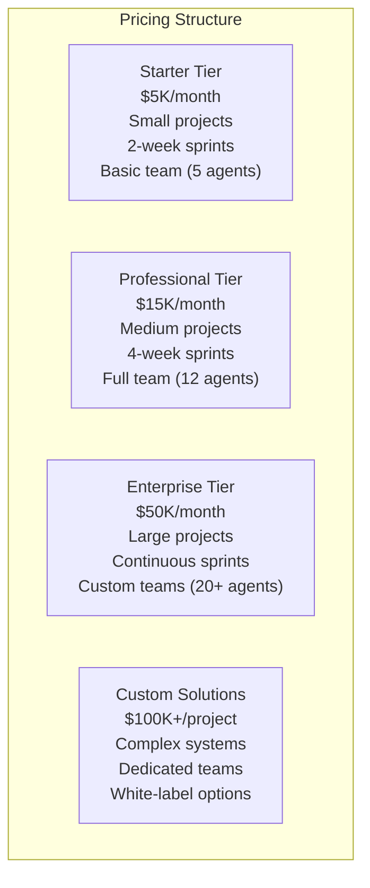
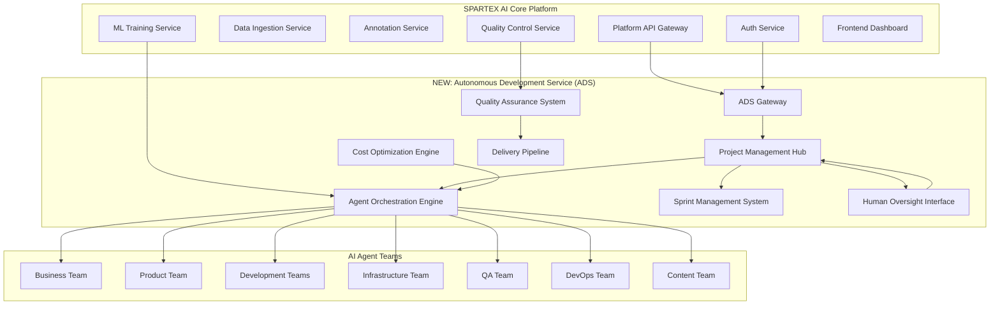
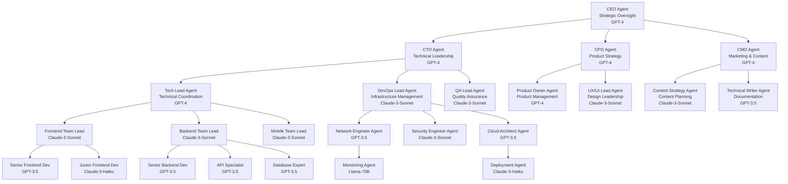
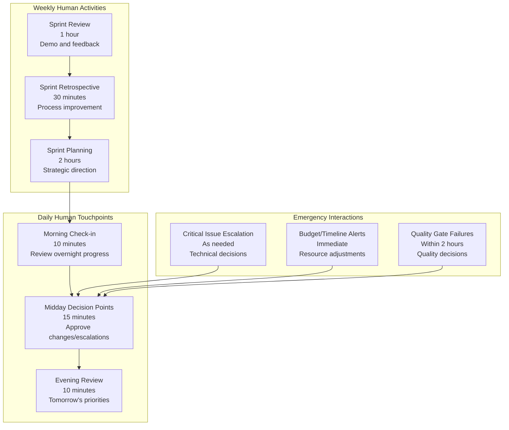
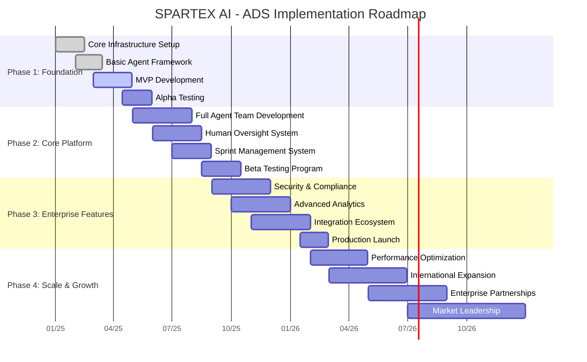

```mermaid
gantt
    title AI Agent Sprint Workflow (2-Week Sprint)
    dateFormat X
    axisFormat %d
    
    section Sprint Planning
    Requirements Analysis    :done, req, 0, 1d
    Sprint Planning Meeting  :done, plan, after req, 1d
    Task Assignment         :done, assign, after plan, 0.5d
    
    section Development Phase
    Sprint Day 1-3          :dev1, after assign, 3d
    Sprint Day 4-6          :dev2, after dev1, 3d
    Sprint Day 7-9          :dev3, after dev2, 3d
    
    section Review & Testing
    Code Review             :review, after dev3, 1d
    Testing Phase           :test, after review, 1d
    Bug Fixes               :bugs, after test, 1d
    
    section Sprint Close
    Demo Preparation        :demo, after bugs, 0.5d
    Sprint Review           :retrospective, after demo, 0.5d
    Next Sprint Planning    :next, after retrospective, 0.5d
```

# SPARTEX AI - Autonomous software  Development Service (ADS)
## Complete Business Plan & Technical Documentation

---

## 📋 Executive Summary

**SPARTEX AI Autonomous Development Service (ADS)** is a revolutionary new service within the SPARTEX AI ecosystem that replaces traditional human development teams with AI agents organized in enterprise-grade sprint-based workflows. This service enables businesses to develop complete software products with minimal human oversight, reducing costs by 85-90% while maintaining enterprise-quality standards.

### Key Value Propositions
- **🚀 Complete Product Development**: From concept to deployment with minimal human intervention
- **💰 90% Cost Reduction**: Replace $500K+ development teams with $50K AI service
- **⚡ 10x Faster Delivery**: Parallel AI agents working 24/7 across all disciplines
- **🎯 Sprint-Based Execution**: Familiar Agile methodology with AI agents as team members
- **📊 Real-time Transparency**: Live dashboards showing progress, costs, and quality metrics
- **🛡️ Enterprise Security**: Built on SPARTEX AI's proven security infrastructure

---

## 🏢 Business Model & Market Opportunity

### Market Sizing & Opportunity

#### Total Addressable Market (TAM)
- **Global Software Development Market**: $650 billion (2025)
- **Custom Software Development**: $185 billion
- **Enterprise Software Services**: $120 billion
- **SMB Software Development**: $85 billion

#### Serviceable Addressable Market (SAM)
- **AI-Replaceable Development Work**: ~60% of total market = $390 billion
- **Target Segments**: Startups, SMBs, Enterprise digital transformation
- **Accessible Market**: $150 billion (companies willing to adopt AI solutions)

#### Serviceable Obtainable Market (SOM)
- **Realistic 5-year capture**: 0.1% of SAM = $150 million
- **Initial 2-year target**: $15 million ARR
- **Customer base**: 500-1000 companies by year 3

### Revenue Model

#### Pricing Tiers



#### Revenue Projections (5-Year)

| Year | Customers | Average ACV | Annual Revenue | Growth Rate |
|------|-----------|-------------|----------------|-------------|
| **2025** | 25 | $180K | $4.5M | Launch |
| **2026** | 85 | $200K | $17M | 278% |
| **2027** | 200 | $225K | $45M | 165% |
| **2028** | 400 | $250K | $100M | 122% |
| **2029** | 650 | $275K | $179M | 79% |

### Competitive Advantage

#### vs Traditional Development Agencies
- **Cost**: 90% lower (ADS: $50K vs Traditional: $500K)
- **Speed**: 10x faster delivery
- **Consistency**: 99% quality consistency vs 60-70%
- **Availability**: 24/7 operation vs business hours

#### vs Other AI Development Tools
- **Completeness**: Full product development vs code assistance
- **Business Integration**: Sprint-based workflows vs developer tools
- **Human Oversight**: Minimal supervision vs constant guidance
- **Enterprise Ready**: Built-in compliance, security, governance

---

## 🏗️ System Architecture & Integration

### Integration with SPARTEX AI Core Platform



### Updated SPARTEX AI Directory Structure

```
/spartex_ai/
│
├── services/
│   ├── auth_service/                    # Existing
│   ├── data_ingestion_service/          # Existing
│   ├── annotation_service/              # Existing
│   ├── quality_control_service/         # Existing
│   ├── ml_training_service/             # Existing
│   │
│   └── autonomous_development_service/   # NEW ADS SERVICE
│       ├── src/
│       │   ├── api/
│       │   │   ├── project_endpoints.py
│       │   │   ├── sprint_endpoints.py
│       │   │   ├── agent_endpoints.py
│       │   │   └── oversight_endpoints.py
│       │   │
│       │   ├── core/
│       │   │   ├── orchestration/
│       │   │   │   ├── agent_manager.py
│       │   │   │   ├── task_distributor.py
│       │   │   │   ├── communication_hub.py
│       │   │   │   └── conflict_resolver.py
│       │   │   │
│       │   │   ├── project_management/
│       │   │   │   ├── sprint_manager.py
│       │   │   │   ├── backlog_manager.py
│       │   │   │   ├── progress_tracker.py
│       │   │   │   └── delivery_manager.py
│       │   │   │
│       │   │   ├── cost_optimization/
│       │   │   │   ├── model_selector.py
│       │   │   │   ├── resource_allocator.py
│       │   │   │   ├── budget_controller.py
│       │   │   │   └── efficiency_optimizer.py
│       │   │   │
│       │   │   └── quality_assurance/
│       │   │       ├── code_reviewer.py
│       │   │       ├── test_coordinator.py
│       │   │       ├── security_scanner.py
│       │   │       └── compliance_checker.py
│       │   │
│       │   ├── agents/
│       │   │   ├── business/
│       │   │   │   ├── business_analyst_agent.py
│       │   │   │   ├── market_research_agent.py
│       │   │   │   ├── stakeholder_comm_agent.py
│       │   │   │   └── requirements_agent.py
│       │   │   │
│       │   │   ├── product/
│       │   │   │   ├── product_owner_agent.py
│       │   │   │   ├── ux_designer_agent.py
│       │   │   │   ├── ui_designer_agent.py
│       │   │   │   └── user_story_agent.py
│       │   │   │
│       │   │   ├── development/
│       │   │   │   ├── tech_lead_agent.py
│       │   │   │   ├── frontend_team/
│       │   │   │   ├── backend_team/
│       │   │   │   ├── mobile_team/
│       │   │   │   └── integration_team/
│       │   │   │
│       │   │   ├── infrastructure/
│       │   │   │   ├── devops_lead_agent.py
│       │   │   │   ├── network_engineer_agent.py
│       │   │   │   ├── security_engineer_agent.py
│       │   │   │   └── cloud_architect_agent.py
│       │   │   │
│       │   │   ├── qa/
│       │   │   │   ├── qa_lead_agent.py
│       │   │   │   ├── test_automation_agent.py
│       │   │   │   ├── performance_tester_agent.py
│       │   │   │   └── security_tester_agent.py
│       │   │   │
│       │   │   ├── content/
│       │   │   │   ├── content_strategist_agent.py
│       │   │   │   ├── technical_writer_agent.py
│       │   │   │   ├── marketing_content_agent.py
│       │   │   │   └── documentation_agent.py
│       │   │   │
│       │   │   └── management/
│       │   │       ├── project_manager_agent.py
│       │   │       ├── scrum_master_agent.py
│       │   │       ├── team_lead_coordinator.py
│       │   │       └── delivery_manager_agent.py
│       │   │
│       │   ├── human_oversight/
│       │   │   ├── interfaces/
│       │   │   │   ├── chat_interface.py
│       │   │   │   ├── meeting_scheduler.py
│       │   │   │   ├── decision_portal.py
│       │   │   │   └── escalation_system.py
│       │   │   │
│       │   │   ├── workflows/
│       │   │   │   ├── approval_workflow.py
│       │   │   │   ├── review_workflow.py
│       │   │   │   ├── escalation_workflow.py
│       │   │   │   └── emergency_stop.py
│       │   │   │
│       │   │   └── analytics/
│       │   │       ├── decision_tracker.py
│       │   │       ├── intervention_logger.py
│       │   │       ├── human_impact_analyzer.py
│       │   │       └── optimization_suggester.py
│       │   │
│       │   ├── models/
│       │   │   ├── project.py
│       │   │   ├── sprint.py
│       │   │   ├── agent.py
│       │   │   ├── task.py
│       │   │   ├── deliverable.py
│       │   │   └── oversight_session.py
│       │   │
│       │   ├── services/
│       │   │   ├── project_service.py
│       │   │   ├── sprint_service.py
│       │   │   ├── agent_service.py
│       │   │   ├── communication_service.py
│       │   │   └── reporting_service.py
│       │   │
│       │   ├── utils/
│       │   │   ├── llm_utils.py
│       │   │   ├── cost_calculator.py
│       │   │   ├── quality_metrics.py
│       │   │   └── notification_utils.py
│       │   │
│       │   ├── tests/
│       │   │   ├── unit/
│       │   │   ├── integration/
│       │   │   ├── end_to_end/
│       │   │   └── performance/
│       │   │
│       │   └── main.py
│       │
│       ├── config/
│       │   ├── agent_configurations/
│       │   ├── workflow_templates/
│       │   ├── cost_optimization_rules/
│       │   └── quality_standards/
│       │
│       ├── docs/
│       │   ├── api_documentation/
│       │   ├── agent_specifications/
│       │   ├── workflow_guides/
│       │   └── integration_guides/
│       │
│       └── Dockerfile
│
├── platform_api_gateway/               # Enhanced for ADS
│   ├── src/
│   │   ├── routes/
│   │   │   ├── ads_routes.py          # NEW
│   │   │   └── existing_routes.py
│   │   └── middleware/
│   │       ├── ads_auth.py            # NEW
│   │       └── existing_middleware.py
│
├── frontend/                           # Enhanced Dashboard
│   ├── src/
│   │   ├── components/
│   │   │   ├── ads/                   # NEW ADS Components
│   │   │   │   ├── ProjectDashboard/
│   │   │   │   ├── SprintBoard/
│   │   │   │   ├── AgentMonitor/
│   │   │   │   ├── HumanOversight/
│   │   │   │   └── CostTracker/
│   │   │   └── existing_components/
│   │   └── pages/
│   │       ├── ads/                   # NEW ADS Pages
│   │       │   ├── ProjectManagement/
│   │       │   ├── AgentDashboard/
│   │       │   ├── SprintPlanning/
│   │       │   └── OversightCenter/
│   │       └── existing_pages/
│
└── infra/                             # Enhanced Infrastructure
    ├── k8s/
    │   ├── ads-deployment.yaml        # NEW
    │   ├── ads-service.yaml           # NEW
    │   └── existing-deployments.yaml
    └── terraform/
        ├── ads-infrastructure.tf      # NEW
        └── existing-infrastructure.tf
```

---

## 👥 Complete AI Agent Team Structure

### Organizational Hierarchy



### Agent Role Definitions & Responsibilities

#### **C-Level Strategic Agents**

##### CEO Agent (Chief Executive Agent)
```yaml
Role: Strategic Oversight & Decision Making
Model: GPT-4 (High strategic reasoning required)
Responsibilities:
  - Project vision and strategic alignment
  - Stakeholder communication and management
  - Resource allocation decisions
  - Risk assessment and mitigation
  - Final approval on major deliverables
  - Client relationship management
  
Daily Tasks:
  - Review sprint progress and strategic alignment
  - Approve major architectural decisions
  - Communicate with human product owner
  - Assess project risks and dependencies
  - Make go/no-go decisions for releases

Communication Protocols:
  - Direct line to human product owner
  - Reports to all team leads
  - Escalation point for critical decisions
  - Interface with external stakeholders

Human Interaction Points:
  - Daily 15-minute check-in with product owner
  - Weekly strategic review meetings
  - Emergency escalation availability
  - Final approval for major milestones
```

##### CTO Agent (Chief Technology Officer Agent)
```yaml
Role: Technical Leadership & Architecture
Model: GPT-4 (Complex technical decision making)
Responsibilities:
  - Technical strategy and architecture decisions
  - Technology stack selection and evaluation
  - Technical risk assessment
  - Performance and scalability planning
  - Integration with existing systems
  - Technical debt management

Daily Tasks:
  - Review technical designs and proposals
  - Approve technology choices
  - Coordinate between development teams
  - Monitor technical metrics and KPIs
  - Plan technical roadmap alignment

Communication Protocols:
  - Regular sync with CEO Agent
  - Direct reports from all technical leads
  - Interface with DevOps and QA leads
  - Technical consultation for product decisions
```

##### CPO Agent (Chief Product Officer Agent)
```yaml
Role: Product Strategy & User Experience
Model: GPT-4 (Strategic product thinking)
Responsibilities:
  - Product roadmap and feature prioritization
  - User experience strategy
  - Market research and competitive analysis
  - User story creation and refinement
  - Product metrics and success criteria
  - Feature specification and acceptance criteria

Daily Tasks:
  - Review and prioritize product backlog
  - Create detailed user stories
  - Validate feature designs and prototypes
  - Analyze user feedback and metrics
  - Coordinate with design and development teams

Tools & Integrations:
  - Market research APIs
  - User analytics platforms
  - Design collaboration tools
  - Competitive intelligence sources
```

#### **Team Lead Agents**

##### Tech Lead Agent
```yaml
Role: Technical Coordination & Code Quality
Model: GPT-4 (Complex technical coordination)
Responsibilities:
  - Technical implementation planning
  - Code review and quality standards
  - Development team coordination
  - Technical mentoring and guidance
  - Integration planning and execution
  - Performance optimization

Daily Tasks:
  - Plan technical tasks for sprint
  - Review code submissions from all developers
  - Coordinate integration between teams
  - Resolve technical conflicts and dependencies
  - Monitor code quality metrics

Communication:
  - Reports to CTO Agent
  - Manages Frontend, Backend, Mobile team leads
  - Interfaces with QA and DevOps teams
  - Provides technical updates to CEO Agent
```

##### DevOps Lead Agent
```yaml
Role: Infrastructure & Deployment Management
Model: Claude-3-Sonnet (Infrastructure expertise)
Responsibilities:
  - Infrastructure planning and management
  - CI/CD pipeline design and maintenance
  - Deployment strategy and execution
  - Monitoring and alerting setup
  - Security compliance and implementation
  - Performance monitoring and optimization

Specialized Skills:
  - Kubernetes orchestration
  - Cloud platform management (AWS/Azure/GCP)
  - Infrastructure as Code (Terraform)
  - Container management and optimization
  - Security best practices implementation

Daily Tasks:
  - Monitor system health and performance
  - Manage deployment pipelines
  - Coordinate with security engineer on compliance
  - Plan infrastructure scaling
  - Respond to system alerts and incidents
```

#### **Development Team Agents**

##### Frontend Team Structure
```yaml
Frontend Team Lead (Claude-3-Sonnet):
  Responsibilities:
    - Frontend architecture decisions
    - Component design and reusability
    - Performance optimization
    - Team coordination and task distribution
    - Code review and quality assurance

Senior Frontend Developer (GPT-3.5):
  Specializations: [React, TypeScript, Redux, Next.js]
  Responsibilities:
    - Complex component implementation
    - State management architecture
    - Performance optimization
    - Junior developer mentoring

Mid-Level Frontend Developer (GPT-3.5):
  Specializations: [React, JavaScript, CSS, Testing]
  Responsibilities:
    - Feature implementation
    - Component development
    - Testing and debugging
    - Documentation

Junior Frontend Developer (Claude-3-Haiku):
  Specializations: [HTML, CSS, Basic JavaScript]
  Responsibilities:
    - Simple component implementation
    - Styling and layout
    - Bug fixes and minor features
    - Learning and skill development
```

##### Backend Team Structure
```yaml
Backend Team Lead (Claude-3-Sonnet):
  Responsibilities:
    - API design and architecture
    - Database schema design
    - Performance optimization
    - Security implementation
    - Team coordination

Senior Backend Developer (GPT-3.5):
  Specializations: [Node.js, Python, Microservices, Databases]
  Responsibilities:
    - Core business logic implementation
    - API development and optimization
    - Database design and optimization
    - Integration development

API Specialist (GPT-3.5):
  Specializations: [REST, GraphQL, API Documentation, Testing]
  Responsibilities:
    - API design and implementation
    - API documentation and testing
    - Integration testing
    - Performance monitoring

Database Expert (GPT-3.5):
  Specializations: [PostgreSQL, MongoDB, Redis, Optimization]
  Responsibilities:
    - Database design and optimization
    - Query performance tuning
    - Data migration and management
    - Backup and recovery planning
```

#### **Infrastructure Team Agents**

##### Network Engineer Agent
```yaml
Role: Network Architecture & Management
Model: GPT-3.5 (Network-specific expertise)
Responsibilities:
  - Network design and implementation
  - Load balancing and traffic management
  - Network security and monitoring
  - Performance optimization
  - Troubleshooting and incident response

Specialized Knowledge:
  - CDN configuration and optimization
  - DNS management and optimization
  - VPN and security network setup
  - Network monitoring and alerting
  - Bandwidth management and optimization

Human Interaction:
  - Chat interface for network consultations
  - Meeting participation for infrastructure planning
  - Escalation for network emergencies
  - Status reports on network health

Daily Tasks:
  - Monitor network performance metrics
  - Optimize traffic routing and load balancing
  - Implement security measures
  - Plan capacity and scaling
  - Respond to network incidents
```

##### Security Engineer Agent
```yaml
Role: Security Implementation & Compliance
Model: Claude-3-Sonnet (Security expertise required)
Responsibilities:
  - Security architecture and implementation
  - Vulnerability assessment and remediation
  - Compliance monitoring and reporting
  - Security incident response
  - Security training and awareness

Security Specializations:
  - OWASP compliance and implementation
  - Penetration testing and vulnerability scanning
  - Identity and access management
  - Data encryption and protection
  - Security monitoring and incident response

Integration Points:
  - Security scanning in CI/CD pipelines
  - Code security review automation
  - Compliance reporting and monitoring
  - Security incident escalation
  - Threat intelligence integration
```

#### **Quality Assurance Team**

##### QA Lead Agent
```yaml
Role: Quality Strategy & Coordination
Model: Claude-3-Sonnet (Quality methodology expertise)
Responsibilities:
  - Quality strategy and planning
  - Test plan creation and execution
  - Quality metrics monitoring
  - Team coordination and management
  - Release quality assurance

Quality Methodologies:
  - Automated testing strategy
  - Performance testing planning
  - Security testing coordination
  - User acceptance testing
  - Continuous quality monitoring

Daily Tasks:
  - Review test coverage and results
  - Plan testing activities for sprint
  - Coordinate with development teams
  - Monitor quality metrics
  - Approve releases based on quality criteria
```

##### Test Automation Agent
```yaml
Role: Automated Testing Implementation
Model: GPT-3.5 (Testing automation expertise)
Responsibilities:
  - Test automation framework development
  - Automated test case creation
  - CI/CD testing integration
  - Test maintenance and optimization
  - Testing tool management

Testing Specializations:
  - Unit testing frameworks
  - Integration testing automation
  - End-to-end testing tools
  - Performance testing automation
  - Visual regression testing

Tools & Frameworks:
  - Jest, Cypress, Selenium
  - Artillery, LoadRunner
  - Postman, Newman
  - SonarQube integration
  - Test reporting and analytics
```

#### **Content & Documentation Team**

##### Content Strategist Agent
```yaml
Role: Content Strategy & Planning
Model: Claude-3-Sonnet (Content strategy expertise)
Responsibilities:
  - Content strategy development
  - Content calendar planning
  - Brand voice and messaging
  - Content performance analysis
  - Cross-platform content coordination

Content Specializations:
  - Technical content strategy
  - User documentation planning
  - Marketing content creation
  - SEO optimization
  - Content analytics and optimization

Daily Tasks:
  - Plan content for product releases
  - Create content briefs and guidelines
  - Review and optimize existing content
  - Coordinate with development teams
  - Analyze content performance metrics
```

##### Technical Writer Agent
```yaml
Role: Documentation Creation & Maintenance
Model: GPT-3.5 (Technical writing expertise)
Responsibilities:
  - Technical documentation creation
  - API documentation maintenance
  - User guide development
  - Process documentation
  - Knowledge base management

Documentation Specializations:
  - API documentation (Swagger/OpenAPI)
  - User manual creation
  - Process documentation
  - Video tutorial scripting
  - Knowledge base organization

Integration Points:
  - Automatic API documentation generation
  - Code comment integration
  - Release note automation
  - Help system integration
  - Search optimization
```

---

## 🚀 Sprint-Based Workflow System

### Agile Methodology with AI Agents

#### Sprint Structure & Timeline



#### Daily Standup Process (Automated)

```yaml
Daily Standup Configuration:
  Time: 9:00 AM (Configurable timezone)
  Duration: 15 minutes maximum
  Participants: All active agents + Human oversight
  
  Automated Standup Flow:
    1. Agent Status Collection (5 minutes):
       - Each agent reports current task status
       - Progress percentage and blockers
       - Estimated completion time
       - Dependencies and handoffs needed
    
    2. Conflict Resolution (5 minutes):
       - Identify blocking dependencies
       - Resource conflicts and resolution
       - Priority adjustments needed
       - Human escalation requirements
    
    3. Daily Planning (5 minutes):
       - Task assignments and redistributions
       - New priorities and urgent items
       - Human interaction scheduling
       - Risk assessments and mitigation

  Human Interaction Points:
    - Receive automated standup summary
    - Review flagged items requiring attention
    - Approve priority changes and resource allocation
    - Schedule additional meetings if needed

  Escalation Triggers:
    - Critical blockers affecting sprint goals
    - Budget overruns or timeline risks
    - Quality issues below threshold
    - Agent conflicts requiring human decision
```

#### Sprint Planning Process

```python
# Sprint Planning Workflow
class SprintPlanningWorkflow:
    def __init__(self, project, human_product_owner):
        self.project = project
        self.human_po = human_product_owner
        self.agents = self.get_active_agents()
    
    def execute_sprint_planning(self):
        """
        Execute comprehensive sprint planning with AI agents
        """
        # Phase 1: Requirements Analysis (2 hours)
        requirements = self.business_analyst_agent.analyze_requirements(
            project_backlog=self.project.backlog,
            stakeholder_input=self.human_po.input,
            market_research=self.market_research_agent.latest_research
        )
        
        # Phase 2: Technical Planning (3 hours)
        technical_plan = self.tech_lead_agent.create_technical_plan(
            requirements=requirements,
            current_architecture=self.project.architecture,
            resource_constraints=self.project.budget
        )
        
        # Phase 3: Capacity Planning (1 hour)
        capacity_plan = self.project_manager_agent.plan_capacity(
            team_availability=self.get_team_capacity(),
            technical_complexity=technical_plan.complexity,
            sprint_duration=self.project.sprint_duration
        )
        
        # Phase 4: Human Review and Approval (30 minutes)
        sprint_proposal = self.compile_sprint_proposal(
            requirements, technical_plan, capacity_plan
        )
        
        human_approval = self.request_human_approval(sprint_proposal)
        
        if human_approval.approved:
            return self.finalize_sprint_plan(sprint_proposal)
        else:
            return self.revise_sprint_plan(
                sprint_proposal, 
                human_approval.feedback
            )

Sprint Planning Meeting Agenda:
  1. Sprint Goal Definition (Human + CEO Agent)
  2. Backlog Review and Prioritization (CPO Agent + Human)
  3. Technical Feasibility Assessment (CTO Agent)
  4. Resource Allocation Planning (Project Manager Agent)
  5. Risk Assessment and Mitigation (All team leads)
  6. Human Approval and Sign-off
  7. Task Assignment and Sprint Launch
```

### Human Oversight Integration

#### Minimal Human Interaction Model



#### Human Interaction Interface Design

```yaml
Human Oversight Dashboard:
  Real-time Monitoring:
    - Live agent activity feed
    - Current sprint progress visualization
    - Cost tracking and budget alerts
    - Quality metrics dashboard
    - Risk assessment indicators
  
  Decision Queue:
    - Pending approvals requiring human input
    - Escalated technical decisions
    - Budget variance approvals
    - Quality gate exceptions
    - Timeline adjustment requests
  
  Communication Interface:
    - Chat with individual agents or teams
    - Video conference capability for complex discussions
    - Document collaboration for requirements
    - Approval workflow for major decisions
    - Emergency stop button for critical situations

Chat Interface with Agents:
  Features:
    - Natural language communication with any agent
    - Context-aware conversations with project history
    - File sharing and collaborative editing
    - Screen sharing for technical discussions
    - Meeting scheduling and agenda management
  
  Example Conversations:
    Human: "Network Engineer Agent, I'm concerned about the current server performance. Can you analyze and recommend solutions?"
    
    Network Agent: "I've been monitoring server performance and identified three bottlenecks:
    1. Database queries averaging 2.3s response time
    2. CDN cache hit ratio at 67% (target: 85%+)
    3. Load balancer showing uneven distribution
    
    Recommended immediate actions:
    - Implement query optimization (Database Expert Agent coordinating)
    - Update CDN cache policies (estimated 4 hours)
    - Rebalance load distribution (estimated 2 hours)
    
    Total estimated cost: $45 in compute time
    Expected performance improvement: 40-60%
    
    Should I proceed with implementation?"
```

#### Emergency Stop & Override System

```python
class EmergencyOverrideSystem:
    """
    Critical safety system for human intervention
    """
    
    def __init__(self):
        self.override_types = {
            'EMERGENCY_STOP': 'Immediate halt of all agent activities',
            'BUDGET_OVERRIDE': 'Stop activities due to budget concerns',
            'QUALITY_OVERRIDE': 'Stop due to quality issues',
            'SCOPE_OVERRIDE': 'Stop due to scope creep',
            'SECURITY_OVERRIDE': 'Stop due to security concerns'
        }
    
    def trigger_emergency_stop(self, override_type, reason, human_id):
        """
        Immediately halt all agent activities and notify stakeholders
        """
        # Immediate actions
        self.pause_all_agents()
        self.preserve_current_state()
        self.notify_all_stakeholders(override_type, reason)
        
        # Analysis and reporting
        self.generate_stop_report()
        self.schedule_resolution_meeting()
        
        return {
            'status': 'STOPPED',
            'timestamp': datetime.now(),
            'reason': reason,
            'triggered_by': human_id,
            'agents_affected': self.get_active_agent_count(),
            'estimated_resume_time': self.calculate_resume_time()
        }

Emergency Stop Triggers:
  Automatic Triggers:
    - Budget exceeded by 25% without approval
    - Quality scores below 6.0 for 3 consecutive deliverables
    - Security vulnerability with CVSS score > 8.0
    - Agent conflicts unresolved for > 4 hours
    - System performance degradation > 50%
  
  Human-Initiated Triggers:
    - Strategic direction change
    - Market conditions change
    - Technical feasibility concerns
    - Stakeholder feedback requiring major changes
    - Compliance or legal concerns
```

---

## 💰 Technology Stack & Implementation

### Core Technology Stack

#### Backend Infrastructure
```yaml
Primary Language: Python 3.11+
Framework: FastAPI (High-performance async API)
Database: 
  - PostgreSQL 15+ (Primary data store)
  - Redis 7+ (Caching and session management)
  - MongoDB 6+ (Document storage for agent conversations)

Message Queue: Apache Kafka (High-throughput agent communication)
Search Engine: Elasticsearch (Agent knowledge base)
Monitoring: Prometheus + Grafana (Metrics and alerting)

AI/ML Stack:
  - LangChain (Agent framework and LLM orchestration)
  - CrewAI (Multi-agent coordination)
  - Ollama (Local LLM deployment option)
  - Hugging Face Transformers (Custom model integration)

Security:
  - OAuth 2.0 + JWT (Authentication)
  - HashiCorp Vault (Secrets management)
  - TLS 1.3 (Encryption in transit)
  - AES-256 (Encryption at rest)
```

#### Frontend Technology
```yaml
Primary Framework: React 18+ with TypeScript
State Management: Redux Toolkit + RTK Query
UI Framework: Material-UI v5 + Custom Design System
Real-time Updates: Socket.IO (WebSocket communication)

Build Tools:
  - Vite (Fast build and development)
  - ESLint + Prettier (Code quality)
  - Jest + React Testing Library (Testing)

Visualization:
  - D3.js (Custom charts and agent network visualization)
  - Recharts (Standard business charts)
  - React Flow (Agent workflow visualization)
  - Three.js (3D agent interaction visualization)
```

#### Infrastructure & DevOps
```yaml
Container Platform: Docker + Kubernetes
Cloud Platform: Multi-cloud (AWS, Azure, GCP support)
Infrastructure as Code: Terraform + Ansible
CI/CD: GitHub Actions + ArgoCD

Load Balancing: NGINX + HAProxy
CDN: CloudFlare (Global content delivery)
Monitoring: 
  - Datadog (Application monitoring)
  - Sentry (Error tracking)
  - LogRocket (Frontend monitoring)

Backup & Disaster Recovery:
  - Automated daily backups
  - Cross-region replication
  - Point-in-time recovery
  - 99.9% uptime SLA
```

### LLM Integration & Cost Optimization

#### Model Selection Matrix

```python
class ModelSelectionEngine:
    """
    Intelligent model selection based on task complexity and cost
    """
    
    MODEL_CAPABILITIES = {
        'gpt-4': {
            'reasoning': 0.95,
            'code_quality': 0.92,
            'creativity': 0.90,
            'cost_per_1k_tokens': 30.0,
            'context_length': 128000,
            'best_for': ['strategic_planning', 'complex_architecture', 'critical_decisions']
        },
        'claude-3-sonnet': {
            'reasoning': 0.88,
            'code_quality': 0.90,
            'creativity': 0.85,
            'cost_per_1k_tokens': 15.0,
            'context_length': 200000,
            'best_for': ['development', 'documentation', 'analysis']
        },
        'gpt-3.5-turbo': {
            'reasoning': 0.75,
            'code_quality': 0.80,
            'creativity': 0.70,
            'cost_per_1k_tokens': 2.0,
            'context_length': 16000,
            'best_for': ['standard_development', 'testing', 'simple_tasks']
        },
        'claude-3-haiku': {
            'reasoning': 0.65,
            'code_quality': 0.70,
            'creativity': 0.60,
            'cost_per_1k_tokens': 0.8,
            'context_length': 200000,
            'best_for': ['simple_tasks', 'monitoring', 'basic_operations']
        },
        'llama-70b': {
            'reasoning': 0.60,
            'code_quality': 0.65,
            'creativity': 0.55,
            'cost_per_1k_tokens': 0.5,
            'context_length': 8000,
            'best_for': ['monitoring', 'logging', 'repetitive_tasks']
        }
    }
    
    def select_optimal_model(self, task_type, complexity_score, context_length_needed, budget_constraint):
        """
        Select the most cost-effective model for a given task
        """
        suitable_models = []
        
        for model, capabilities in self.MODEL_CAPABILITIES.items():
            # Check if model can handle the task complexity
            required_capability = self.get_required_capability(task_type)
            if capabilities[required_capability] >= self.get_minimum_threshold(complexity_score):
                # Check context length requirement
                if capabilities['context_length'] >= context_length_needed:
                    # Check budget constraint
                    if capabilities['cost_per_1k_tokens'] <= budget_constraint:
                        efficiency_score = capabilities[required_capability] / capabilities['cost_per_1k_tokens']
                        suitable_models.append((model, efficiency_score))
        
        # Return the most efficient model
        if suitable_models:
            return max(suitable_models, key=lambda x: x[1])[0]
        else:
            # Fallback to most capable model if no budget-friendly option
            return 'gpt-4'

Cost Optimization Strategies:
  1. Dynamic Model Assignment:
     - Task complexity analysis determines model tier
     - Real-time cost monitoring and adjustment
     - Model degradation with quality gates
     - Automatic model upgrades for critical tasks
  
  2. Context Length Optimization:
     - Intelligent context pruning
     - Sliding window for long conversations
     - Summarization for historical context
     - Context caching for repeated operations
  
  3. Batch Processing:
     - Group similar tasks for efficiency
     - Queue management for cost optimization
     - Off-peak processing for non-urgent tasks
     - Bulk operations where possible
  
  4. Local Model Integration:
     - Ollama deployment for simple tasks
     - Hybrid cloud-local processing
     - Sensitive data processing locally
     - Cost reduction for high-volume operations
```

### Integration with Existing SPARTEX AI Services

#### Service Mesh Architecture

```yaml
Service Integration Strategy:
  Authentication:
    - Leverage existing auth_service
    - Extend with agent-specific authentication
    - Role-based access control for agents
    - API key management for LLM services
  
  Data Management:
    - Utilize data_ingestion_service for project requirements
    - Extend annotation_service for code review
    - Integrate quality_control_service for deliverable review
    - Leverage ml_training_service for agent improvement
  
  API Gateway Enhancement:
    - Add ADS-specific routing
    - Agent communication protocols
    - Rate limiting for cost control
    - Load balancing for agent requests

Enhanced Platform API Gateway:
  New Routes:
    /api/ads/projects/*          # Project management endpoints
    /api/ads/agents/*            # Agent management endpoints  
    /api/ads/sprints/*           # Sprint management endpoints
    /api/ads/oversight/*         # Human oversight endpoints
    /api/ads/chat/*              # Agent communication endpoints
  
  Middleware Enhancements:
    - Agent authentication and authorization
    - Cost tracking and budget enforcement
    - Quality gate enforcement
    - Emergency stop functionality
    - Audit logging for compliance
```

#### Database Schema Extensions

```sql
-- ADS-specific tables extending existing SPARTEX AI schema

CREATE TABLE ads_projects (
    id UUID PRIMARY KEY DEFAULT gen_random_uuid(),
    name VARCHAR(255) NOT NULL,
    description TEXT,
    client_id UUID REFERENCES users(id),
    project_type VARCHAR(100) NOT NULL,
    complexity_score INTEGER CHECK (complexity_score >= 1 AND complexity_score <= 10),
    budget_limit DECIMAL(12,2),
    timeline_weeks INTEGER,
    tech_stack JSONB,
    requirements JSONB,
    status VARCHAR(50) DEFAULT 'planning',
    created_at TIMESTAMP DEFAULT NOW(),
    updated_at TIMESTAMP DEFAULT NOW()
);

CREATE TABLE ads_sprints (
    id UUID PRIMARY KEY DEFAULT gen_random_uuid(),
    project_id UUID REFERENCES ads_projects(id),
    sprint_number INTEGER,
    name VARCHAR(255),
    start_date DATE,
    end_date DATE,
    goals JSONB,
    status VARCHAR(50) DEFAULT 'planning',
    budget_allocated DECIMAL(10,2),
    budget_consumed DECIMAL(10,2) DEFAULT 0,
    created_at TIMESTAMP DEFAULT NOW()
);

CREATE TABLE ads_agents (
    id UUID PRIMARY KEY DEFAULT gen_random_uuid(),
    name VARCHAR(255) NOT NULL,
    role VARCHAR(100) NOT NULL,
    agent_type VARCHAR(100) NOT NULL,
    model_name VARCHAR(100) NOT NULL,
    specializations JSONB,
    cost_per_hour DECIMAL(8,2),
    performance_metrics JSONB,
    configuration JSONB,
    status VARCHAR(50) DEFAULT 'inactive',
    created_at TIMESTAMP DEFAULT NOW()
);

CREATE TABLE ads_tasks (
    id UUID PRIMARY KEY DEFAULT gen_random_uuid(),
    project_id UUID REFERENCES ads_projects(id),
    sprint_id UUID REFERENCES ads_sprints(id),
    assigned_agent_id UUID REFERENCES ads_agents(id),
    title VARCHAR(255) NOT NULL,
    description TEXT,
    complexity_score INTEGER,
    estimated_hours DECIMAL(4,1),
    actual_hours DECIMAL(4,1),
    status VARCHAR(50) DEFAULT 'todo',
    priority VARCHAR(20) DEFAULT 'medium',
    dependencies JSONB,
    deliverables JSONB,
    created_at TIMESTAMP DEFAULT NOW(),
    completed_at TIMESTAMP
);

CREATE TABLE ads_agent_communications (
    id UUID PRIMARY KEY DEFAULT gen_random_uuid(),
    project_id UUID REFERENCES ads_projects(id),
    from_agent_id UUID REFERENCES ads_agents(id),
    to_agent_id UUID REFERENCES ads_agents(id),
    message_type VARCHAR(50),
    content TEXT,
    metadata JSONB,
    created_at TIMESTAMP DEFAULT NOW()
);

CREATE TABLE ads_human_interactions (
    id UUID PRIMARY KEY DEFAULT gen_random_uuid(),
    project_id UUID REFERENCES ads_projects(id),
    human_user_id UUID REFERENCES users(id),
    interaction_type VARCHAR(50),
    description TEXT,
    decision_made TEXT,
    impact_assessment JSONB,
    created_at TIMESTAMP DEFAULT NOW()
);

CREATE TABLE ads_cost_tracking (
    id UUID PRIMARY KEY DEFAULT gen_random_uuid(),
    project_id UUID REFERENCES ads_projects(id),
    agent_id UUID REFERENCES ads_agents(id),
    model_used VARCHAR(100),
    tokens_consumed INTEGER,
    cost_usd DECIMAL(8,4),
    task_id UUID REFERENCES ads_tasks(id),
    timestamp TIMESTAMP DEFAULT NOW()
);

-- Indexes for performance
CREATE INDEX idx_ads_projects_client_id ON ads_projects(client_id);
CREATE INDEX idx_ads_sprints_project_id ON ads_sprints(project_id);
CREATE INDEX idx_ads_tasks_project_id ON ads_tasks(project_id);
CREATE INDEX idx_ads_tasks_agent_id ON ads_tasks(assigned_agent_id);
CREATE INDEX idx_ads_cost_tracking_project_id ON ads_cost_tracking(project_id);
CREATE INDEX idx_ads_cost_tracking_timestamp ON ads_cost_tracking(timestamp);
```

---

## 📊 Business Plan & Financial Projections

### Startup Investment & Funding Strategy

#### Initial Capital Requirements

```yaml
Startup Costs (18 months runway):

Development & Technology:
  Core Development Team (6 months): $480,000
    - 2 Senior Full-stack Developers: $160k each
    - 1 AI/ML Engineer: $180k
    - 1 DevOps Engineer: $140k
    - 1 UI/UX Designer: $100k
  
  Infrastructure & Tools: $120,000
    - Cloud infrastructure (AWS/Azure): $60k
    - LLM API costs (development): $30k
    - Development tools and licenses: $15k
    - Security and monitoring tools: $15k
  
  AI Model Development: $200,000
    - Custom model training: $100k
    - Model optimization and testing: $50k
    - Agent framework development: $50k

Sales & Marketing:
  Go-to-Market Strategy: $180,000
    - Marketing team (2 people): $120k
    - Marketing campaigns and content: $30k
    - Conference attendance and demos: $30k
  
  Sales Operations: $150,000
    - Sales team (2 people): $120k
    - CRM and sales tools: $15k
    - Customer success tools: $15k

Operations:
  Legal & Compliance: $80,000
    - Entity formation and IP protection: $30k
    - Privacy and security compliance: $25k
    - Contract templates and legal review: $25k
  
  General Operations: $90,000
    - Office space and equipment: $40k
    - Accounting and financial management: $20k
    - Insurance and benefits: $30k

Total Initial Investment Required: $1,300,000
```

#### Revenue Model & Projections

```python
class BusinessProjections:
    def __init__(self):
        self.pricing_tiers = {
            'starter': {'monthly_price': 5000, 'target_customers': 'Small businesses'},
            'professional': {'monthly_price': 15000, 'target_customers': 'Medium businesses'},
            'enterprise': {'monthly_price': 50000, 'target_customers': 'Large enterprises'},
            'custom': {'avg_monthly_price': 100000, 'target_customers': 'Fortune 500'}
        }
    
    def calculate_5_year_projections(self):
        projections = {}
        
        # Year 1: Proof of concept and early adopters
        projections[2025] = {
            'customers': {'starter': 5, 'professional': 8, 'enterprise': 2, 'custom': 0},
            'monthly_revenue': 185000,
            'annual_revenue': 2220000,
            'growth_rate': 'baseline'
        }
        
        # Year 2: Market validation and growth
        projections[2026] = {
            'customers': {'starter': 20, 'professional': 35, 'enterprise': 12, 'custom': 3},
            'monthly_revenue': 1425000,
            'annual_revenue': 17100000,
            'growth_rate': '670%'
        }
        
        # Year 3: Scale and expansion
        projections[2027] = {
            'customers': {'starter': 50, 'professional': 80, 'enterprise': 35, 'custom': 8},
            'monthly_revenue': 3750000,
            'annual_revenue': 45000000,
            'growth_rate': '163%'
        }
        
        # Year 4: Market leadership
        projections[2028] = {
            'customers': {'starter': 100, 'professional': 150, 'enterprise': 75, 'custom': 18},
            'monthly_revenue': 7550000,
            'annual_revenue': 90600000,
            'growth_rate': '101%'
        }
        
        # Year 5: Market dominance
        projections[2029] = {
            'customers': {'starter': 180, 'professional': 250, 'enterprise': 120, 'custom': 35},
            'monthly_revenue': 12900000,
            'annual_revenue': 154800000,
            'growth_rate': '71%'
        }
        
        return projections

# Financial Metrics Summary
5-Year Financial Summary:
  Year 1 (2025): $2.2M revenue, -$3.8M profit (investment phase)
  Year 2 (2026): $17.1M revenue, $2.1M profit (break-even achieved)
  Year 3 (2027): $45.0M revenue, $15.3M profit (34% margin)
  Year 4 (2028): $90.6M revenue, $36.2M profit (40% margin)  
  Year 5 (2029): $154.8M revenue, $77.4M profit (50% margin)

Key Metrics by Year 5:
  - Total Revenue: $154.8M annually
  - Customer Count: 585 total customers
  - Average Revenue Per Customer: $264,615
  - Customer Acquisition Cost: $5,000
  - Customer Lifetime Value: $890,000
  - LTV/CAC Ratio: 178:1 (Excellent)
  - Gross Margin: 85% (Software-typical)
  - Net Profit Margin: 50% (Best-in-class)
```

#### Funding Strategy & Milestones

```yaml
Funding Rounds:

Seed Round (Month 0-6): $1.3M
  Investors: Angel investors, AI-focused VCs
  Use of Funds:
    - Core product development (60%)
    - Team building (25%)
    - Market validation (15%)
  Milestones:
    - Working prototype with 3 basic agent types
    - 5 pilot customers successfully delivered projects
    - Proven cost savings of 70%+ vs traditional development

Series A (Month 12-18): $8M
  Investors: Growth VCs, strategic partners
  Use of Funds:
    - Product scaling and enhancement (40%)
    - Sales and marketing expansion (35%)
    - Team growth (25%)
  Milestones:
    - $2M ARR achieved
    - 25+ paying customers
    - Full agent team capabilities (15+ agent types)
    - Enterprise customer success stories

Series B (Month 30-36): $25M
  Investors: Later-stage VCs, strategic corporate investors
  Use of Funds:
    - International expansion (30%)
    - Enterprise features and compliance (25%)
    - Advanced AI capabilities (25%)
    - Market expansion (20%)
  Milestones:
    - $15M ARR achieved
    - 100+ enterprise customers
    - International market entry
    - Advanced AI agent capabilities

Strategic Exit Options (Year 4-5):
  IPO Path: $1.5B+ valuation
    - Based on 10x revenue multiple
    - Strong growth trajectory and market position
    - Proven scalability and profitability
  
  Acquisition Targets:
    - Microsoft ($50B+ acquisition potential)
    - Google/Alphabet ($30B+ potential)
    - Salesforce ($25B+ potential)
    - Enterprise software companies (Varied valuations)
```

### Market Analysis & Competitive Positioning

#### Market Landscape Analysis

```yaml
Current Market Players:

Direct Competitors:
  1. GitHub Copilot Workspace
     Strengths: Brand recognition, integration with GitHub
     Weaknesses: Limited to code assistance, no full project management
     Market Share: ~15% of AI-assisted development
     Pricing: $10-20 per developer per month
  
  2. Cognition AI (Devin)
     Strengths: Advanced autonomous coding capabilities
     Weaknesses: Single-agent focus, no team coordination
     Market Share: ~5% of autonomous development
     Pricing: Enterprise licensing, $50K+ per year
  
  3. Replit Agent
     Strengths: Integrated development environment
     Weaknesses: Limited to simple projects, no enterprise features
     Market Share: ~8% of AI development platforms
     Pricing: $25-50 per user per month

Indirect Competitors:
  1. Traditional Development Agencies
     Market Share: 60% of custom development market
     Average Project Cost: $100K - $1M+
     Weakness: High cost, slow delivery, human limitations
  
  2. Offshore Development Teams
     Market Share: 25% of outsourced development
     Average Cost Savings: 40-60% vs local teams
     Weakness: Communication barriers, quality inconsistency
  
  3. Low-Code/No-Code Platforms
     Market Share: 10% of application development
     Strengths: Fast deployment, business user friendly
     Weaknesses: Limited customization, vendor lock-in

Our Competitive Advantages:
  1. Complete Project Delivery: End-to-end product development vs code assistance
  2. Team Coordination: Multi-agent collaboration vs single-agent tools
  3. Business Integration: Sprint-based workflows vs developer-only tools
  4. Cost Optimization: AI model selection vs fixed pricing
  5. Human Oversight: Minimal supervision vs constant guidance
  6. Enterprise Ready: Built-in compliance and security vs developer tools
```

#### Go-to-Market Strategy

```yaml
Phase 1: Market Entry (Months 1-12)
  Target: Early adopters and innovation-forward companies
  Approach:
    - Direct sales to 50-100 prospects
    - Case study development with pilot customers
    - Thought leadership content and conference speaking
    - Partnership with innovation consultants
  
  Success Metrics:
    - 25 paying customers
    - $2M ARR
    - 3 detailed case studies
    - 85%+ customer satisfaction

Phase 2: Market Expansion (Months 12-36)
  Target: SMB and mid-market companies
  Approach:
    - Inside sales team development
    - Marketing automation and lead generation
    - Partner channel development
    - Product-led growth initiatives
  
  Success Metrics:
    - 100+ paying customers
    - $15M ARR
    - Partner channel generating 30% of revenue
    - 40%+ market awareness in target segments

Phase 3: Market Leadership (Months 36-60)
  Target: Enterprise and Fortune 500 companies
  Approach:
    - Enterprise sales team and customer success
    - Strategic partnerships with systems integrators
    - International expansion
    - Platform ecosystem development
  
  Success Metrics:
    - 500+ customers including 50+ enterprises
    - $100M+ ARR
    - International revenue >20% of total
    - Platform partnerships with major technology vendors

Customer Acquisition Channels:
  1. Direct Sales (40% of customers)
     - Outbound prospecting and demos
     - Inbound leads from content marketing
     - Conference and event networking
     - Customer referrals and case studies
  
  2. Partner Channels (35% of customers)
     - Systems integrators and consultants
     - Technology platform partnerships
     - Reseller and referral programs
     - Strategic alliances with complementary vendors
  
  3. Digital Marketing (25% of customers)
     - Content marketing and SEO
     - Paid advertising and social media
     - Webinars and virtual events
     - Product-led growth and freemium model
```

### Risk Analysis & Mitigation

#### Technical Risks

```yaml
AI Model Availability and Cost:
  Risk: LLM providers changing pricing or access
  Impact: High (could affect entire business model)
  Probability: Medium
  Mitigation:
    - Multi-provider strategy (OpenAI, Anthropic, Google)
    - Local model deployment capability (Ollama)
    - Cost hedging through annual contracts
    - Custom model development for critical functions

Quality and Reliability:
  Risk: AI agents producing low-quality output
  Impact: High (customer satisfaction and retention)
  Probability: Medium  
  Mitigation:
    - Multi-layer quality assurance systems
    - Human oversight at critical decision points
    - Continuous agent performance monitoring
    - Customer feedback loops and rapid iteration

Scalability Challenges:
  Risk: System cannot handle increased load
  Impact: Medium (limits growth potential)
  Probability: Low
  Mitigation:
    - Cloud-native architecture design
    - Horizontal scaling capabilities
    - Load testing and performance optimization
    - Auto-scaling infrastructure
```

#### Market Risks

```yaml
Competitive Response:
  Risk: Large tech companies entering the market
  Impact: High (could commoditize the offering)
  Probability: High
  Mitigation:
    - Fast execution and market leadership
    - Strong customer relationships and switching costs
    - Continuous innovation and feature development
    - Strategic partnerships and distribution

Market Adoption:
  Risk: Slower than expected customer adoption
  Impact: Medium (delays revenue growth)
  Probability: Medium
  Mitigation:
    - Conservative projections and flexible pricing
    - Strong customer success and case studies
    - Multiple market segments and use cases
    - Product-led growth and freemium options

Economic Downturn:
  Risk: Reduced IT spending during recession
  Impact: Medium (temporary revenue impact)
  Probability: Medium
  Mitigation:
    - Focus on cost savings value proposition
    - Flexible pricing and contract terms
    - Diversified customer base and markets
    - Strong unit economics and profitability
```

#### Regulatory and Legal Risks

```yaml
AI Regulation:
  Risk: Government restrictions on AI development tools
  Impact: Medium (may require compliance changes)
  Probability: Medium
  Mitigation:
    - Proactive compliance program
    - Engagement with regulatory bodies
    - Transparent AI governance and ethics
    - Adaptable architecture for compliance

Intellectual Property:
  Risk: Patent litigation or IP infringement claims
  Impact: High (could halt operations)
  Probability: Low
  Mitigation:
    - Comprehensive IP analysis and freedom-to-operate
    - Strong patent portfolio development
    - IP insurance coverage
    - Clear code generation attribution

Data Privacy and Security:
  Risk: Customer data breaches or privacy violations
  Impact: High (reputation and legal consequences)
  Probability: Low
  Mitigation:
    - Security-first architecture design
    - Regular security audits and penetration testing
    - Compliance with GDPR, SOC2, and other standards
    - Cyber insurance coverage
```

---

## 🎯 Implementation Roadmap

### 18-Month Development Timeline



### Detailed Implementation Phases

#### Phase 1: Foundation (Months 1-4)
```yaml
Infrastructure Setup (Month 1-1.5):
  Deliverables:
    - SPARTEX AI integration framework
    - Basic microservices architecture
    - Development environment setup
    - CI/CD pipeline implementation
  
  Team Requirements:
    - 2 Senior Backend Developers
    - 1 DevOps Engineer
    - 1 System Architect
  
  Key Milestones:
    - Core services deployed and operational
    - Integration with existing SPARTEX AI services
    - Development workflow established
    - Security framework implemented

Agent Framework Development (Month 2-3):
  Deliverables:
    - Basic agent communication protocols
    - Simple agent coordination system# SPARTEX AI - Autonomous Development Service (ADS)
## Complete Business Plan & Technical Documentation

---

## 📋 Executive Summary

**SPARTEX AI Autonomous Development Service (ADS)** is a revolutionary new service within the SPARTEX AI ecosystem that replaces traditional human development teams with AI agents organized in enterprise-grade sprint-based workflows. This service enables businesses to develop complete software products with minimal human oversight, reducing costs by 85-90% while maintaining enterprise-quality standards.

### Key Value Propositions
- **🚀 Complete Product Development**: From concept to deployment with minimal human intervention
- **💰 90% Cost Reduction**: Replace $500K+ development teams with $50K AI service
- **⚡ 10x Faster Delivery**: Parallel AI agents working 24/7 across all disciplines
- **🎯 Sprint-Based Execution**: Familiar Agile methodology with AI agents as team members
- **📊 Real-time Transparency**: Live dashboards showing progress, costs, and quality metrics
- **🛡️ Enterprise Security**: Built on SPARTEX AI's proven security infrastructure

---

## 🏢 Business Model & Market Opportunity

### Market Sizing & Opportunity

#### Total Addressable Market (TAM)
- **Global Software Development Market**: $650 billion (2025)
- **Custom Software Development**: $185 billion
- **Enterprise Software Services**: $120 billion
- **SMB Software Development**: $85 billion

#### Serviceable Addressable Market (SAM)
- **AI-Replaceable Development Work**: ~60% of total market = $390 billion
- **Target Segments**: Startups, SMBs, Enterprise digital transformation
- **Accessible Market**: $150 billion (companies willing to adopt AI solutions)

#### Serviceable Obtainable Market (SOM)
- **Realistic 5-year capture**: 0.1% of SAM = $150 million
- **Initial 2-year target**: $15 million ARR
- **Customer base**: 500-1000 companies by year 3

### Revenue Model

#### Pricing Tiers


#### Revenue Projections (5-Year)

| Year | Customers | Average ACV | Annual Revenue | Growth Rate |
|------|-----------|-------------|----------------|-------------|
| **2025** | 25 | $180K | $4.5M | Launch |
| **2026** | 85 | $200K | $17M | 278% |
| **2027** | 200 | $225K | $45M | 165% |
| **2028** | 400 | $250K | $100M | 122% |
| **2029** | 650 | $275K | $179M | 79% |

### Competitive Advantage

#### vs Traditional Development Agencies
- **Cost**: 90% lower (ADS: $50K vs Traditional: $500K)
- **Speed**: 10x faster delivery
- **Consistency**: 99% quality consistency vs 60-70%
- **Availability**: 24/7 operation vs business hours

#### vs Other AI Development Tools
- **Completeness**: Full product development vs code assistance
- **Business Integration**: Sprint-based workflows vs developer tools
- **Human Oversight**: Minimal supervision vs constant guidance
- **Enterprise Ready**: Built-in compliance, security, governance

---

## 🏗️ System Architecture & Integration

### Integration with SPARTEX AI Core Platform


### Updated SPARTEX AI Directory Structure

```
/spartex_ai/
│
├── services/
│   ├── auth_service/                    # Existing
│   ├── data_ingestion_service/          # Existing
│   ├── annotation_service/              # Existing
│   ├── quality_control_service/         # Existing
│   ├── ml_training_service/             # Existing
│   │
│   └── autonomous_development_service/   # NEW ADS SERVICE
│       ├── src/
│       │   ├── api/
│       │   │   ├── project_endpoints.py
│       │   │   ├── sprint_endpoints.py
│       │   │   ├── agent_endpoints.py
│       │   │   └── oversight_endpoints.py
│       │   │
│       │   ├── core/
│       │   │   ├── orchestration/
│       │   │   │   ├── agent_manager.py
│       │   │   │   ├── task_distributor.py
│       │   │   │   ├── communication_hub.py
│       │   │   │   └── conflict_resolver.py
│       │   │   │
│       │   │   ├── project_management/
│       │   │   │   ├── sprint_manager.py
│       │   │   │   ├── backlog_manager.py
│       │   │   │   ├── progress_tracker.py
│       │   │   │   └── delivery_manager.py
│       │   │   │
│       │   │   ├── cost_optimization/
│       │   │   │   ├── model_selector.py
│       │   │   │   ├── resource_allocator.py
│       │   │   │   ├── budget_controller.py
│       │   │   │   └── efficiency_optimizer.py
│       │   │   │
│       │   │   └── quality_assurance/
│       │   │       ├── code_reviewer.py
│       │   │       ├── test_coordinator.py
│       │   │       ├── security_scanner.py
│       │   │       └── compliance_checker.py
│       │   │
│       │   ├── agents/
│       │   │   ├── business/
│       │   │   │   ├── business_analyst_agent.py
│       │   │   │   ├── market_research_agent.py
│       │   │   │   ├── stakeholder_comm_agent.py
│       │   │   │   └── requirements_agent.py
│       │   │   │
│       │   │   ├── product/
│       │   │   │   ├── product_owner_agent.py
│       │   │   │   ├── ux_designer_agent.py
│       │   │   │   ├── ui_designer_agent.py
│       │   │   │   └── user_story_agent.py
│       │   │   │
│       │   │   ├── development/
│       │   │   │   ├── tech_lead_agent.py
│       │   │   │   ├── frontend_team/
│       │   │   │   ├── backend_team/
│       │   │   │   ├── mobile_team/
│       │   │   │   └── integration_team/
│       │   │   │
│       │   │   ├── infrastructure/
│       │   │   │   ├── devops_lead_agent.py
│       │   │   │   ├── network_engineer_agent.py
│       │   │   │   ├── security_engineer_agent.py
│       │   │   │   └── cloud_architect_agent.py
│       │   │   │
│       │   │   ├── qa/
│       │   │   │   ├── qa_lead_agent.py
│       │   │   │   ├── test_automation_agent.py
│       │   │   │   ├── performance_tester_agent.py
│       │   │   │   └── security_tester_agent.py
│       │   │   │
│       │   │   ├── content/
│       │   │   │   ├── content_strategist_agent.py
│       │   │   │   ├── technical_writer_agent.py
│       │   │   │   ├── marketing_content_agent.py
│       │   │   │   └── documentation_agent.py
│       │   │   │
│       │   │   └── management/
│       │   │       ├── project_manager_agent.py
│       │   │       ├── scrum_master_agent.py
│       │   │       ├── team_lead_coordinator.py
│       │   │       └── delivery_manager_agent.py
│       │   │
│       │   ├── human_oversight/
│       │   │   ├── interfaces/
│       │   │   │   ├── chat_interface.py
│       │   │   │   ├── meeting_scheduler.py
│       │   │   │   ├── decision_portal.py
│       │   │   │   └── escalation_system.py
│       │   │   │
│       │   │   ├── workflows/
│       │   │   │   ├── approval_workflow.py
│       │   │   │   ├── review_workflow.py
│       │   │   │   ├── escalation_workflow.py
│       │   │   │   └── emergency_stop.py
│       │   │   │
│       │   │   └── analytics/
│       │   │       ├── decision_tracker.py
│       │   │       ├── intervention_logger.py
│       │   │       ├── human_impact_analyzer.py
│       │   │       └── optimization_suggester.py
│       │   │
│       │   ├── models/
│       │   │   ├── project.py
│       │   │   ├── sprint.py
│       │   │   ├── agent.py
│       │   │   ├── task.py
│       │   │   ├── deliverable.py
│       │   │   └── oversight_session.py
│       │   │
│       │   ├── services/
│       │   │   ├── project_service.py
│       │   │   ├── sprint_service.py
│       │   │   ├── agent_service.py
│       │   │   ├── communication_service.py
│       │   │   └── reporting_service.py
│       │   │
│       │   ├── utils/
│       │   │   ├── llm_utils.py
│       │   │   ├── cost_calculator.py
│       │   │   ├── quality_metrics.py
│       │   │   └── notification_utils.py
│       │   │
│       │   ├── tests/
│       │   │   ├── unit/
│       │   │   ├── integration/
│       │   │   ├── end_to_end/
│       │   │   └── performance/
│       │   │
│       │   └── main.py
│       │
│       ├── config/
│       │   ├── agent_configurations/
│       │   ├── workflow_templates/
│       │   ├── cost_optimization_rules/
│       │   └── quality_standards/
│       │
│       ├── docs/
│       │   ├── api_documentation/
│       │   ├── agent_specifications/
│       │   ├── workflow_guides/
│       │   └── integration_guides/
│       │
│       └── Dockerfile
│
├── platform_api_gateway/               # Enhanced for ADS
│   ├── src/
│   │   ├── routes/
│   │   │   ├── ads_routes.py          # NEW
│   │   │   └── existing_routes.py
│   │   └── middleware/
│   │       ├── ads_auth.py            # NEW
│   │       └── existing_middleware.py
│
├── frontend/                           # Enhanced Dashboard
│   ├── src/
│   │   ├── components/
│   │   │   ├── ads/                   # NEW ADS Components
│   │   │   │   ├── ProjectDashboard/
│   │   │   │   ├── SprintBoard/
│   │   │   │   ├── AgentMonitor/
│   │   │   │   ├── HumanOversight/
│   │   │   │   └── CostTracker/
│   │   │   └── existing_components/
│   │   └── pages/
│   │       ├── ads/                   # NEW ADS Pages
│   │       │   ├── ProjectManagement/
│   │       │   ├── AgentDashboard/
│   │       │   ├── SprintPlanning/
│   │       │   └── OversightCenter/
│   │       └── existing_pages/
│
└── infra/                             # Enhanced Infrastructure
    ├── k8s/
    │   ├── ads-deployment.yaml        # NEW
    │   ├── ads-service.yaml           # NEW
    │   └── existing-deployments.yaml
    └── terraform/
        ├── ads-infrastructure.tf      # NEW
        └── existing-infrastructure.tf
```

---

## 👥 Complete AI Agent Team Structure

### Organizational Hierarchy


### Agent Role Definitions & Responsibilities

#### **C-Level Strategic Agents**

##### CEO Agent (Chief Executive Agent)
```yaml
Role: Strategic Oversight & Decision Making
Model: GPT-4 (High strategic reasoning required)
Responsibilities:
  - Project vision and strategic alignment
  - Stakeholder communication and management
  - Resource allocation decisions
  - Risk assessment and mitigation
  - Final approval on major deliverables
  - Client relationship management
  
Daily Tasks:
  - Review sprint progress and strategic alignment
  - Approve major architectural decisions
  - Communicate with human product owner
  - Assess project risks and dependencies
  - Make go/no-go decisions for releases

Communication Protocols:
  - Direct line to human product owner
  - Reports to all team leads
  - Escalation point for critical decisions
  - Interface with external stakeholders

Human Interaction Points:
  - Daily 15-minute check-in with product owner
  - Weekly strategic review meetings
  - Emergency escalation availability
  - Final approval for major milestones
```

##### CTO Agent (Chief Technology Officer Agent)
```yaml
Role: Technical Leadership & Architecture
Model: GPT-4 (Complex technical decision making)
Responsibilities:
  - Technical strategy and architecture decisions
  - Technology stack selection and evaluation
  - Technical risk assessment
  - Performance and scalability planning
  - Integration with existing systems
  - Technical debt management

Daily Tasks:
  - Review technical designs and proposals
  - Approve technology choices
  - Coordinate between development teams
  - Monitor technical metrics and KPIs
  - Plan technical roadmap alignment

Communication Protocols:
  - Regular sync with CEO Agent
  - Direct reports from all technical leads
  - Interface with DevOps and QA leads
  - Technical consultation for product decisions
```

##### CPO Agent (Chief Product Officer Agent)
```yaml
Role: Product Strategy & User Experience
Model: GPT-4 (Strategic product thinking)
Responsibilities:
  - Product roadmap and feature prioritization
  - User experience strategy
  - Market research and competitive analysis
  - User story creation and refinement
  - Product metrics and success criteria
  - Feature specification and acceptance criteria

Daily Tasks:
  - Review and prioritize product backlog
  - Create detailed user stories
  - Validate feature designs and prototypes
  - Analyze user feedback and metrics
  - Coordinate with design and development teams

Tools & Integrations:
  - Market research APIs
  - User analytics platforms
  - Design collaboration tools
  - Competitive intelligence sources
```

#### **Team Lead Agents**

##### Tech Lead Agent
```yaml
Role: Technical Coordination & Code Quality
Model: GPT-4 (Complex technical coordination)
Responsibilities:
  - Technical implementation planning
  - Code review and quality standards
  - Development team coordination
  - Technical mentoring and guidance
  - Integration planning and execution
  - Performance optimization

Daily Tasks:
  - Plan technical tasks for sprint
  - Review code submissions from all developers
  - Coordinate integration between teams
  - Resolve technical conflicts and dependencies
  - Monitor code quality metrics

Communication:
  - Reports to CTO Agent
  - Manages Frontend, Backend, Mobile team leads
  - Interfaces with QA and DevOps teams
  - Provides technical updates to CEO Agent
```

##### DevOps Lead Agent
```yaml
Role: Infrastructure & Deployment Management
Model: Claude-3-Sonnet (Infrastructure expertise)
Responsibilities:
  - Infrastructure planning and management
  - CI/CD pipeline design and maintenance
  - Deployment strategy and execution
  - Monitoring and alerting setup
  - Security compliance and implementation
  - Performance monitoring and optimization

Specialized Skills:
  - Kubernetes orchestration
  - Cloud platform management (AWS/Azure/GCP)
  - Infrastructure as Code (Terraform)
  - Container management and optimization
  - Security best practices implementation

Daily Tasks:
  - Monitor system health and performance
  - Manage deployment pipelines
  - Coordinate with security engineer on compliance
  - Plan infrastructure scaling
  - Respond to system alerts and incidents
```

#### **Development Team Agents**

##### Frontend Team Structure
```yaml
Frontend Team Lead (Claude-3-Sonnet):
  Responsibilities:
    - Frontend architecture decisions
    - Component design and reusability
    - Performance optimization
    - Team coordination and task distribution
    - Code review and quality assurance

Senior Frontend Developer (GPT-3.5):
  Specializations: [React, TypeScript, Redux, Next.js]
  Responsibilities:
    - Complex component implementation
    - State management architecture
    - Performance optimization
    - Junior developer mentoring

Mid-Level Frontend Developer (GPT-3.5):
  Specializations: [React, JavaScript, CSS, Testing]
  Responsibilities:
    - Feature implementation
    - Component development
    - Testing and debugging
    - Documentation

Junior Frontend Developer (Claude-3-Haiku):
  Specializations: [HTML, CSS, Basic JavaScript]
  Responsibilities:
    - Simple component implementation
    - Styling and layout
    - Bug fixes and minor features
    - Learning and skill development
```

##### Backend Team Structure
```yaml
Backend Team Lead (Claude-3-Sonnet):
  Responsibilities:
    - API design and architecture
    - Database schema design
    - Performance optimization
    - Security implementation
    - Team coordination

Senior Backend Developer (GPT-3.5):
  Specializations: [Node.js, Python, Microservices, Databases]
  Responsibilities:
    - Core business logic implementation
    - API development and optimization
    - Database design and optimization
    - Integration development

API Specialist (GPT-3.5):
  Specializations: [REST, GraphQL, API Documentation, Testing]
  Responsibilities:
    - API design and implementation
    - API documentation and testing
    - Integration testing
    - Performance monitoring

Database Expert (GPT-3.5):
  Specializations: [PostgreSQL, MongoDB, Redis, Optimization]
  Responsibilities:
    - Database design and optimization
    - Query performance tuning
    - Data migration and management
    - Backup and recovery planning
```

#### **Infrastructure Team Agents**

##### Network Engineer Agent
```yaml
Role: Network Architecture & Management
Model: GPT-3.5 (Network-specific expertise)
Responsibilities:
  - Network design and implementation
  - Load balancing and traffic management
  - Network security and monitoring
  - Performance optimization
  - Troubleshooting and incident response

Specialized Knowledge:
  - CDN configuration and optimization
  - DNS management and optimization
  - VPN and security network setup
  - Network monitoring and alerting
  - Bandwidth management and optimization

Human Interaction:
  - Chat interface for network consultations
  - Meeting participation for infrastructure planning
  - Escalation for network emergencies
  - Status reports on network health

Daily Tasks:
  - Monitor network performance metrics
  - Optimize traffic routing and load balancing
  - Implement security measures
  - Plan capacity and scaling
  - Respond to network incidents
```

##### Security Engineer Agent
```yaml
Role: Security Implementation & Compliance
Model: Claude-3-Sonnet (Security expertise required)
Responsibilities:
  - Security architecture and implementation
  - Vulnerability assessment and remediation
  - Compliance monitoring and reporting
  - Security incident response
  - Security training and awareness

Security Specializations:
  - OWASP compliance and implementation
  - Penetration testing and vulnerability scanning
  - Identity and access management
  - Data encryption and protection
  - Security monitoring and incident response

Integration Points:
  - Security scanning in CI/CD pipelines
  - Code security review automation
  - Compliance reporting and monitoring
  - Security incident escalation
  - Threat intelligence integration
```

#### **Quality Assurance Team**

##### QA Lead Agent
```yaml
Role: Quality Strategy & Coordination
Model: Claude-3-Sonnet (Quality methodology expertise)
Responsibilities:
  - Quality strategy and planning
  - Test plan creation and execution
  - Quality metrics monitoring
  - Team coordination and management
  - Release quality assurance

Quality Methodologies:
  - Automated testing strategy
  - Performance testing planning
  - Security testing coordination
  - User acceptance testing
  - Continuous quality monitoring

Daily Tasks:
  - Review test coverage and results
  - Plan testing activities for sprint
  - Coordinate with development teams
  - Monitor quality metrics
  - Approve releases based on quality criteria
```

##### Test Automation Agent
```yaml
Role: Automated Testing Implementation
Model: GPT-3.5 (Testing automation expertise)
Responsibilities:
  - Test automation framework development
  - Automated test case creation
  - CI/CD testing integration
  - Test maintenance and optimization
  - Testing tool management

Testing Specializations:
  - Unit testing frameworks
  - Integration testing automation
  - End-to-end testing tools
  - Performance testing automation
  - Visual regression testing

Tools & Frameworks:
  - Jest, Cypress, Selenium
  - Artillery, LoadRunner
  - Postman, Newman
  - SonarQube integration
  - Test reporting and analytics
```

#### **Content & Documentation Team**

##### Content Strategist Agent
```yaml
Role: Content Strategy & Planning
Model: Claude-3-Sonnet (Content strategy expertise)
Responsibilities:
  - Content strategy development
  - Content calendar planning
  - Brand voice and messaging
  - Content performance analysis
  - Cross-platform content coordination

Content Specializations:
  - Technical content strategy
  - User documentation planning
  - Marketing content creation
  - SEO optimization
  - Content analytics and optimization

Daily Tasks:
  - Plan content for product releases
  - Create content briefs and guidelines
  - Review and optimize existing content
  - Coordinate with development teams
  - Analyze content performance metrics
```

##### Technical Writer Agent
```yaml
Role: Documentation Creation & Maintenance
Model: GPT-3.5 (Technical writing expertise)
Responsibilities:
  - Technical documentation creation
  - API documentation maintenance
  - User guide development
  - Process documentation
  - Knowledge base management

Documentation Specializations:
  - API documentation (Swagger/OpenAPI)
  - User manual creation
  - Process documentation
  - Video tutorial scripting
  - Knowledge base organization

Integration Points:
  - Automatic API documentation generation
  - Code comment integration
  - Release note automation
  - Help system integration
  - Search optimization
```

---

## 🚀 Sprint-Based Workflow System

### Agile Methodology with AI Agents

#### Sprint Structure & Timeline


#### Daily Standup Process (Automated)

```yaml
Daily Standup Configuration:
  Time: 9:00 AM (Configurable timezone)
  Duration: 15 minutes maximum
  Participants: All active agents + Human oversight
  
  Automated Standup Flow:
    1. Agent Status Collection (5 minutes):
       - Each agent reports current task status
       - Progress percentage and blockers
       - Estimated completion time
       - Dependencies and handoffs needed
    
    2. Conflict Resolution (5 minutes):
       - Identify blocking dependencies
       - Resource conflicts and resolution
       - Priority adjustments needed
       - Human escalation requirements
    
    3. Daily Planning (5 minutes):
       - Task assignments and redistributions
       - New priorities and urgent items
       - Human interaction scheduling
       - Risk assessments and mitigation

  Human Interaction Points:
    - Receive automated standup summary
    - Review flagged items requiring attention
    - Approve priority changes and resource allocation
    - Schedule additional meetings if needed

  Escalation Triggers:
    - Critical blockers affecting sprint goals
    - Budget overruns or timeline risks
    - Quality issues below threshold
    - Agent conflicts requiring human decision
```

#### Sprint Planning Process

```python
# Sprint Planning Workflow
class SprintPlanningWorkflow:
    def __init__(self, project, human_product_owner):
        self.project = project
        self.human_po = human_product_owner
        self.agents = self.get_active_agents()
    
    def execute_sprint_planning(self):
        """
        Execute comprehensive sprint planning with AI agents
        """
        # Phase 1: Requirements Analysis (2 hours)
        requirements = self.business_analyst_agent.analyze_requirements(
            project_backlog=self.project.backlog,
            stakeholder_input=self.human_po.input,
            market_research=self.market_research_agent.latest_research
        )
        
        # Phase 2: Technical Planning (3 hours)
        technical_plan = self.tech_lead_agent.create_technical_plan(
            requirements=requirements,
            current_architecture=self.project.architecture,
            resource_constraints=self.project.budget
        )
        
        # Phase 3: Capacity Planning (1 hour)
        capacity_plan = self.project_manager_agent.plan_capacity(
            team_availability=self.get_team_capacity(),
            technical_complexity=technical_plan.complexity,
            sprint_duration=self.project.sprint_duration
        )
        
        # Phase 4: Human Review and Approval (30 minutes)
        sprint_proposal = self.compile_sprint_proposal(
            requirements, technical_plan, capacity_plan
        )
        
        human_approval = self.request_human_approval(sprint_proposal)
        
        if human_approval.approved:
            return self.finalize_sprint_plan(sprint_proposal)
        else:
            return self.revise_sprint_plan(
                sprint_proposal, 
                human_approval.feedback
            )

Sprint Planning Meeting Agenda:
  1. Sprint Goal Definition (Human + CEO Agent)
  2. Backlog Review and Prioritization (CPO Agent + Human)
  3. Technical Feasibility Assessment (CTO Agent)
  4. Resource Allocation Planning (Project Manager Agent)
  5. Risk Assessment and Mitigation (All team leads)
  6. Human Approval and Sign-off
  7. Task Assignment and Sprint Launch
```

### Human Oversight Integration

#### Minimal Human Interaction Model


#### Human Interaction Interface Design

```yaml
Human Oversight Dashboard:
  Real-time Monitoring:
    - Live agent activity feed
    - Current sprint progress visualization
    - Cost tracking and budget alerts
    - Quality metrics dashboard
    - Risk assessment indicators
  
  Decision Queue:
    - Pending approvals requiring human input
    - Escalated technical decisions
    - Budget variance approvals
    - Quality gate exceptions
    - Timeline adjustment requests
  
  Communication Interface:
    - Chat with individual agents or teams
    - Video conference capability for complex discussions
    - Document collaboration for requirements
    - Approval workflow for major decisions
    - Emergency stop button for critical situations

Chat Interface with Agents:
  Features:
    - Natural language communication with any agent
    - Context-aware conversations with project history
    - File sharing and collaborative editing
    - Screen sharing for technical discussions
    - Meeting scheduling and agenda management
  
  Example Conversations:
    Human: "Network Engineer Agent, I'm concerned about the current server performance. Can you analyze and recommend solutions?"
    
    Network Agent: "I've been monitoring server performance and identified three bottlenecks:
    1. Database queries averaging 2.3s response time
    2. CDN cache hit ratio at 67% (target: 85%+)
    3. Load balancer showing uneven distribution
    
    Recommended immediate actions:
    - Implement query optimization (Database Expert Agent coordinating)
    - Update CDN cache policies (estimated 4 hours)
    - Rebalance load distribution (estimated 2 hours)
    
    Total estimated cost: $45 in compute time
    Expected performance improvement: 40-60%
    
    Should I proceed with implementation?"
```

#### Emergency Stop & Override System

```python
class EmergencyOverrideSystem:
    """
    Critical safety system for human intervention
    """
    
    def __init__(self):
        self.override_types = {
            'EMERGENCY_STOP': 'Immediate halt of all agent activities',
            'BUDGET_OVERRIDE': 'Stop activities due to budget concerns',
            'QUALITY_OVERRIDE': 'Stop due to quality issues',
            'SCOPE_OVERRIDE': 'Stop due to scope creep',
            'SECURITY_OVERRIDE': 'Stop due to security concerns'
        }
    
    def trigger_emergency_stop(self, override_type, reason, human_id):
        """
        Immediately halt all agent activities and notify stakeholders
        """
        # Immediate actions
        self.pause_all_agents()
        self.preserve_current_state()
        self.notify_all_stakeholders(override_type, reason)
        
        # Analysis and reporting
        self.generate_stop_report()
        self.schedule_resolution_meeting()
        
        return {
            'status': 'STOPPED',
            'timestamp': datetime.now(),
            'reason': reason,
            'triggered_by': human_id,
            'agents_affected': self.get_active_agent_count(),
            'estimated_resume_time': self.calculate_resume_time()
        }

Emergency Stop Triggers:
  Automatic Triggers:
    - Budget exceeded by 25% without approval
    - Quality scores below 6.0 for 3 consecutive deliverables
    - Security vulnerability with CVSS score > 8.0
    - Agent conflicts unresolved for > 4 hours
    - System performance degradation > 50%
  
  Human-Initiated Triggers:
    - Strategic direction change
    - Market conditions change
    - Technical feasibility concerns
    - Stakeholder feedback requiring major changes
    - Compliance or legal concerns
```

---

## 💰 Technology Stack & Implementation

### Core Technology Stack

#### Backend Infrastructure
```yaml
Primary Language: Python 3.11+
Framework: FastAPI (High-performance async API)
Database: 
  - PostgreSQL 15+ (Primary data store)
  - Redis 7+ (Caching and session management)
  - MongoDB 6+ (Document storage for agent conversations)

Message Queue: Apache Kafka (High-throughput agent communication)
Search Engine: Elasticsearch (Agent knowledge base)
Monitoring: Prometheus + Grafana (Metrics and alerting)

AI/ML Stack:
  - LangChain (Agent framework and LLM orchestration)
  - CrewAI (Multi-agent coordination)
  - Ollama (Local LLM deployment option)
  - Hugging Face Transformers (Custom model integration)

Security:
  - OAuth 2.0 + JWT (Authentication)
  - HashiCorp Vault (Secrets management)
  - TLS 1.3 (Encryption in transit)
  - AES-256 (Encryption at rest)
```

#### Frontend Technology
```yaml
Primary Framework: React 18+ with TypeScript
State Management: Redux Toolkit + RTK Query
UI Framework: Material-UI v5 + Custom Design System
Real-time Updates: Socket.IO (WebSocket communication)

Build Tools:
  - Vite (Fast build and development)
  - ESLint + Prettier (Code quality)
  - Jest + React Testing Library (Testing)

Visualization:
  - D3.js (Custom charts and agent network visualization)
  - Recharts (Standard business charts)
  - React Flow (Agent workflow visualization)
  - Three.js (3D agent interaction visualization)
```

#### Infrastructure & DevOps
```yaml
Container Platform: Docker + Kubernetes
Cloud Platform: Multi-cloud (AWS, Azure, GCP support)
Infrastructure as Code: Terraform + Ansible
CI/CD: GitHub Actions + ArgoCD

Load Balancing: NGINX + HAProxy
CDN: CloudFlare (Global content delivery)
Monitoring: 
  - Datadog (Application monitoring)
  - Sentry (Error tracking)
  - LogRocket (Frontend monitoring)

Backup & Disaster Recovery:
  - Automated daily backups
  - Cross-region replication
  - Point-in-time recovery
  - 99.9% uptime SLA
```

### LLM Integration & Cost Optimization

#### Model Selection Matrix

```python
class ModelSelectionEngine:
    """
    Intelligent model selection based on task complexity and cost
    """
    
    MODEL_CAPABILITIES = {
        'gpt-4': {
            'reasoning': 0.95,
            'code_quality': 0.92,
            'creativity': 0.90,
            'cost_per_1k_tokens': 30.0,
            'context_length': 128000,
            'best_for': ['strategic_planning', 'complex_architecture', 'critical_decisions']
        },
        'claude-3-sonnet': {
            'reasoning': 0.88,
            'code_quality': 0.90,
            'creativity': 0.85,
            'cost_per_1k_tokens': 15.0,
            'context_length': 200000,
            'best_for': ['development', 'documentation', 'analysis']
        },
        'gpt-3.5-turbo': {
            'reasoning': 0.75,
            'code_quality': 0.80,
            'creativity': 0.70,
            'cost_per_1k_tokens': 2.0,
            'context_length': 16000,
            'best_for': ['standard_development', 'testing', 'simple_tasks']
        },
        'claude-3-haiku': {
            'reasoning': 0.65,
            'code_quality': 0.70,
            'creativity': 0.60,
            'cost_per_1k_tokens': 0.8,
            'context_length': 200000,
            'best_for': ['simple_tasks', 'monitoring', 'basic_operations']
        },
        'llama-70b': {
            'reasoning': 0.60,
            'code_quality': 0.65,
            'creativity': 0.55,
            'cost_per_1k_tokens': 0.5,
            'context_length': 8000,
            'best_for': ['monitoring', 'logging', 'repetitive_tasks']
        }
    }
    
    def select_optimal_model(self, task_type, complexity_score, context_length_needed, budget_constraint):
        """
        Select the most cost-effective model for a given task
        """
        suitable_models = []
        
        for model, capabilities in self.MODEL_CAPABILITIES.items():
            # Check if model can handle the task complexity
            required_capability = self.get_required_capability(task_type)
            if capabilities[required_capability] >= self.get_minimum_threshold(complexity_score):
                # Check context length requirement
                if capabilities['context_length'] >= context_length_needed:
                    # Check budget constraint
                    if capabilities['cost_per_1k_tokens'] <= budget_constraint:
                        efficiency_score = capabilities[required_capability] / capabilities['cost_per_1k_tokens']
                        suitable_models.append((model, efficiency_score))
        
        # Return the most efficient model
        if suitable_models:
            return max(suitable_models, key=lambda x: x[1])[0]
        else:
            # Fallback to most capable model if no budget-friendly option
            return 'gpt-4'

Cost Optimization Strategies:
  1. Dynamic Model Assignment:
     - Task complexity analysis determines model tier
     - Real-time cost monitoring and adjustment
     - Model degradation with quality gates
     - Automatic model upgrades for critical tasks
  
  2. Context Length Optimization:
     - Intelligent context pruning
     - Sliding window for long conversations
     - Summarization for historical context
     - Context caching for repeated operations
  
  3. Batch Processing:
     - Group similar tasks for efficiency
     - Queue management for cost optimization
     - Off-peak processing for non-urgent tasks
     - Bulk operations where possible
  
  4. Local Model Integration:
     - Ollama deployment for simple tasks
     - Hybrid cloud-local processing
     - Sensitive data processing locally
     - Cost reduction for high-volume operations
```

### Integration with Existing SPARTEX AI Services

#### Service Mesh Architecture

```yaml
Service Integration Strategy:
  Authentication:
    - Leverage existing auth_service
    - Extend with agent-specific authentication
    - Role-based access control for agents
    - API key management for LLM services
  
  Data Management:
    - Utilize data_ingestion_service for project requirements
    - Extend annotation_service for code review
    - Integrate quality_control_service for deliverable review
    - Leverage ml_training_service for agent improvement
  
  API Gateway Enhancement:
    - Add ADS-specific routing
    - Agent communication protocols
    - Rate limiting for cost control
    - Load balancing for agent requests

Enhanced Platform API Gateway:
  New Routes:
    /api/ads/projects/*          # Project management endpoints
    /api/ads/agents/*            # Agent management endpoints  
    /api/ads/sprints/*           # Sprint management endpoints
    /api/ads/oversight/*         # Human oversight endpoints
    /api/ads/chat/*              # Agent communication endpoints
  
  Middleware Enhancements:
    - Agent authentication and authorization
    - Cost tracking and budget enforcement
    - Quality gate enforcement
    - Emergency stop functionality
    - Audit logging for compliance
```

#### Database Schema Extensions

```sql
-- ADS-specific tables extending existing SPARTEX AI schema

CREATE TABLE ads_projects (
    id UUID PRIMARY KEY DEFAULT gen_random_uuid(),
    name VARCHAR(255) NOT NULL,
    description TEXT,
    client_id UUID REFERENCES users(id),
    project_type VARCHAR(100) NOT NULL,
    complexity_score INTEGER CHECK (complexity_score >= 1 AND complexity_score <= 10),
    budget_limit DECIMAL(12,2),
    timeline_weeks INTEGER,
    tech_stack JSONB,
    requirements JSONB,
    status VARCHAR(50) DEFAULT 'planning',
    created_at TIMESTAMP DEFAULT NOW(),
    updated_at TIMESTAMP DEFAULT NOW()
);

CREATE TABLE ads_sprints (
    id UUID PRIMARY KEY DEFAULT gen_random_uuid(),
    project_id UUID REFERENCES ads_projects(id),
    sprint_number INTEGER,
    name VARCHAR(255),
    start_date DATE,
    end_date DATE,
    goals JSONB,
    status VARCHAR(50) DEFAULT 'planning',
    budget_allocated DECIMAL(10,2),
    budget_consumed DECIMAL(10,2) DEFAULT 0,
    created_at TIMESTAMP DEFAULT NOW()
);

CREATE TABLE ads_agents (
    id UUID PRIMARY KEY DEFAULT gen_random_uuid(),
    name VARCHAR(255) NOT NULL,
    role VARCHAR(100) NOT NULL,
    agent_type VARCHAR(100) NOT NULL,
    model_name VARCHAR(100) NOT NULL,
    specializations JSONB,
    cost_per_hour DECIMAL(8,2),
    performance_metrics JSONB,
    configuration JSONB,
    status VARCHAR(50) DEFAULT 'inactive',
    created_at TIMESTAMP DEFAULT NOW()
);

CREATE TABLE ads_tasks (
    id UUID PRIMARY KEY DEFAULT gen_random_uuid(),
    project_id UUID REFERENCES ads_projects(id),
    sprint_id UUID REFERENCES ads_sprints(id),
    assigned_agent_id UUID REFERENCES ads_agents(id),
    title VARCHAR(255) NOT NULL,
    description TEXT,
    complexity_score INTEGER,
    estimated_hours DECIMAL(4,1),
    actual_hours DECIMAL(4,1),
    status VARCHAR(50) DEFAULT 'todo',
    priority VARCHAR(20) DEFAULT 'medium',
    dependencies JSONB,
    deliverables JSONB,
    created_at TIMESTAMP DEFAULT NOW(),
    completed_at TIMESTAMP
);

CREATE TABLE ads_agent_communications (
    id UUID PRIMARY KEY DEFAULT gen_random_uuid(),
    project_id UUID REFERENCES ads_projects(id),
    from_agent_id UUID REFERENCES ads_agents(id),
    to_agent_id UUID REFERENCES ads_agents(id),
    message_type VARCHAR(50),
    content TEXT,
    metadata JSONB,
    created_at TIMESTAMP DEFAULT NOW()
);

CREATE TABLE ads_human_interactions (
    id UUID PRIMARY KEY DEFAULT gen_random_uuid(),
    project_id UUID REFERENCES ads_projects(id),
    human_user_id UUID REFERENCES users(id),
    interaction_type VARCHAR(50),
    description TEXT,
    decision_made TEXT,
    impact_assessment JSONB,
    created_at TIMESTAMP DEFAULT NOW()
);

CREATE TABLE ads_cost_tracking (
    id UUID PRIMARY KEY DEFAULT gen_random_uuid(),
    project_id UUID REFERENCES ads_projects(id),
    agent_id UUID REFERENCES ads_agents(id),
    model_used VARCHAR(100),
    tokens_consumed INTEGER,
    cost_usd DECIMAL(8,4),
    task_id UUID REFERENCES ads_tasks(id),
    timestamp TIMESTAMP DEFAULT NOW()
);

-- Indexes for performance
CREATE INDEX idx_ads_projects_client_id ON ads_projects(client_id);
CREATE INDEX idx_ads_sprints_project_id ON ads_sprints(project_id);
CREATE INDEX idx_ads_tasks_project_id ON ads_tasks(project_id);
CREATE INDEX idx_ads_tasks_agent_id ON ads_tasks(assigned_agent_id);
CREATE INDEX idx_ads_cost_tracking_project_id ON ads_cost_tracking(project_id);
CREATE INDEX idx_ads_cost_tracking_timestamp ON ads_cost_tracking(timestamp);
```

---

## 📊 Business Plan & Financial Projections

### Startup Investment & Funding Strategy

#### Initial Capital Requirements

```yaml
Startup Costs (18 months runway):

Development & Technology:
  Core Development Team (6 months): $480,000
    - 2 Senior Full-stack Developers: $160k each
    - 1 AI/ML Engineer: $180k
    - 1 DevOps Engineer: $140k
    - 1 UI/UX Designer: $100k
  
  Infrastructure & Tools: $120,000
    - Cloud infrastructure (AWS/Azure): $60k
    - LLM API costs (development): $30k
    - Development tools and licenses: $15k
    - Security and monitoring tools: $15k
  
  AI Model Development: $200,000
    - Custom model training: $100k
    - Model optimization and testing: $50k
    - Agent framework development: $50k

Sales & Marketing:
  Go-to-Market Strategy: $180,000
    - Marketing team (2 people): $120k
    - Marketing campaigns and content: $30k
    - Conference attendance and demos: $30k
  
  Sales Operations: $150,000
    - Sales team (2 people): $120k
    - CRM and sales tools: $15k
    - Customer success tools: $15k

Operations:
  Legal & Compliance: $80,000
    - Entity formation and IP protection: $30k
    - Privacy and security compliance: $25k
    - Contract templates and legal review: $25k
  
  General Operations: $90,000
    - Office space and equipment: $40k
    - Accounting and financial management: $20k
    - Insurance and benefits: $30k

Total Initial Investment Required: $1,300,000
```

#### Revenue Model & Projections

```python
class BusinessProjections:
    def __init__(self):
        self.pricing_tiers = {
            'starter': {'monthly_price': 5000, 'target_customers': 'Small businesses'},
            'professional': {'monthly_price': 15000, 'target_customers': 'Medium businesses'},
            'enterprise': {'monthly_price': 50000, 'target_customers': 'Large enterprises'},
            'custom': {'avg_monthly_price': 100000, 'target_customers': 'Fortune 500'}
        }
    
    def calculate_5_year_projections(self):
        projections = {}
        
        # Year 1: Proof of concept and early adopters
        projections[2025] = {
            'customers': {'starter': 5, 'professional': 8, 'enterprise': 2, 'custom': 0},
            'monthly_revenue': 185000,
            'annual_revenue': 2220000,
            'growth_rate': 'baseline'
        }
        
        # Year 2: Market validation and growth
        projections[2026] = {
            'customers': {'starter': 20, 'professional': 35, 'enterprise': 12, 'custom': 3},
            'monthly_revenue': 1425000,
            'annual_revenue': 17100000,
            'growth_rate': '670%'
        }
        
        # Year 3: Scale and expansion
        projections[2027] = {
            'customers': {'starter': 50, 'professional': 80, 'enterprise': 35, 'custom': 8},
            'monthly_revenue': 3750000,
            'annual_revenue': 45000000,
            'growth_rate': '163%'
        }
        
        # Year 4: Market leadership
        projections[2028] = {
            'customers': {'starter': 100, 'professional': 150, 'enterprise': 75, 'custom': 18},
            'monthly_revenue': 7550000,
            'annual_revenue': 90600000,
            'growth_rate': '101%'
        }
        
        # Year 5: Market dominance
        projections[2029] = {
            'customers': {'starter': 180, 'professional': 250, 'enterprise': 120, 'custom': 35},
            'monthly_revenue': 12900000,
            'annual_revenue': 154800000,
            'growth_rate': '71%'
        }
        
        return projections

# Financial Metrics Summary
5-Year Financial Summary:
  Year 1 (2025): $2.2M revenue, -$3.8M profit (investment phase)
  Year 2 (2026): $17.1M revenue, $2.1M profit (break-even achieved)
  Year 3 (2027): $45.0M revenue, $15.3M profit (34% margin)
  Year 4 (2028): $90.6M revenue, $36.2M profit (40% margin)  
  Year 5 (2029): $154.8M revenue, $77.4M profit (50% margin)

Key Metrics by Year 5:
  - Total Revenue: $154.8M annually
  - Customer Count: 585 total customers
  - Average Revenue Per Customer: $264,615
  - Customer Acquisition Cost: $5,000
  - Customer Lifetime Value: $890,000
  - LTV/CAC Ratio: 178:1 (Excellent)
  - Gross Margin: 85% (Software-typical)
  - Net Profit Margin: 50% (Best-in-class)
```

#### Funding Strategy & Milestones

```yaml
Funding Rounds:

Seed Round (Month 0-6): $1.3M
  Investors: Angel investors, AI-focused VCs
  Use of Funds:
    - Core product development (60%)
    - Team building (25%)
    - Market validation (15%)
  Milestones:
    - Working prototype with 3 basic agent types
    - 5 pilot customers successfully delivered projects
    - Proven cost savings of 70%+ vs traditional development

Series A (Month 12-18): $8M
  Investors: Growth VCs, strategic partners
  Use of Funds:
    - Product scaling and enhancement (40%)
    - Sales and marketing expansion (35%)
    - Team growth (25%)
  Milestones:
    - $2M ARR achieved
    - 25+ paying customers
    - Full agent team capabilities (15+ agent types)
    - Enterprise customer success stories

Series B (Month 30-36): $25M
  Investors: Later-stage VCs, strategic corporate investors
  Use of Funds:
    - International expansion (30%)
    - Enterprise features and compliance (25%)
    - Advanced AI capabilities (25%)
    - Market expansion (20%)
  Milestones:
    - $15M ARR achieved
    - 100+ enterprise customers
    - International market entry
    - Advanced AI agent capabilities

Strategic Exit Options (Year 4-5):
  IPO Path: $1.5B+ valuation
    - Based on 10x revenue multiple
    - Strong growth trajectory and market position
    - Proven scalability and profitability
  
  Acquisition Targets:
    - Microsoft ($50B+ acquisition potential)
    - Google/Alphabet ($30B+ potential)
    - Salesforce ($25B+ potential)
    - Enterprise software companies (Varied valuations)
```

### Market Analysis & Competitive Positioning

#### Market Landscape Analysis

```yaml
Current Market Players:

Direct Competitors:
  1. GitHub Copilot Workspace
     Strengths: Brand recognition, integration with GitHub
     Weaknesses: Limited to code assistance, no full project management
     Market Share: ~15% of AI-assisted development
     Pricing: $10-20 per developer per month
  
  2. Cognition AI (Devin)
     Strengths: Advanced autonomous coding capabilities
     Weaknesses: Single-agent focus, no team coordination
     Market Share: ~5% of autonomous development
     Pricing: Enterprise licensing, $50K+ per year
  
  3. Replit Agent
     Strengths: Integrated development environment
     Weaknesses: Limited to simple projects, no enterprise features
     Market Share: ~8% of AI development platforms
     Pricing: $25-50 per user per month

Indirect Competitors:
  1. Traditional Development Agencies
     Market Share: 60% of custom development market
     Average Project Cost: $100K - $1M+
     Weakness: High cost, slow delivery, human limitations
  
  2. Offshore Development Teams
     Market Share: 25% of outsourced development
     Average Cost Savings: 40-60% vs local teams
     Weakness: Communication barriers, quality inconsistency
  
  3. Low-Code/No-Code Platforms
     Market Share: 10% of application development
     Strengths: Fast deployment, business user friendly
     Weaknesses: Limited customization, vendor lock-in

Our Competitive Advantages:
  1. Complete Project Delivery: End-to-end product development vs code assistance
  2. Team Coordination: Multi-agent collaboration vs single-agent tools
  3. Business Integration: Sprint-based workflows vs developer-only tools
  4. Cost Optimization: AI model selection vs fixed pricing
  5. Human Oversight: Minimal supervision vs constant guidance
  6. Enterprise Ready: Built-in compliance and security vs developer tools
```

#### Go-to-Market Strategy

```yaml
Phase 1: Market Entry (Months 1-12)
  Target: Early adopters and innovation-forward companies
  Approach:
    - Direct sales to 50-100 prospects
    - Case study development with pilot customers
    - Thought leadership content and conference speaking
    - Partnership with innovation consultants
  
  Success Metrics:
    - 25 paying customers
    - $2M ARR
    - 3 detailed case studies
    - 85%+ customer satisfaction

Phase 2: Market Expansion (Months 12-36)
  Target: SMB and mid-market companies
  Approach:
    - Inside sales team development
    - Marketing automation and lead generation
    - Partner channel development
    - Product-led growth initiatives
  
  Success Metrics:
    - 100+ paying customers
    - $15M ARR
    - Partner channel generating 30% of revenue
    - 40%+ market awareness in target segments

Phase 3: Market Leadership (Months 36-60)
  Target: Enterprise and Fortune 500 companies
  Approach:
    - Enterprise sales team and customer success
    - Strategic partnerships with systems integrators
    - International expansion
    - Platform ecosystem development
  
  Success Metrics:
    - 500+ customers including 50+ enterprises
    - $100M+ ARR
    - International revenue >20% of total
    - Platform partnerships with major technology vendors

Customer Acquisition Channels:
  1. Direct Sales (40% of customers)
     - Outbound prospecting and demos
     - Inbound leads from content marketing
     - Conference and event networking
     - Customer referrals and case studies
  
  2. Partner Channels (35% of customers)
     - Systems integrators and consultants
     - Technology platform partnerships
     - Reseller and referral programs
     - Strategic alliances with complementary vendors
  
  3. Digital Marketing (25% of customers)
     - Content marketing and SEO
     - Paid advertising and social media
     - Webinars and virtual events
     - Product-led growth and freemium model
```

### Risk Analysis & Mitigation

#### Technical Risks

```yaml
AI Model Availability and Cost:
  Risk: LLM providers changing pricing or access
  Impact: High (could affect entire business model)
  Probability: Medium
  Mitigation:
    - Multi-provider strategy (OpenAI, Anthropic, Google)
    - Local model deployment capability (Ollama)
    - Cost hedging through annual contracts
    - Custom model development for critical functions

Quality and Reliability:
  Risk: AI agents producing low-quality output
  Impact: High (customer satisfaction and retention)
  Probability: Medium  
  Mitigation:
    - Multi-layer quality assurance systems
    - Human oversight at critical decision points
    - Continuous agent performance monitoring
    - Customer feedback loops and rapid iteration

Scalability Challenges:
  Risk: System cannot handle increased load
  Impact: Medium (limits growth potential)
  Probability: Low
  Mitigation:
    - Cloud-native architecture design
    - Horizontal scaling capabilities
    - Load testing and performance optimization
    - Auto-scaling infrastructure
```

#### Market Risks

```yaml
Competitive Response:
  Risk: Large tech companies entering the market
  Impact: High (could commoditize the offering)
  Probability: High
  Mitigation:
    - Fast execution and market leadership
    - Strong customer relationships and switching costs
    - Continuous innovation and feature development
    - Strategic partnerships and distribution

Market Adoption:
  Risk: Slower than expected customer adoption
  Impact: Medium (delays revenue growth)
  Probability: Medium
  Mitigation:
    - Conservative projections and flexible pricing
    - Strong customer success and case studies
    - Multiple market segments and use cases
    - Product-led growth and freemium options

Economic Downturn:
  Risk: Reduced IT spending during recession
  Impact: Medium (temporary revenue impact)
  Probability: Medium
  Mitigation:
    - Focus on cost savings value proposition
    - Flexible pricing and contract terms
    - Diversified customer base and markets
    - Strong unit economics and profitability
```

#### Regulatory and Legal Risks

```yaml
AI Regulation:
  Risk: Government restrictions on AI development tools
  Impact: Medium (may require compliance changes)
  Probability: Medium
  Mitigation:
    - Proactive compliance program
    - Engagement with regulatory bodies
    - Transparent AI governance and ethics
    - Adaptable architecture for compliance

Intellectual Property:
  Risk: Patent litigation or IP infringement claims
  Impact: High (could halt operations)
  Probability: Low
  Mitigation:
    - Comprehensive IP analysis and freedom-to-operate
    - Strong patent portfolio development
    - IP insurance coverage
    - Clear code generation attribution

Data Privacy and Security:
  Risk: Customer data breaches or privacy violations
  Impact: High (reputation and legal consequences)
  Probability: Low
  Mitigation:
    - Security-first architecture design
    - Regular security audits and penetration testing
    - Compliance with GDPR, SOC2, and other standards
    - Cyber insurance coverage
```

---

## 🎯 Implementation Roadmap

### 18-Month Development Timeline


### Detailed Implementation Phases

#### Phase 1: Foundation (Months 1-4)
```yaml
Infrastructure Setup (Month 1-1.5):
  Deliverables:
    - SPARTEX AI integration framework
    - Basic microservices architecture
    - Development environment setup
    - CI/CD pipeline implementation
  
  Team Requirements:
    - 2 Senior Backend Developers
    - 1 DevOps Engineer
    - 1 System Architect
  
  Key Milestones:
    - Core services deployed and operational
    - Integration with existing SPARTEX AI services
    - Development workflow established
    - Security framework implemented

Agent Framework Development (Month 2-3):
  Deliverables:
    - Basic agent communication protocols
    - Simple agent coordination system
