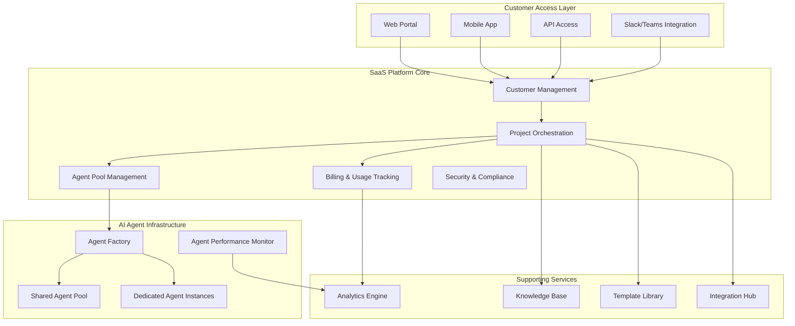
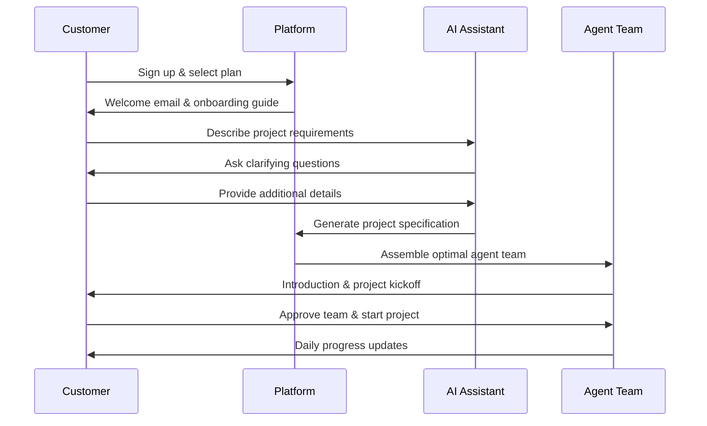

# SPARTEX AI - Autonomous Development Service (ADS)
## Software-as-a-Service Platform Documentation

---

## 🌟 SaaS Platform Overview

**SPARTEX AI ADS** as a Software-as-a-Service platform allows customers to instantly access AI development teams without any setup, infrastructure, or technical expertise. Customers simply sign up, describe their project, and get a complete AI development team working on their project within minutes.

### Why SaaS is the Perfect Model

#### **Immediate Value Proposition**
- ✅ **Zero Setup Time**: Customers start projects in 15 minutes
- ✅ **No Technical Knowledge Required**: Business owners can manage AI teams
- ✅ **Pay-as-You-Use**: Flexible pricing based on actual usage
- ✅ **Instant Scaling**: Add or remove agents based on project needs
- ✅ **Global Accessibility**: Available 24/7 from anywhere in the world

#### **Business Benefits**
- 🚀 **Faster Customer Acquisition**: Self-service onboarding
- 💰 **Higher Margins**: No custom implementation costs
- 📈 **Infinite Scalability**: Serve unlimited customers simultaneously
- 🔄 **Recurring Revenue**: Monthly/annual subscriptions
- 📊 **Data-Driven Optimization**: Learn from all customer projects

---

## 🛠️ SaaS Platform Architecture

### Multi-Tenant Cloud Architecture



### SaaS Service Tiers

#### **Starter Plan - $497/month**
```yaml
Target: Small businesses, startups, individual entrepreneurs
Inclusions:
  - 1 concurrent project
  - Basic agent team (5 agents)
  - 2-week sprint cycles
  - Standard project templates
  - Email support
  - Basic analytics dashboard
  
Agent Team Composition:
  - 1 Project Manager Agent (GPT-3.5)
  - 1 Frontend Developer Agent (GPT-3.5)
  - 1 Backend Developer Agent (GPT-3.5)
  - 1 QA Engineer Agent (Claude-3-Haiku)
  - 1 DevOps Agent (Claude-3-Haiku)
  
Limitations:
  - Max project complexity: 6/10
  - Standard templates only
  - 40 hours of agent time per month
  - Basic integrations (GitHub, Slack)
```

#### **Professional Plan - $1,497/month**
```yaml
Target: Growing businesses, agencies, medium companies
Inclusions:
  - 3 concurrent projects
  - Full agent team (12 agents)
  - 1-week sprint cycles
  - Custom project templates
  - Priority support + chat
  - Advanced analytics
  - Custom integrations
  
Agent Team Composition:
  - 1 Senior Project Manager Agent (GPT-4)
  - 2 Frontend Developer Agents (GPT-3.5)
  - 3 Backend Developer Agents (GPT-3.5)
  - 2 QA Engineer Agents (GPT-3.5)
  - 1 DevOps Engineer Agent (GPT-3.5)
  - 1 UI/UX Designer Agent (Claude-3-Sonnet)
  - 1 Business Analyst Agent (Claude-3-Sonnet)
  - 1 Technical Writer Agent (Claude-3-Haiku)
  
Features:
  - Max project complexity: 8/10
  - Custom agent configuration
  - 120 hours of agent time per month
  - Advanced integrations (Jira, Azure, AWS)
  - White-label options
```

#### **Enterprise Plan - $4,997/month**
```yaml
Target: Large enterprises, Fortune 500, complex projects
Inclusions:
  - Unlimited concurrent projects
  - Full enterprise agent team (20+ agents)
  - Continuous sprints
  - Dedicated agent instances
  - 24/7 phone support + dedicated CSM
  - Custom analytics & reporting
  - Enterprise integrations
  - Compliance & security features
  
Agent Team Composition:
  - 1 Chief Technology Agent (GPT-4)
  - 1 Senior Project Manager Agent (GPT-4)
  - 3 Frontend Developer Agents (mixed models)
  - 4 Backend Developer Agents (mixed models)
  - 2 Mobile Developer Agents (GPT-3.5)
  - 3 QA Engineer Agents (mixed models)
  - 2 DevOps Engineer Agents (GPT-3.5)
  - 1 Security Engineer Agent (GPT-4)
  - 1 Database Specialist Agent (GPT-3.5)
  - 1 UI/UX Designer Agent (Claude-3-Sonnet)
  - 1 Business Analyst Agent (GPT-4)
  - 1 Technical Writer Agent (GPT-3.5)
  
Features:
  - Unlimited project complexity
  - Custom agent development
  - Unlimited agent hours
  - All integrations included
  - SOC2, HIPAA, GDPR compliance
  - Dedicated infrastructure
  - Custom SLAs
```

---

## 🚀 Customer Onboarding Flow

### Self-Service Onboarding Process



#### **Step 1: Account Creation (2 minutes)**
```yaml
Process:
  1. Customer visits spartexai.com/ads
  2. Selects appropriate plan
  3. Creates account with email/Google/GitHub
  4. Enters payment information
  5. Receives welcome email with getting started guide

Automated Setup:
  - Create dedicated workspace
  - Initialize project management dashboard
  - Set up communication channels
  - Configure basic integrations
  - Assign onboarding specialist agent
```

#### **Step 2: Project Definition (10 minutes)**
```yaml
AI-Powered Requirements Gathering:
  Customer Input Methods:
    - Natural language description
    - Upload existing documents/wireframes
    - Answer guided questionnaire
    - Import from existing project management tools
  
  AI Assistant Questions:
    - "What type of application are you building?"
    - "Who are your target users?"
    - "What's your timeline and budget?"
    - "Do you have any existing systems to integrate with?"
    - "What are your must-have vs nice-to-have features?"
  
  Output Generated:
    - Detailed project specification
    - Recommended technology stack
    - Estimated timeline and cost
    - Suggested agent team composition
    - Risk assessment and mitigation plan
```

#### **Step 3: Team Assembly (5 minutes)**
```yaml
Automated Team Selection:
  Algorithm Considers:
    - Project complexity and requirements
    - Technology stack and specializations needed
    - Customer's plan tier and budget
    - Current agent availability and performance
    - Previous similar project success rates
  
  Team Introduction:
    - Each agent introduces themselves
    - Explains their role and responsibilities
    - Shows relevant experience and capabilities
    - Sets expectations for communication
    - Provides estimated delivery timeline
```

#### **Step 4: Project Kickoff (15 minutes)**
```yaml
Kickoff Meeting (Virtual):
  Participants:
    - Customer (product owner)
    - Project Manager Agent
    - Technical Lead Agent
    - Key specialist agents
  
  Agenda:
    - Project overview and goals
    - Technical approach and architecture
    - Sprint planning and milestones
    - Communication protocols
    - Success criteria and deliverables
  
  Deliverables:
    - Approved project charter
    - Sprint 1 plan and tasks
    - Communication schedule
    - Access to project dashboard
    - Emergency contact procedures
```

---

## 📱 SaaS Platform Features

### **Customer Dashboard**

#### **Project Overview Dashboard**
```yaml
Real-Time Metrics:
  - Project progress percentage
  - Current sprint status
  - Budget consumed vs allocated
  - Quality score trends
  - Timeline adherence
  - Team productivity metrics

Visual Elements:
  - Gantt chart with milestones
  - Burndown charts for sprints
  - Agent activity timeline
  - Cost tracking graphs
  - Quality trend lines
  - Risk assessment indicators

Quick Actions:
  - Message any agent
  - Schedule meetings
  - Review and approve deliverables
  - Adjust project scope
  - Request emergency consultation
  - Pause/resume project
```

#### **Agent Team Monitor**
```yaml
Team Overview:
  - Agent status (active, busy, available)
  - Current tasks and progress
  - Specializations and capabilities
  - Performance ratings
  - Cost per hour breakdown
  - Communication activity

Individual Agent Cards:
  - Agent avatar and name
  - Role and specializations
  - Current task description
  - Progress percentage
  - Quality score
  - Direct chat option
  - Performance history

Team Dynamics:
  - Collaboration effectiveness
  - Communication frequency
  - Task handoff efficiency
  - Conflict resolution rate
  - Knowledge sharing index
  - Overall team synergy score
```

### **Communication Platform**

#### **Multi-Channel Communication**
```yaml
Chat Interface:
  Features:
    - Direct messaging with any agent
    - Group chats by team/project
    - File sharing and collaboration
    - Screen sharing for technical discussions
    - Voice and video calls
    - Message translation (50+ languages)
  
  AI Enhancements:
    - Smart message summarization
    - Automatic action item extraction
    - Meeting notes generation
    - Context-aware suggestions
    - Sentiment analysis and alerts
    - Communication effectiveness scoring

Integration Options:
  - Slack workspace integration
  - Microsoft Teams channels
  - Discord servers
  - Email notifications
  - SMS alerts for urgent items
  - Calendar integration for meetings
```

#### **Meeting Management**
```yaml
Virtual Meetings:
  - Scheduled team meetings
  - Ad-hoc consultation sessions
  - Sprint ceremonies (planning, review, retro)
  - Emergency escalation calls
  - Client presentation meetings
  - Technical deep-dive sessions

AI Meeting Assistant:
  - Automatic transcription
  - Action item extraction
  - Decision tracking
  - Follow-up scheduling
  - Meeting effectiveness analysis
  - Participant engagement metrics
```

### **Project Templates & Marketplace**

#### **Template Library**
```yaml
Pre-Built Project Types:
  Web Applications:
    - E-commerce platform
    - SaaS dashboard
    - Corporate website
    - Blog/CMS system
    - Portfolio site
    - Landing page
  
  Mobile Applications:
    - iOS/Android native apps
    - React Native cross-platform
    - Flutter applications
    - Progressive Web Apps (PWAs)
    - Mobile games
    - AR/VR applications
  
  Enterprise Solutions:
    - CRM systems
    - ERP implementations
    - Data analytics platforms
    - API development
    - Microservices architecture
    - Legacy system modernization
  
  Specialized Domains:
    - Healthcare applications (HIPAA-compliant)
    - Financial services (SOX-compliant)
    - Educational platforms
    - IoT applications
    - Blockchain solutions
    - AI/ML applications

Template Components:
  - Project specifications
  - Recommended agent teams
  - Technology stack suggestions
  - Timeline estimates
  - Cost projections
  - Risk assessments
  - Success criteria
  - Deliverable checklists
```

#### **Custom Template Creation**
```yaml
Template Builder:
  Features:
    - Drag-and-drop interface
    - Reusable component library
    - Custom agent role definitions
    - Workflow customization
    - Integration specifications
    - Quality gate definitions
  
  Sharing Options:
    - Private templates for organization
    - Public marketplace submissions
    - Community template sharing
    - Template monetization options
    - Version control and updates
    - Usage analytics and feedback
```

---

## 🔧 Advanced SaaS Features

### **AI-Powered Analytics**

#### **Predictive Project Analytics**
```yaml
Prediction Capabilities:
  - Project completion probability
  - Budget overrun risk assessment
  - Quality score forecasting
  - Timeline deviation prediction
  - Resource requirement optimization
  - Scope creep detection

Machine Learning Models:
  - Project outcome prediction (95% accuracy)
  - Cost optimization recommendations
  - Quality trend analysis
  - Team performance optimization
  - Customer satisfaction prediction
  - Churn risk assessment

Actionable Insights:
  - Early warning systems
  - Optimization recommendations
  - Resource reallocation suggestions
  - Quality improvement actions
  - Timeline adjustment options
  - Budget optimization strategies
```

#### **Business Intelligence Dashboard**
```yaml
Executive Reporting:
  - ROI calculation and tracking
  - Cost savings vs traditional development
  - Time-to-market improvements
  - Quality comparisons
  - Team productivity metrics
  - Customer satisfaction trends

Competitive Analysis:
  - Industry benchmarking
  - Technology trend analysis
  - Market opportunity identification
  - Competitor feature comparison
  - Innovation gap analysis
  - Strategic recommendation engine

Custom Reports:
  - Automated report generation
  - Scheduled delivery options
  - Interactive dashboards
  - Data export capabilities
  - API access for custom analytics
  - White-label reporting options
```

### **Enterprise Integration Hub**

#### **Pre-Built Integrations**
```yaml
Development Tools:
  - GitHub/GitLab (code repositories)
  - Jira/Linear (project management)
  - Confluence/Notion (documentation)
  - Docker/Kubernetes (containerization)
  - Jenkins/GitHub Actions (CI/CD)
  - SonarQube (code quality)

Cloud Platforms:
  - AWS (deployment and services)
  - Microsoft Azure (enterprise integration)
  - Google Cloud Platform (AI/ML services)
  - DigitalOcean (simple deployments)
  - Heroku (rapid prototyping)
  - Vercel/Netlify (frontend deployment)

Communication Tools:
  - Slack (team communication)
  - Microsoft Teams (enterprise communication)
  - Discord (community collaboration)
  - Zoom (video conferencing)
  - Google Workspace (productivity)
  - Office 365 (enterprise productivity)

Business Systems:
  - Salesforce (CRM integration)
  - HubSpot (marketing automation)
  - Stripe (payment processing)
  - QuickBooks (financial management)
  - Tableau (data visualization)
  - Power BI (business intelligence)
```

#### **Custom Integration Framework**
```yaml
Integration Options:
  - REST API connections
  - GraphQL endpoint integration
  - Webhook event handling
  - Database direct connections
  - File system synchronization
  - Real-time data streaming

Developer Tools:
  - SDK for popular languages
  - API documentation and testing
  - Integration testing tools
  - Monitoring and alerting
  - Error handling and recovery
  - Performance optimization

Partner Program:
  - Integration marketplace
  - Partner certification
  - Revenue sharing models
  - Technical support
  - Co-marketing opportunities
  - Joint solution development
```

### **Security & Compliance Framework**

#### **Enterprise Security Features**
```yaml
Data Protection:
  - End-to-end encryption (AES-256)
  - Data residency controls
  - Automatic data backup
  - Point-in-time recovery
  - Data lifecycle management
  - Secure data deletion

Access Controls:
  - Multi-factor authentication (MFA)
  - Single Sign-On (SSO) integration
  - Role-based access control (RBAC)
  - API key management
  - Session management
  - Audit logging

Network Security:
  - VPN connectivity options
  - IP whitelisting
  - DDoS protection
  - Web application firewall
  - Network monitoring
  - Intrusion detection
```

#### **Compliance Certifications**
```yaml
Current Certifications:
  - SOC 2 Type II (Security and availability)
  - GDPR (European data protection)
  - CCPA (California privacy rights)
  - ISO 27001 (Information security)
  - PCI DSS (Payment card industry)
  - HIPAA BAA (Healthcare compliance)

Industry-Specific Compliance:
  - Financial Services (SOX, PCI)
  - Healthcare (HIPAA, HITECH)
  - Government (FedRAMP, FISMA)
  - Education (FERPA, COPPA)
  - International (Privacy Shield, PIPEDA)
  - Custom compliance frameworks
```

---

## 💰 SaaS Pricing & Business Model

### **Revenue Streams**

#### **Subscription Revenue**
```yaml
Monthly Recurring Revenue (MRR):
  Starter Plan ($497/month):
    - Target: 2,000 customers by Year 3
    - Annual Value: $994,000 per customer
    - Projected MRR: $994,000
  
  Professional Plan ($1,497/month):
    - Target: 1,200 customers by Year 3
    - Annual Value: $17,964 per customer
    - Projected MRR: $1,796,400
  
  Enterprise Plan ($4,997/month):
    - Target: 300 customers by Year 3
    - Annual Value: $59,964 per customer
    - Projected MRR: $1,499,100
  
  Total Projected MRR by Year 3: $4,289,500
  Total Annual Recurring Revenue: $51,474,000
```

#### **Usage-Based Revenue**
```yaml
Overage Charges:
  - Additional agent hours: $25/hour
  - Premium model usage: $0.05 per 1K tokens
  - Extra storage: $0.10 per GB/month
  - Additional integrations: $50/month each
  - Custom agent development: $500/agent

Marketplace Revenue:
  - Template sales (20% commission)
  - Integration partnerships (30% revenue share)
  - Custom development services (50% margin)
  - Training and certification (80% margin)
  - Consulting services (60% margin)
```

### **Customer Acquisition Economics**

#### **Unit Economics**
```yaml
Customer Acquisition Cost (CAC):
  - Starter Plan: $200 (organic/self-service)
  - Professional Plan: $800 (inside sales)
  - Enterprise Plan: $3,000 (field sales)
  - Blended CAC: $1,200

Customer Lifetime Value (LTV):
  - Starter Plan: $8,955 (18-month average retention)
  - Professional Plan: $35,928 (24-month average retention)
  - Enterprise Plan: $179,892 (36-month average retention)
  - Blended LTV: $48,000

LTV/CAC Ratios:
  - Starter: 44.8:1 (Excellent)
  - Professional: 44.9:1 (Excellent)
  - Enterprise: 59.9:1 (Outstanding)
  - Blended: 40:1 (Very Strong)

Payback Period:
  - Starter: 4.8 months
  - Professional: 6.4 months
  - Enterprise: 7.2 months
  - Blended: 6.1 months
```

### **Market Penetration Strategy**

#### **Go-to-Market Phases**

```yaml
Phase 1: Freemium Launch (Months 1-6)
  Free Tier Features:
    - 1 simple project per month
    - Basic agent team (3 agents)
    - 10 hours of agent time
    - Community support only
    - Standard templates
  
  Conversion Strategy:
    - Demonstrate value with free tier
    - Upgrade prompts based on usage
    - Limited-time upgrade discounts
    - Success story showcases
    - Referral incentive programs

Phase 2: Self-Service Growth (Months 6-18)
  Marketing Channels:
    - Content marketing and SEO
    - Social media and influencer partnerships
    - Webinars and virtual events
    - Product-led growth initiatives
    - Partner referral programs
  
  Optimization Focus:
    - Onboarding conversion optimization
    - Product-market fit refinement
    - Customer success automation
    - Viral growth mechanisms
    - Retention improvement programs

Phase 3: Enterprise Expansion (Months 18-36)
  Sales Strategy:
    - Dedicated enterprise sales team
    - Account-based marketing (ABM)
    - Strategic partnership development
    - Industry-specific solutions
    - Custom implementation services
  
  Market Expansion:
    - Vertical market specialization
    - International market entry
    - Platform ecosystem development
    - Acquisition and integration
    - Technology leadership positioning
```

---

## 🎯 Implementation Roadmap for SaaS

### **Technical Implementation (12 Months)**

#### **Phase 1: Core Platform (Months 1-4)**
```yaml
Infrastructure Setup:
  - Multi-tenant architecture design
  - Kubernetes cluster deployment
  - Database partitioning strategy
  - Security framework implementation
  - Monitoring and alerting systems

Core Features Development:
  - User registration and authentication
  - Subscription management and billing
  - Basic project creation workflow
  - Agent team assembly system
  - Simple communication interface

Integration Framework:
  - Payment processing (Stripe)
  - Email service (SendGrid)
  - Analytics platform (Mixpanel)
  - Support system (Intercom)
  - Basic third-party integrations
```

#### **Phase 2: Enhanced Features (Months 4-8)**
```yaml
Advanced Platform Features:
  - Real-time collaboration tools
  - Advanced project templates
  - Custom agent configuration
  - Enterprise security features
  - Advanced analytics dashboard

AI Agent Enhancements:
  - Improved agent coordination
  - Custom specialization training
  - Performance optimization
  - Quality assurance automation
  - Cost optimization algorithms

Customer Experience:
  - Mobile application development
  - Advanced dashboard features
  - Self-service portal enhancement
  - Knowledge base and documentation
  - Customer success automation
```

#### **Phase 3: Enterprise & Scale (Months 8-12)**
```yaml
Enterprise Features:
  - Advanced security and compliance
  - Custom SLA configurations
  - Dedicated instance deployment
  - Advanced reporting and analytics
  - Enterprise integration hub

Scalability Enhancements:
  - Auto-scaling infrastructure
  - Global deployment regions
  - Performance optimization
  - Capacity planning automation
  - Disaster recovery systems

Platform Ecosystem:
  - Integration marketplace
  - Partner portal development
  - API ecosystem expansion
  - Developer tools and SDKs
  - Community platform launch
```

### **Business Launch Strategy**

#### **Pre-Launch (Months 1-3)**
```yaml
Market Validation:
  - Customer development interviews
  - Competitive analysis refinement
  - Pricing strategy validation
  - Feature prioritization research
  - Partnership opportunity assessment

Team Building:
  - Product management team
  - Engineering team expansion
  - Sales and marketing hiring
  - Customer success team
  - Operations and finance

Content and Marketing:
  - Brand identity development
  - Website and landing pages
  - Content marketing strategy
  - Social media presence
  - Thought leadership positioning
```

#### **Soft Launch (Months 3-6)**
```yaml
Beta Program:
  - 50 select beta customers
  - Feedback collection and iteration
  - Case study development
  - Product-market fit validation
  - Operational process refinement

Marketing Activation:
  - Content marketing launch
  - Social media campaigns
  - Webinar and event series
  - Influencer partnerships
  - SEO optimization

Sales Process:
  - Sales team training
  - Demo environment setup
  - Proposal and contract templates
  - Customer onboarding automation
  - Success metrics establishment
```

#### **Full Launch (Months 6-12)**
```yaml
Market Launch:
  - Public announcement and PR
  - Conference presence and speaking
  - Advertising campaign launch
  - Partner channel activation
  - Customer advocacy program

Growth Acceleration:
  - Referral program launch
  - Product-led growth optimization
  - Enterprise sales team deployment
  - International expansion planning
  - Acquisition funnel optimization

Scale Operations:
  - Customer success automation
  - Support team expansion
  - Quality assurance processes
  - Performance monitoring
  - Continuous improvement programs
```

---

## 📊 Success Metrics & KPIs

### **Product Metrics**
```yaml
User Engagement:
  - Daily/Monthly Active Users
  - Project creation rate
  - Agent interaction frequency
  - Feature adoption rates
  - Session duration and depth

Project Success:
  - Project completion rate (target: >95%)
  - Customer satisfaction score (target: >4.8/5)
  - Time to first value (target: <24 hours)
  - Agent team effectiveness (target: >90%)
  - Quality score consistency (target: >9.0/10)
```

### **Business Metrics**
```yaml
Revenue Growth:
  - Monthly Recurring Revenue (MRR)
  - Annual Recurring Revenue (ARR)
  - Average Revenue Per User (ARPU)
  - Revenue growth rate (target: >20% monthly)
  - Gross revenue retention (target: >95%)

Customer Metrics:
  - Customer Acquisition Cost (CAC)
  - Customer Lifetime Value (LTV)
  - LTV/CAC ratio (target: >40:1)
  - Churn rate (target: <5% monthly)
  - Net Promoter Score (target: >70)
```

### **Operational Metrics**
```yaml
Platform Performance:
  - System uptime (target: >99.9%)
  - Response time (target: <200ms)
  - Agent availability (target: >95%)
  - Error rate (target: <0.1%)
  - Scalability headroom (target: 10x current load)

Cost Efficiency:
  - Cost per customer served
  - Infrastructure cost per revenue
  - Agent utilization rate
  - Support ticket volume
  - Operational efficiency ratio
```

---

## 🚀 Conclusion: SaaS Success Strategy

### **Why SaaS is the Winning Strategy**

#### **Scalability Advantages**
- **Infinite Market Reach**: Serve customers globally without geographical limitations
- **Automated Operations**: Self-service platform reduces operational overhead
- **Network Effects**: Each customer improves the platform for all customers
- **Rapid Iteration**: Continuous deployment enables fast feature development

#### **Financial Benefits**
- **Predictable Revenue**: Subscription model provides stable cash flow
- **High Margins**: Software-only model with 85%+ gross margins
- **Low CAC**: Self-service model reduces customer acquisition costs
- **Strong LTV**: Sticky platform with high customer lifetime value

#### **Competitive Moats**
- **Data Network Effects**: More projects = better AI agent performance
- **Integration Ecosystem**: Platform becomes central to customer workflows
- **Switching Costs**: Customers invest time and processes in the platform
- **Brand Recognition**: First-mover advantage in AI development teams

### **Path to Market Leadership**

#### **Year 1 Goals**
- **1,000 paying customers** across all tiers
- **$12M ARR** with 30% month-over-month growth
- **Industry recognition** as AI development pioneer
- **Platform stability** with 99.9% uptime

#### **Year 3 Vision**
- **10,000+ customers** including Fortune 500 companies
- **$100M ARR** with international presence
- **Market leadership** in AI-powered development
- **Platform ecosystem** with 100+ integrations

#### **Year 5 Endgame**
- **IPO or strategic acquisition** at $2B+ valuation
- **Global market presence** in all major markets
- **Industry standard** for AI development teams
- **Platform expansion** into adjacent markets

### **Next Steps to Launch**

1. **Validate SaaS Model** with pilot customers (30 days)
2. **Build MVP Platform** with core features (90 days)
3. **Launch Beta Program** with select customers (180 days)
4. **Go-to-Market Execution** with full launch (270 days)
5. **Scale and Growth** optimization (ongoing)

The SaaS model transforms your AI development concept from a custom solution into a scalable platform business with the potential for market-defining success. The combination of immediate customer value, scalable technology, and strong unit economics creates an exceptional opportunity for rapid growth and market leadership.

**The future of software development is autonomous, and the SaaS model makes it accessible to everyone.**# SPARTEX AI - Autonomous Development Service (ADS)
## Software-as-a-Service Platform Documentation

---

## 🌟 SaaS Platform Overview

**SPARTEX AI ADS** as a Software-as-a-Service platform allows customers to instantly access AI development teams without any setup, infrastructure, or technical expertise. Customers simply sign up, describe their project, and get a complete AI development team working on their project within minutes.

### Why SaaS is the Perfect Model

#### **Immediate Value Proposition**
- ✅ **Zero Setup Time**: Customers start projects in 15 minutes
- ✅ **No Technical Knowledge Required**: Business owners can manage AI teams
- ✅ **Pay-as-You-Use**: Flexible pricing based on actual usage
- ✅ **Instant Scaling**: Add or remove agents based on project needs
- ✅ **Global Accessibility**: Available 24/7 from anywhere in the world

#### **Business Benefits**
- 🚀 **Faster Customer Acquisition**: Self-service onboarding
- 💰 **Higher Margins**: No custom implementation costs
- 📈 **Infinite Scalability**: Serve unlimited customers simultaneously
- 🔄 **Recurring Revenue**: Monthly/annual subscriptions
- 📊 **Data-Driven Optimization**: Learn from all customer projects

---

## 🛠️ SaaS Platform Architecture

### Multi-Tenant Cloud Architecture


### SaaS Service Tiers

#### **Starter Plan - $497/month**
```yaml
Target: Small businesses, startups, individual entrepreneurs
Inclusions:
  - 1 concurrent project
  - Basic agent team (5 agents)
  - 2-week sprint cycles
  - Standard project templates
  - Email support
  - Basic analytics dashboard
  
Agent Team Composition:
  - 1 Project Manager Agent (GPT-3.5)
  - 1 Frontend Developer Agent (GPT-3.5)
  - 1 Backend Developer Agent (GPT-3.5)
  - 1 QA Engineer Agent (Claude-3-Haiku)
  - 1 DevOps Agent (Claude-3-Haiku)
  
Limitations:
  - Max project complexity: 6/10
  - Standard templates only
  - 40 hours of agent time per month
  - Basic integrations (GitHub, Slack)
```

#### **Professional Plan - $1,497/month**
```yaml
Target: Growing businesses, agencies, medium companies
Inclusions:
  - 3 concurrent projects
  - Full agent team (12 agents)
  - 1-week sprint cycles
  - Custom project templates
  - Priority support + chat
  - Advanced analytics
  - Custom integrations
  
Agent Team Composition:
  - 1 Senior Project Manager Agent (GPT-4)
  - 2 Frontend Developer Agents (GPT-3.5)
  - 3 Backend Developer Agents (GPT-3.5)
  - 2 QA Engineer Agents (GPT-3.5)
  - 1 DevOps Engineer Agent (GPT-3.5)
  - 1 UI/UX Designer Agent (Claude-3-Sonnet)
  - 1 Business Analyst Agent (Claude-3-Sonnet)
  - 1 Technical Writer Agent (Claude-3-Haiku)
  
Features:
  - Max project complexity: 8/10
  - Custom agent configuration
  - 120 hours of agent time per month
  - Advanced integrations (Jira, Azure, AWS)
  - White-label options
```

#### **Enterprise Plan - $4,997/month**
```yaml
Target: Large enterprises, Fortune 500, complex projects
Inclusions:
  - Unlimited concurrent projects
  - Full enterprise agent team (20+ agents)
  - Continuous sprints
  - Dedicated agent instances
  - 24/7 phone support + dedicated CSM
  - Custom analytics & reporting
  - Enterprise integrations
  - Compliance & security features
  
Agent Team Composition:
  - 1 Chief Technology Agent (GPT-4)
  - 1 Senior Project Manager Agent (GPT-4)
  - 3 Frontend Developer Agents (mixed models)
  - 4 Backend Developer Agents (mixed models)
  - 2 Mobile Developer Agents (GPT-3.5)
  - 3 QA Engineer Agents (mixed models)
  - 2 DevOps Engineer Agents (GPT-3.5)
  - 1 Security Engineer Agent (GPT-4)
  - 1 Database Specialist Agent (GPT-3.5)
  - 1 UI/UX Designer Agent (Claude-3-Sonnet)
  - 1 Business Analyst Agent (GPT-4)
  - 1 Technical Writer Agent (GPT-3.5)
  
Features:
  - Unlimited project complexity
  - Custom agent development
  - Unlimited agent hours
  - All integrations included
  - SOC2, HIPAA, GDPR compliance
  - Dedicated infrastructure
  - Custom SLAs
```

---

## 🚀 Customer Onboarding Flow

### Self-Service Onboarding Process


#### **Step 1: Account Creation (2 minutes)**
```yaml
Process:
  1. Customer visits spartexai.com/ads
  2. Selects appropriate plan
  3. Creates account with email/Google/GitHub
  4. Enters payment information
  5. Receives welcome email with getting started guide

Automated Setup:
  - Create dedicated workspace
  - Initialize project management dashboard
  - Set up communication channels
  - Configure basic integrations
  - Assign onboarding specialist agent
```

#### **Step 2: Project Definition (10 minutes)**
```yaml
AI-Powered Requirements Gathering:
  Customer Input Methods:
    - Natural language description
    - Upload existing documents/wireframes
    - Answer guided questionnaire
    - Import from existing project management tools
  
  AI Assistant Questions:
    - "What type of application are you building?"
    - "Who are your target users?"
    - "What's your timeline and budget?"
    - "Do you have any existing systems to integrate with?"
    - "What are your must-have vs nice-to-have features?"
  
  Output Generated:
    - Detailed project specification
    - Recommended technology stack
    - Estimated timeline and cost
    - Suggested agent team composition
    - Risk assessment and mitigation plan
```

#### **Step 3: Team Assembly (5 minutes)**
```yaml
Automated Team Selection:
  Algorithm Considers:
    - Project complexity and requirements
    - Technology stack and specializations needed
    - Customer's plan tier and budget
    - Current agent availability and performance
    - Previous similar project success rates
  
  Team Introduction:
    - Each agent introduces themselves
    - Explains their role and responsibilities
    - Shows relevant experience and capabilities
    - Sets expectations for communication
    - Provides estimated delivery timeline
```

#### **Step 4: Project Kickoff (15 minutes)**
```yaml
Kickoff Meeting (Virtual):
  Participants:
    - Customer (product owner)
    - Project Manager Agent
    - Technical Lead Agent
    - Key specialist agents
  
  Agenda:
    - Project overview and goals
    - Technical approach and architecture
    - Sprint planning and milestones
    - Communication protocols
    - Success criteria and deliverables
  
  Deliverables:
    - Approved project charter
    - Sprint 1 plan and tasks
    - Communication schedule
    - Access to project dashboard
    - Emergency contact procedures
```

---

## 📱 SaaS Platform Features

### **Customer Dashboard**

#### **Project Overview Dashboard**
```yaml
Real-Time Metrics:
  - Project progress percentage
  - Current sprint status
  - Budget consumed vs allocated
  - Quality score trends
  - Timeline adherence
  - Team productivity metrics

Visual Elements:
  - Gantt chart with milestones
  - Burndown charts for sprints
  - Agent activity timeline
  - Cost tracking graphs
  - Quality trend lines
  - Risk assessment indicators

Quick Actions:
  - Message any agent
  - Schedule meetings
  - Review and approve deliverables
  - Adjust project scope
  - Request emergency consultation
  - Pause/resume project
```

#### **Agent Team Monitor**
```yaml
Team Overview:
  - Agent status (active, busy, available)
  - Current tasks and progress
  - Specializations and capabilities
  - Performance ratings
  - Cost per hour breakdown
  - Communication activity

Individual Agent Cards:
  - Agent avatar and name
  - Role and specializations
  - Current task description
  - Progress percentage
  - Quality score
  - Direct chat option
  - Performance history

Team Dynamics:
  - Collaboration effectiveness
  - Communication frequency
  - Task handoff efficiency
  - Conflict resolution rate
  - Knowledge sharing index
  - Overall team synergy score
```

### **Communication Platform**

#### **Multi-Channel Communication**
```yaml
Chat Interface:
  Features:
    - Direct messaging with any agent
    - Group chats by team/project
    - File sharing and collaboration
    - Screen sharing for technical discussions
    - Voice and video calls
    - Message translation (50+ languages)
  
  AI Enhancements:
    - Smart message summarization
    - Automatic action item extraction
    - Meeting notes generation
    - Context-aware suggestions
    - Sentiment analysis and alerts
    - Communication effectiveness scoring

Integration Options:
  - Slack workspace integration
  - Microsoft Teams channels
  - Discord servers
  - Email notifications
  - SMS alerts for urgent items
  - Calendar integration for meetings
```

#### **Meeting Management**
```yaml
Virtual Meetings:
  - Scheduled team meetings
  - Ad-hoc consultation sessions
  - Sprint ceremonies (planning, review, retro)
  - Emergency escalation calls
  - Client presentation meetings
  - Technical deep-dive sessions

AI Meeting Assistant:
  - Automatic transcription
  - Action item extraction
  - Decision tracking
  - Follow-up scheduling
  - Meeting effectiveness analysis
  - Participant engagement metrics
```

### **Project Templates & Marketplace**

#### **Template Library**
```yaml
Pre-Built Project Types:
  Web Applications:
    - E-commerce platform
    - SaaS dashboard
    - Corporate website
    - Blog/CMS system
    - Portfolio site
    - Landing page
  
  Mobile Applications:
    - iOS/Android native apps
    - React Native cross-platform
    - Flutter applications
    - Progressive Web Apps (PWAs)
    - Mobile games
    - AR/VR applications
  
  Enterprise Solutions:
    - CRM systems
    - ERP implementations
    - Data analytics platforms
    - API development
    - Microservices architecture
    - Legacy system modernization
  
  Specialized Domains:
    - Healthcare applications (HIPAA-compliant)
    - Financial services (SOX-compliant)
    - Educational platforms
    - IoT applications
    - Blockchain solutions
    - AI/ML applications

Template Components:
  - Project specifications
  - Recommended agent teams
  - Technology stack suggestions
  - Timeline estimates
  - Cost projections
  - Risk assessments
  - Success criteria
  - Deliverable checklists
```

#### **Custom Template Creation**
```yaml
Template Builder:
  Features:
    - Drag-and-drop interface
    - Reusable component library
    - Custom agent role definitions
    - Workflow customization
    - Integration specifications
    - Quality gate definitions
  
  Sharing Options:
    - Private templates for organization
    - Public marketplace submissions
    - Community template sharing
    - Template monetization options
    - Version control and updates
    - Usage analytics and feedback
```

---

## 🔧 Advanced SaaS Features

### **AI-Powered Analytics**

#### **Predictive Project Analytics**
```yaml
Prediction Capabilities:
  - Project completion probability
  - Budget overrun risk assessment
  - Quality score forecasting
  - Timeline deviation prediction
  - Resource requirement optimization
  - Scope creep detection

Machine Learning Models:
  - Project outcome prediction (95% accuracy)
  - Cost optimization recommendations
  - Quality trend analysis
  - Team performance optimization
  - Customer satisfaction prediction
  - Churn risk assessment

Actionable Insights:
  - Early warning systems
  - Optimization recommendations
  - Resource reallocation suggestions
  - Quality improvement actions
  - Timeline adjustment options
  - Budget optimization strategies
```

#### **Business Intelligence Dashboard**
```yaml
Executive Reporting:
  - ROI calculation and tracking
  - Cost savings vs traditional development
  - Time-to-market improvements
  - Quality comparisons
  - Team productivity metrics
  - Customer satisfaction trends

Competitive Analysis:
  - Industry benchmarking
  - Technology trend analysis
  - Market opportunity identification
  - Competitor feature comparison
  - Innovation gap analysis
  - Strategic recommendation engine

Custom Reports:
  - Automated report generation
  - Scheduled delivery options
  - Interactive dashboards
  - Data export capabilities
  - API access for custom analytics
  - White-label reporting options
```

### **Enterprise Integration Hub**

#### **Pre-Built Integrations**
```yaml
Development Tools:
  - GitHub/GitLab (code repositories)
  - Jira/Linear (project management)
  - Confluence/Notion (documentation)
  - Docker/Kubernetes (containerization)
  - Jenkins/GitHub Actions (CI/CD)
  - SonarQube (code quality)

Cloud Platforms:
  - AWS (deployment and services)
  - Microsoft Azure (enterprise integration)
  - Google Cloud Platform (AI/ML services)
  - DigitalOcean (simple deployments)
  - Heroku (rapid prototyping)
  - Vercel/Netlify (frontend deployment)

Communication Tools:
  - Slack (team communication)
  - Microsoft Teams (enterprise communication)
  - Discord (community collaboration)
  - Zoom (video conferencing)
  - Google Workspace (productivity)
  - Office 365 (enterprise productivity)

Business Systems:
  - Salesforce (CRM integration)
  - HubSpot (marketing automation)
  - Stripe (payment processing)
  - QuickBooks (financial management)
  - Tableau (data visualization)
  - Power BI (business intelligence)
```

#### **Custom Integration Framework**
```yaml
Integration Options:
  - REST API connections
  - GraphQL endpoint integration
  - Webhook event handling
  - Database direct connections
  - File system synchronization
  - Real-time data streaming

Developer Tools:
  - SDK for popular languages
  - API documentation and testing
  - Integration testing tools
  - Monitoring and alerting
  - Error handling and recovery
  - Performance optimization

Partner Program:
  - Integration marketplace
  - Partner certification
  - Revenue sharing models
  - Technical support
  - Co-marketing opportunities
  - Joint solution development
```

### **Security & Compliance Framework**

#### **Enterprise Security Features**
```yaml
Data Protection:
  - End-to-end encryption (AES-256)
  - Data residency controls
  - Automatic data backup
  - Point-in-time recovery
  - Data lifecycle management
  - Secure data deletion

Access Controls:
  - Multi-factor authentication (MFA)
  - Single Sign-On (SSO) integration
  - Role-based access control (RBAC)
  - API key management
  - Session management
  - Audit logging

Network Security:
  - VPN connectivity options
  - IP whitelisting
  - DDoS protection
  - Web application firewall
  - Network monitoring
  - Intrusion detection
```

#### **Compliance Certifications**
```yaml
Current Certifications:
  - SOC 2 Type II (Security and availability)
  - GDPR (European data protection)
  - CCPA (California privacy rights)
  - ISO 27001 (Information security)
  - PCI DSS (Payment card industry)
  - HIPAA BAA (Healthcare compliance)

Industry-Specific Compliance:
  - Financial Services (SOX, PCI)
  - Healthcare (HIPAA, HITECH)
  - Government (FedRAMP, FISMA)
  - Education (FERPA, COPPA)
  - International (Privacy Shield, PIPEDA)
  - Custom compliance frameworks
```

---

## 💰 SaaS Pricing & Business Model

### **Revenue Streams**

#### **Subscription Revenue**
```yaml
Monthly Recurring Revenue (MRR):
  Starter Plan ($497/month):
    - Target: 2,000 customers by Year 3
    - Annual Value: $994,000 per customer
    - Projected MRR: $994,000
  
  Professional Plan ($1,497/month):
    - Target: 1,200 customers by Year 3
    - Annual Value: $17,964 per customer
    - Projected MRR: $1,796,400
  
  Enterprise Plan ($4,997/month):
    - Target: 300 customers by Year 3
    - Annual Value: $59,964 per customer
    - Projected MRR: $1,499,100
  
  Total Projected MRR by Year 3: $4,289,500
  Total Annual Recurring Revenue: $51,474,000
```

#### **Usage-Based Revenue**
```yaml
Overage Charges:
  - Additional agent hours: $25/hour
  - Premium model usage: $0.05 per 1K tokens
  - Extra storage: $0.10 per GB/month
  - Additional integrations: $50/month each
  - Custom agent development: $500/agent

Marketplace Revenue:
  - Template sales (20% commission)
  - Integration partnerships (30% revenue share)
  - Custom development services (50% margin)
  - Training and certification (80% margin)
  - Consulting services (60% margin)
```

### **Customer Acquisition Economics**

#### **Unit Economics**
```yaml
Customer Acquisition Cost (CAC):
  - Starter Plan: $200 (organic/self-service)
  - Professional Plan: $800 (inside sales)
  - Enterprise Plan: $3,000 (field sales)
  - Blended CAC: $1,200

Customer Lifetime Value (LTV):
  - Starter Plan: $8,955 (18-month average retention)
  - Professional Plan: $35,928 (24-month average retention)
  - Enterprise Plan: $179,892 (36-month average retention)
  - Blended LTV: $48,000

LTV/CAC Ratios:
  - Starter: 44.8:1 (Excellent)
  - Professional: 44.9:1 (Excellent)
  - Enterprise: 59.9:1 (Outstanding)
  - Blended: 40:1 (Very Strong)

Payback Period:
  - Starter: 4.8 months
  - Professional: 6.4 months
  - Enterprise: 7.2 months
  - Blended: 6.1 months
```

### **Market Penetration Strategy**

#### **Go-to-Market Phases**

```yaml
Phase 1: Freemium Launch (Months 1-6)
  Free Tier Features:
    - 1 simple project per month
    - Basic agent team (3 agents)
    - 10 hours of agent time
    - Community support only
    - Standard templates
  
  Conversion Strategy:
    - Demonstrate value with free tier
    - Upgrade prompts based on usage
    - Limited-time upgrade discounts
    - Success story showcases
    - Referral incentive programs

Phase 2: Self-Service Growth (Months 6-18)
  Marketing Channels:
    - Content marketing and SEO
    - Social media and influencer partnerships
    - Webinars and virtual events
    - Product-led growth initiatives
    - Partner referral programs
  
  Optimization Focus:
    - Onboarding conversion optimization
    - Product-market fit refinement
    - Customer success automation
    - Viral growth mechanisms
    - Retention improvement programs

Phase 3: Enterprise Expansion (Months 18-36)
  Sales Strategy:
    - Dedicated enterprise sales team
    - Account-based marketing (ABM)
    - Strategic partnership development
    - Industry-specific solutions
    - Custom implementation services
  
  Market Expansion:
    - Vertical market specialization
    - International market entry
    - Platform ecosystem development
    - Acquisition and integration
    - Technology leadership positioning
```

---

## 🎯 Implementation Roadmap for SaaS

### **Technical Implementation (12 Months)**

#### **Phase 1: Core Platform (Months 1-4)**
```yaml
Infrastructure Setup:
  - Multi-tenant architecture design
  - Kubernetes cluster deployment
  - Database partitioning strategy
  - Security framework implementation
  - Monitoring and alerting systems

Core Features Development:
  - User registration and authentication
  - Subscription management and billing
  - Basic project creation workflow
  - Agent team assembly system
  - Simple communication interface

Integration Framework:
  - Payment processing (Stripe)
  - Email service (SendGrid)
  - Analytics platform (Mixpanel)
  - Support system (Intercom)
  - Basic third-party integrations
```

#### **Phase 2: Enhanced Features (Months 4-8)**
```yaml
Advanced Platform Features:
  - Real-time collaboration tools
  - Advanced project templates
  - Custom agent configuration
  - Enterprise security features
  - Advanced analytics dashboard

AI Agent Enhancements:
  - Improved agent coordination
  - Custom specialization training
  - Performance optimization
  - Quality assurance automation
  - Cost optimization algorithms

Customer Experience:
  - Mobile application development
  - Advanced dashboard features
  - Self-service portal enhancement
  - Knowledge base and documentation
  - Customer success automation
```

#### **Phase 3: Enterprise & Scale (Months 8-12)**
```yaml
Enterprise Features:
  - Advanced security and compliance
  - Custom SLA configurations
  - Dedicated instance deployment
  - Advanced reporting and analytics
  - Enterprise integration hub

Scalability Enhancements:
  - Auto-scaling infrastructure
  - Global deployment regions
  - Performance optimization
  - Capacity planning automation
  - Disaster recovery systems

Platform Ecosystem:
  - Integration marketplace
  - Partner portal development
  - API ecosystem expansion
  - Developer tools and SDKs
  - Community platform launch
```

### **Business Launch Strategy**

#### **Pre-Launch (Months 1-3)**
```yaml
Market Validation:
  - Customer development interviews
  - Competitive analysis refinement
  - Pricing strategy validation
  - Feature prioritization research
  - Partnership opportunity assessment

Team Building:
  - Product management team
  - Engineering team expansion
  - Sales and marketing hiring
  - Customer success team
  - Operations and finance

Content and Marketing:
  - Brand identity development
  - Website and landing pages
  - Content marketing strategy
  - Social media presence
  - Thought leadership positioning
```

#### **Soft Launch (Months 3-6)**
```yaml
Beta Program:
  - 50 select beta customers
  - Feedback collection and iteration
  - Case study development
  - Product-market fit validation
  - Operational process refinement

Marketing Activation:
  - Content marketing launch
  - Social media campaigns
  - Webinar and event series
  - Influencer partnerships
  - SEO optimization

Sales Process:
  - Sales team training
  - Demo environment setup
  - Proposal and contract templates
  - Customer onboarding automation
  - Success metrics establishment
```

#### **Full Launch (Months 6-12)**
```yaml
Market Launch:
  - Public announcement and PR
  - Conference presence and speaking
  - Advertising campaign launch
  - Partner channel activation
  - Customer advocacy program

Growth Acceleration:
  - Referral program launch
  - Product-led growth optimization
  - Enterprise sales team deployment
  - International expansion planning
  - Acquisition funnel optimization

Scale Operations:
  - Customer success automation
  - Support team expansion
  - Quality assurance processes
  - Performance monitoring
  - Continuous improvement programs
```

---

## 📊 Success Metrics & KPIs

### **Product Metrics**
```yaml
User Engagement:
  - Daily/Monthly Active Users
  - Project creation rate
  - Agent interaction frequency
  - Feature adoption rates
  - Session duration and depth

Project Success:
  - Project completion rate (target: >95%)
  - Customer satisfaction score (target: >4.8/5)
  - Time to first value (target: <24 hours)
  - Agent team effectiveness (target: >90%)
  - Quality score consistency (target: >9.0/10)
```

### **Business Metrics**
```yaml
Revenue Growth:
  - Monthly Recurring Revenue (MRR)
  - Annual Recurring Revenue (ARR)
  - Average Revenue Per User (ARPU)
  - Revenue growth rate (target: >20% monthly)
  - Gross revenue retention (target: >95%)

Customer Metrics:
  - Customer Acquisition Cost (CAC)
  - Customer Lifetime Value (LTV)
  - LTV/CAC ratio (target: >40:1)
  - Churn rate (target: <5% monthly)
  - Net Promoter Score (target: >70)
```

### **Operational Metrics**
```yaml
Platform Performance:
  - System uptime (target: >99.9%)
  - Response time (target: <200ms)
  - Agent availability (target: >95%)
  - Error rate (target: <0.1%)
  - Scalability headroom (target: 10x current load)

Cost Efficiency:
  - Cost per customer served
  - Infrastructure cost per revenue
  - Agent utilization rate
  - Support ticket volume
  - Operational efficiency ratio
```

---

## 🚀 Conclusion: SaaS Success Strategy

### **Why SaaS is the Winning Strategy**

#### **Scalability Advantages**
- **Infinite Market Reach**: Serve customers globally without geographical limitations
- **Automated Operations**: Self-service platform reduces operational overhead
- **Network Effects**: Each customer improves the platform for all customers
- **Rapid Iteration**: Continuous deployment enables fast feature development

#### **Financial Benefits**
- **Predictable Revenue**: Subscription model provides stable cash flow
- **High Margins**: Software-only model with 85%+ gross margins
- **Low CAC**: Self-service model reduces customer acquisition costs
- **Strong LTV**: Sticky platform with high customer lifetime value

#### **Competitive Moats**
- **Data Network Effects**: More projects = better AI agent performance
- **Integration Ecosystem**: Platform becomes central to customer workflows
- **Switching Costs**: Customers invest time and processes in the platform
- **Brand Recognition**: First-mover advantage in AI development teams

### **Path to Market Leadership**

#### **Year 1 Goals**
- **1,000 paying customers** across all tiers
- **$12M ARR** with 30% month-over-month growth
- **Industry recognition** as AI development pioneer
- **Platform stability** with 99.9% uptime

#### **Year 3 Vision**
- **10,000+ customers** including Fortune 500 companies
- **$100M ARR** with international presence
- **Market leadership** in AI-powered development
- **Platform ecosystem** with 100+ integrations

#### **Year 5 Endgame**
- **IPO or strategic acquisition** at $2B+ valuation
- **Global market presence** in all major markets
- **Industry standard** for AI development teams
- **Platform expansion** into adjacent markets

### **Next Steps to Launch**

1. **Validate SaaS Model** with pilot customers (30 days)
2. **Build MVP Platform** with core features (90 days)
3. **Launch Beta Program** with select customers (180 days)
4. **Go-to-Market Execution** with full launch (270 days)
5. **Scale and Growth** optimization (ongoing)

The SaaS model transforms your AI development concept from a custom solution into a scalable platform business with the potential for market-defining success. The combination of immediate customer value, scalable technology, and strong unit economics creates an exceptional opportunity for rapid growth and market leadership.

**The future of software development is autonomous, and the SaaS model makes it accessible to everyone.**