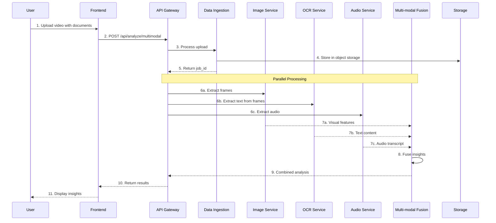

# Spartex AI Platform - Complete Documentation

## Table of Contents
1. [Project Overview](#project-overview)
2. [Architecture Overview](#architecture-overview)
3. [Project Structure Breakdown](#project-structure-breakdown)
4. [Service Details & Port Mapping](#service-details--port-mapping)
5. [Future Microservices (Planned)](#future-microservices-planned)
6. [Development Setup](#development-setup)
7. [Running the Application](#running-the-application)
8. [API Flow & Communication](#api-flow--communication)
9. [Deployment Guide](#deployment-guide)
10. [CI/CD Pipeline Setup](#cicd-pipeline-setup)
11. [Scaling for Unstructured Data](#scaling-for-unstructured-data)
12. [Best Practices & Tips](#best-practices--tips)

---
/spartex_ai/
│
├── services/
│   ├── auth_service/
│   │   ├── src/
│   │   │   ├── api/
│   │   │   ├── models/
│   │   │   ├── services/
│   │   │   ├── utils/
│   │   │   ├── tests/
│   │   │   └── main.py
│   │   └── Dockerfile
│   │
│   ├── data_ingestion_service/
│   │   ├── src/
│   │   │   ├── api/
│   │   │   ├── processors/
│   │   │   ├── storage/
│   │   │   ├── services/
│   │   │   ├── tests/
│   │   │   └── main.py
│   │   └── Dockerfile
│   │
│   ├── annotation_service/
│   │   ├── src/
│   │   │   ├── api/
│   │   │   ├── controllers/
│   │   │   ├── models/
│   │   │   ├── services/
│   │   │   ├── workers/
│   │   │   ├── tests/
│   │   │   └── main.py
│   │   └── Dockerfile
│   │
│   ├── quality_control_service/
│   │   ├── src/
│   │   │   ├── api/
│   │   │   ├── models/
│   │   │   ├── services/
│   │   │   ├── tests/
│   │   │   └── main.py
│   │   └── Dockerfile
│   │
│   ├── ml_training_service/
│   │   ├── src/
│   │   │   ├── api/
│   │   │   ├── pipelines/
│   │   │   ├── trainers/
│   │   │   ├── evaluators/
│   │   │   ├── models/
│   │   │   ├── tests/
│   │   │   └── main.py
│   │   └── Dockerfile
│
├── platform_api_gateway/
│   ├── src/
│   │   ├── routes/
│   │   ├── middleware/
│   │   ├── utils/
│   │   ├── tests/
│   │   └── main.py
│   └── Dockerfile
│
├── frontend/
│   ├── public/
│   ├── src/
│   │   ├── components/
│   │   ├── pages/
│   │   ├── services/
│   │   ├── utils/
│   │   ├── styles/
│   │   └── index.js
│   ├── Dockerfile
│   └── package.json
│
├── infra/
│   ├── k8s/
│   ├── terraform/
│   └── scripts/
│
├── docs/
│
├── docker-compose.yml
├── README.md
└── .gitignore
## Project Overview

**Spartex AI** is a comprehensive microservices-based platform designed for analyzing structured and unstructured data, with specialized capabilities for:

- **Text Analysis**: Documents, resumes, reports
- **Image Processing**: Object detection, classification, segmentation
- **Video Analytics**: Frame extraction, motion detection, content analysis
- **Audio Processing**: Transcription, sentiment analysis
- **Multi-modal Analysis**: Combined analysis of different data types

The platform follows a modern microservices architecture designed for scalability and extensibility.

### Current Features
- User authentication and authorization
- Data ingestion and processing
- Manual and semi-automated annotation
- Quality control workflows
- ML model training pipeline
- RESTful API architecture

### Planned Features
- Real-time video stream analysis
- Image recognition and classification
- Audio transcription and analysis
- OCR for document processing
- Multi-modal data fusion
- Edge computing support

---

## Architecture Overview

### Current Architecture
```
┌─────────────────────────────────────────────────────────────────┐
│                         User Browser                            │
└───────────────────────┬─────────────────────────────────────────┘
                        │ HTTP/HTTPS
                        ▼
┌─────────────────────────────────────────────────────────────────┐
│                    Frontend (React)                              │
│                    Port: 3000                                    │
└───────────────────────┬─────────────────────────────────────────┘
                        │ REST API / WebSocket
                        ▼
┌─────────────────────────────────────────────────────────────────┐
│                 API Gateway (FastAPI)                            │
│                    Port: 8000                                    │
└─────┬──────┬──────┬──────┬──────┬──────┬──────┬──────┬─────────┘
      │      │      │      │      │      │      │      │
      ▼      ▼      ▼      ▼      ▼      ▼      ▼      ▼
┌─────────┐┌──────────┐┌──────────┐┌─────────┐┌──────────┐
│  Auth   ││   Data   ││Annotation││ Quality ││    ML    │
│Service  ││Ingestion ││ Service  ││ Control ││ Training │
│Port:8001││Port:8002 ││Port:8003 ││Port:8004││Port:8005 │
└─────────┘└──────────┘└──────────┘└─────────┘└──────────┘
                        │
                        ▼ [Future Services]
┌─────────┐┌──────────┐┌──────────┐┌─────────┐┌──────────┐
│  Image  ││  Video   ││  Audio   ││   OCR   ││Streaming │
│Analysis ││Analytics ││Processing││ Service ││ Service  │
│Port:8006││Port:8007 ││Port:8008 ││Port:8009││Port:8010 │
└─────────┘└──────────┘└──────────┘└─────────┘└──────────┘
```

### Expanded Architecture (With Unstructured Data Services)
```
                           ┌─────────────────┐
                           │   Message Queue │
                           │  (RabbitMQ/Kafka)│
                           └────────┬────────┘
                                    │
┌───────────────────────────────────┴───────────────────────────────┐
│                          Event Bus                                 │
├───────────┬───────────┬───────────┬───────────┬──────────────────┤
│           │           │           │           │                   │
▼           ▼           ▼           ▼           ▼                   ▼
Image    Video      Audio       OCR      Multi-modal         Stream
Service  Service    Service   Service    Fusion            Processing
│           │           │           │           │                   │
└───────────┴───────────┴───────────┴───────────┴──────────────────┘
                                    │
                                    ▼
                        ┌───────────────────────┐
                        │   Object Storage      │
                        │   (S3/MinIO)          │
                        └───────────────────────┘
```

---

## Project Structure Breakdown

### Root Directory Structure

```
/spartex_ai/
├── services/                 # All microservices
├── platform_api_gateway/     # API Gateway service
├── frontend/                 # React frontend application
├── shared/                   # Shared libraries and utilities
├── ml_models/               # Pre-trained models storage
├── infra/                   # Infrastructure configurations
├── docs/                    # Documentation
├── docker-compose.yml       # Local development orchestration
├── docker-compose.prod.yml  # Production orchestration
├── README.md               # Project introduction
└── .gitignore             # Git ignore rules
```

### Current Services (Detailed Breakdown)

[Previous service details remain the same...]

---

## Service Details & Port Mapping

### Current Services Port Configuration

| Service | Port | Description | Environment Variable |
|---------|------|-------------|---------------------|
| Frontend | 3000 | React development server | `REACT_APP_PORT` |
| API Gateway | 8000 | Main API entry point | `API_GATEWAY_PORT` |
| Auth Service | 8001 | Authentication endpoints | `AUTH_SERVICE_PORT` |
| Data Ingestion | 8002 | File upload/processing | `DATA_SERVICE_PORT` |
| Annotation Service | 8003 | Annotation operations | `ANNOTATION_SERVICE_PORT` |
| Quality Control | 8004 | QC workflows | `QC_SERVICE_PORT` |
| ML Training | 8005 | Model training | `ML_SERVICE_PORT` |

### Future Services Port Configuration

| Service | Port | Description | Environment Variable |
|---------|------|-------------|---------------------|
| Image Analysis | 8006 | Image processing & analysis | `IMAGE_SERVICE_PORT` |
| Video Analytics | 8007 | Video processing & analysis | `VIDEO_SERVICE_PORT` |
| Audio Processing | 8008 | Audio transcription & analysis | `AUDIO_SERVICE_PORT` |
| OCR Service | 8009 | Optical character recognition | `OCR_SERVICE_PORT` |
| Stream Processing | 8010 | Real-time stream analysis | `STREAM_SERVICE_PORT` |
| Multi-modal Fusion | 8011 | Combined data analysis | `FUSION_SERVICE_PORT` |
| Edge Gateway | 8012 | Edge device management | `EDGE_SERVICE_PORT` |

### Infrastructure Services

| Service | Port | Description |
|---------|------|-------------|
| PostgreSQL | 5432 | Main database |
| Redis | 6379 | Cache & message queue |
| RabbitMQ | 5672 | Message broker |
| Kafka | 9092 | Stream processing |
| MinIO | 9000 | Object storage |
| Elasticsearch | 9200 | Search & analytics |
| Prometheus | 9090 | Metrics collection |
| Grafana | 3001 | Monitoring dashboard |

---

## Future Microservices (Planned)

### 1. **Image Analysis Service** (`/services/image_analysis_service/`)

**Purpose**: Comprehensive image processing and analysis capabilities.

```
image_analysis_service/
├── src/
│   ├── api/              # REST & gRPC endpoints
│   ├── processors/       # Image processing algorithms
│   │   ├── detection/    # Object detection (YOLO, R-CNN)
│   │   ├── classification/ # Image classification
│   │   ├── segmentation/ # Semantic/instance segmentation
│   │   └── enhancement/  # Image enhancement algorithms
│   ├── models/           # ML model definitions
│   ├── services/         # Business logic
│   ├── utils/            # Image utilities
│   └── main.py
├── models/               # Pre-trained model storage
└── Dockerfile
```

**Planned Features**:
- Object detection and tracking
- Face recognition
- Image classification
- Semantic segmentation
- Image quality assessment
- Batch processing support
- GPU acceleration

### 2. **Video Analytics Service** (`/services/video_analytics_service/`)

**Purpose**: Real-time and batch video processing.

```
video_analytics_service/
├── src/
│   ├── api/              # Streaming & REST endpoints
│   ├── processors/       
│   │   ├── extraction/   # Frame extraction
│   │   ├── tracking/     # Object tracking
│   │   ├── detection/    # Motion/event detection
│   │   └── summarization/ # Video summarization
│   ├── streaming/        # Real-time processing
│   ├── models/           # Video analysis models
│   └── main.py
├── cache/                # Temporary video storage
└── Dockerfile
```

**Planned Features**:
- Real-time video stream analysis
- Object tracking across frames
- Activity recognition
- Video summarization
- Scene change detection
- Multi-camera synchronization

### 3. **Audio Processing Service** (`/services/audio_processing_service/`)

**Purpose**: Audio analysis and transcription.

```
audio_processing_service/
├── src/
│   ├── api/              
│   ├── processors/       
│   │   ├── transcription/ # Speech-to-text
│   │   ├── analysis/      # Audio analysis
│   │   ├── enhancement/   # Noise reduction
│   │   └── detection/     # Sound event detection
│   ├── models/           
│   └── main.py
└── Dockerfile
```

**Planned Features**:
- Speech-to-text transcription
- Speaker diarization
- Emotion detection
- Language identification
- Audio classification
- Real-time processing

### 4. **OCR Service** (`/services/ocr_service/`)

**Purpose**: Extract text from images and documents.

```
ocr_service/
├── src/
│   ├── api/              
│   ├── processors/       
│   │   ├── detection/    # Text detection
│   │   ├── recognition/  # Text recognition
│   │   ├── layout/       # Document layout analysis
│   │   └── preprocessing/ # Image preprocessing
│   ├── languages/        # Language models
│   └── main.py
└── Dockerfile
```

**Planned Features**:
- Multi-language OCR
- Handwriting recognition
- Document layout analysis
- Table extraction
- Form processing
- Barcode/QR code reading

### 5. **Stream Processing Service** (`/services/stream_processing_service/`)

**Purpose**: Handle real-time data streams.

```
stream_processing_service/
├── src/
│   ├── api/              
│   ├── processors/       
│   │   ├── ingestion/    # Stream ingestion
│   │   ├── transformation/ # Stream transformation
│   │   └── analytics/    # Real-time analytics
│   ├── connectors/       # Various data source connectors
│   └── main.py
└── Dockerfile
```

**Planned Features**:
- Kafka/Kinesis integration
- Real-time ETL
- Stream aggregation
- Windowing operations
- Complex event processing

### 6. **Multi-modal Fusion Service** (`/services/multimodal_fusion_service/`)

**Purpose**: Combine insights from multiple data types.

```
multimodal_fusion_service/
├── src/
│   ├── api/              
│   ├── fusion/           
│   │   ├── strategies/   # Fusion algorithms
│   │   ├── models/       # Multi-modal models
│   │   └── pipelines/    # Processing pipelines
│   ├── orchestration/    # Service orchestration
│   └── main.py
└── Dockerfile
```

**Planned Features**:
- Cross-modal analysis
- Data synchronization
- Unified insights generation
- Context understanding
- Decision fusion

---

## Development Setup

### Prerequisites for Unstructured Data Services

```bash
# Additional requirements for multimedia processing
- CUDA >= 11.0 (for GPU support)
- FFmpeg (for video processing)
- OpenCV >= 4.5
- TensorFlow/PyTorch with GPU support
- GStreamer (for streaming)
```

### GPU Support Configuration

```yaml
# docker-compose.gpu.yml
services:
  image_analysis_service:
    runtime: nvidia
    environment:
      - NVIDIA_VISIBLE_DEVICES=0
      - CUDA_VISIBLE_DEVICES=0
    deploy:
      resources:
        reservations:
          devices:
            - driver: nvidia
              count: 1
              capabilities: [gpu]
```

### Storage Configuration for Large Files

```env
# Additional environment variables for multimedia
MAX_FILE_SIZE=5GB
VIDEO_CHUNK_SIZE=100MB
IMAGE_CACHE_SIZE=10GB
TEMP_STORAGE_PATH=/mnt/fast-storage
PERMANENT_STORAGE_PATH=/mnt/object-storage

# Streaming configuration
RTMP_PORT=1935
HLS_PORT=8080
DASH_PORT=8081
```

---

## Running the Application

### Starting Services with GPU Support

```bash
# Start with GPU support
docker-compose -f docker-compose.yml -f docker-compose.gpu.yml up -d

# Start specific multimedia services
docker-compose up -d image_analysis_service video_analytics_service

# Monitor GPU usage
nvidia-smi -l 1
```

### Testing Multimedia Services

```bash
# Test image analysis
curl -X POST http://localhost:8006/analyze \
  -F "image=@test_image.jpg" \
  -F "operations=detection,classification"

# Test video processing
curl -X POST http://localhost:8007/process \
  -F "video=@test_video.mp4" \
  -F "operations=extract_frames,detect_objects"

# Test OCR
curl -X POST http://localhost:8009/extract \
  -F "document=@scan.pdf" \
  -F "languages=en,es"
```

---

## API Flow & Communication

### Example: Multi-modal Document Analysis Flow



### Streaming Pipeline Architecture

```
┌─────────────┐     ┌─────────────┐     ┌─────────────┐
│   Camera/   │────▶│   Stream    │────▶│   Video     │
│   Stream    │     │  Ingestion  │     │  Analytics  │
└─────────────┘     └─────────────┘     └─────────────┘
                            │                    │
                            ▼                    ▼
                    ┌─────────────┐     ┌─────────────┐
                    │   Message   │     │   Real-time │
                    │    Queue    │     │   Alerts    │
                    └─────────────┘     └─────────────┘
```

---

## Deployment Guide

### Resource Requirements for Multimedia Services

#### Development Environment
```yaml
# Minimum requirements
services:
  image_analysis_service:
    deploy:
      resources:
        limits:
          cpus: '2'
          memory: 4G
        reservations:
          cpus: '1'
          memory: 2G

  video_analytics_service:
    deploy:
      resources:
        limits:
          cpus: '4'
          memory: 8G
        reservations:
          cpus: '2'
          memory: 4G
          devices:
            - driver: nvidia
              count: 1
              capabilities: [gpu]
```

#### Production Environment
```yaml
# Recommended production setup
services:
  image_analysis_service:
    deploy:
      replicas: 3
      resources:
        limits:
          cpus: '8'
          memory: 16G
        reservations:
          cpus: '4'
          memory: 8G
          devices:
            - driver: nvidia
              count: 2
              capabilities: [gpu]
```

### Kubernetes Deployment for GPU Services

```yaml
# infra/k8s/deployments/image-analysis-service.yaml
apiVersion: apps/v1
kind: Deployment
metadata:
  name: image-analysis-service
spec:
  replicas: 3
  template:
    spec:
      containers:
      - name: image-analysis
        image: spartex-ai/image-analysis:latest
        resources:
          limits:
            nvidia.com/gpu: 1
            memory: "16Gi"
            cpu: "8"
          requests:
            nvidia.com/gpu: 1
            memory: "8Gi"
            cpu: "4"
        volumeMounts:
        - name: model-cache
          mountPath: /models
        - name: temp-storage
          mountPath: /tmp/processing
      volumes:
      - name: model-cache
        persistentVolumeClaim:
          claimName: model-cache-pvc
      - name: temp-storage
        emptyDir:
          sizeLimit: 100Gi
```

### Auto-scaling Configuration

```yaml
# infra/k8s/hpa/video-analytics-hpa.yaml
apiVersion: autoscaling/v2
kind: HorizontalPodAutoscaler
metadata:
  name: video-analytics-hpa
spec:
  scaleTargetRef:
    apiVersion: apps/v1
    kind: Deployment
    name: video-analytics-service
  minReplicas: 2
  maxReplicas: 10
  metrics:
  - type: Resource
    resource:
      name: cpu
      target:
        type: Utilization
        averageUtilization: 70
  - type: Resource
    resource:
      name: nvidia.com/gpu
      target:
        type: Utilization
        averageUtilization: 80
  - type: Pods
    pods:
      metric:
        name: processing_queue_length
      target:
        type: AverageValue
        averageValue: "10"
```

---

## CI/CD Pipeline Setup

### Enhanced Pipeline for Multimedia Services

```yaml
# .github/workflows/multimedia-services.yml
name: Build and Test Multimedia Services

on:
  push:
    paths:
      - 'services/image_analysis_service/**'
      - 'services/video_analytics_service/**'
      - 'services/audio_processing_service/**'

jobs:
  test-multimedia:
    runs-on: ubuntu-latest
    strategy:
      matrix:
        service: 
          - image_analysis_service
          - video_analytics_service
          - audio_processing_service
    
    steps:
    - uses: actions/checkout@v3
    
    - name: Set up Python
      uses: actions/setup-python@v4
      with:
        python-version: '3.9'
    
    - name: Install system dependencies
      run: |
        sudo apt-get update
        sudo apt-get install -y ffmpeg libopencv-dev
    
    - name: Install Python dependencies
      run: |
        cd services/${{ matrix.service }}
        pip install -r requirements.txt
        pip install pytest pytest-cov
    
    - name: Run tests
      run: |
        cd services/${{ matrix.service }}
        pytest src/tests/ --cov=src --cov-report=xml
    
    - name: Upload coverage
      uses: codecov/codecov-action@v3

  build-gpu-images:
    needs: test-multimedia
    runs-on: ubuntu-latest
    
    steps:
    - uses: actions/checkout@v3
    
    - name: Set up Docker Buildx
      uses: docker/setup-buildx-action@v2
    
    - name: Build GPU-enabled images
      run: |
        docker buildx build \
          --platform linux/amd64 \
          --build-arg CUDA_VERSION=11.8 \
          -f services/image_analysis_service/Dockerfile.gpu \
          -t spartex-ai/image-analysis:gpu-latest \
          services/image_analysis_service
```

---

## Scaling for Unstructured Data

### Data Pipeline Architecture

```
┌─────────────────────────────────────────────────────────┐
│                   Data Ingestion Layer                   │
├─────────────┬─────────────┬─────────────┬──────────────┤
│   Batch     │  Streaming  │   Real-time │    Edge      │
│  Upload     │   Ingestion │   Cameras   │   Devices    │
└─────────────┴─────────────┴─────────────┴──────────────┘
                            │
                            ▼
┌─────────────────────────────────────────────────────────┐
│                  Processing Queue                        │
│                 (Kafka/RabbitMQ)                        │
└─────────────────────────────────────────────────────────┘
                            │
        ┌───────────────────┼───────────────────┐
        ▼                   ▼                   ▼
┌──────────────┐   ┌──────────────┐   ┌──────────────┐
│    Image     │   │    Video     │   │    Audio     │
│  Processing  │   │  Processing  │   │  Processing  │
└──────────────┘   └──────────────┘   └──────────────┘
        │                   │                   │
        └───────────────────┴───────────────────┘
                            │
                            ▼
┌─────────────────────────────────────────────────────────┐
│                   Storage Layer                          │
├─────────────┬─────────────┬─────────────┬──────────────┤
│   Hot       │    Warm     │    Cold     │   Archive    │
│  Storage    │   Storage   │   Storage   │   Storage    │
│  (SSD)      │   (HDD)     │   (Object)  │   (Glacier)  │
└─────────────┴─────────────┴─────────────┴──────────────┘
```

### Performance Optimization Strategies

#### 1. **Caching Strategy for Multimedia**
```python
# Redis caching for processed results
CACHE_CONFIG = {
    "image_features": {"ttl": 3600, "max_size": "10GB"},
    "video_thumbnails": {"ttl": 7200, "max_size": "20GB"},
    "ocr_results": {"ttl": 86400, "max_size": "5GB"},
    "model_predictions": {"ttl": 1800, "max_size": "15GB"}
}
```

#### 2. **Batch Processing Configuration**
```python
BATCH_CONFIG = {
    "image_batch_size": 32,
    "video_chunk_duration": 60,  # seconds
    "audio_segment_length": 30,  # seconds
    "max_concurrent_jobs": 10,
    "queue_timeout": 300  # seconds
}
```

#### 3. **Model Optimization**
```python
MODEL_CONFIG = {
    "quantization": True,  # Use INT8 quantization
    "pruning_threshold": 0.1,  # Prune 10% of weights
    "batch_inference": True,
    "tensorrt_optimization": True,  # For NVIDIA GPUs
    "onnx_runtime": True  # For CPU inference
}
```

### Edge Computing Integration

```yaml
# Edge device configuration
edge_config:
  devices:
    - type: nvidia_jetson
      capabilities: [image, video]
      model_format: tensorrt
      max_fps: 30
    
    - type: raspberry_pi
      capabilities: [image]
      model_format: tflite
      max_fps: 5
    
    - type: intel_nuc
      capabilities: [image, video, audio]
      model_format: openvino
      max_fps: 15
```

---

## Best Practices & Tips

### Multimedia Processing Best Practices

1. **File Size Management**
   ```python
   # Implement chunked upload for large files
   @app.post("/upload/chunk")
   async def upload_chunk(
       file_id: str,
       chunk_number: int,
       chunk: UploadFile,
       total_chunks: int
   ):
       # Process chunk
       # Reassemble when all chunks received
   ```

2. **Stream Processing**
   ```python
   # Use async generators for efficient streaming
   async def process_video_stream(stream_url: str):
       async for frame in video_stream_reader(stream_url):
           result = await analyze_frame(frame)
           yield result
   ```

3. **GPU Memory Management**
   ```python
   # Implement GPU memory pooling
   gpu_memory_pool = GPUMemoryPool(
       max_allocation=0.8,  # Use 80% of GPU memory
       cleanup_threshold=0.9  # Cleanup at 90% usage
   )
   ```

4. **Model Loading Strategy**
   ```python
   # Lazy load models based on usage
   model_cache = LRUCache(maxsize=5)
   
   @lru_cache(maxsize=5)
   def load_model(model_name: str):
       return load_pretrained_model(model_name)
   ```

### Security Considerations for Multimedia

1. **Content Validation**
   ```python
   # Validate file types and content
   ALLOWED_EXTENSIONS = {
       'image': ['jpg', 'jpeg', 'png', 'gif', 'bmp'],
       'video': ['mp4', 'avi', 'mov', 'mkv'],
       'audio': ['mp3', 'wav', 'flac', 'aac']
   }
   
   def validate_file(file: UploadFile, file_type: str):
       # Check extension
       # Check MIME type
       # Check file signature (magic bytes)
       # Scan for malware
   ```

2. **Privacy Protection**
   ```python
   # Implement face blurring for privacy
   def anonymize_video(video_path: str):
       # Detect faces
       # Apply blur/pixelation
       # Remove metadata
   ```

### Monitoring Multimedia Services

```yaml
# Prometheus metrics for multimedia services
metrics:
  - name: image_processing_duration
    type: histogram
    labels: [operation, model, status]
  
  - name: video_fps_processed
    type: gauge
    labels: [stream_id, quality]
  
  - name: gpu_memory_usage
    type: gauge
    labels: [device_id, service]
  
  - name: model_inference_latency
    type: histogram
    labels: [model_name, batch_size]
```

### Troubleshooting Multimedia Services

**Common Issues:**

1. **GPU Out of Memory**
   ```bash
   # Check GPU memory usage
   nvidia-smi
   
   # Clear GPU cache
   docker exec <container> python -c "import torch; torch.cuda.empty_cache()"
   
   # Reduce batch size in config
   ```

2. **Video Processing Timeout**
   ```bash
   # Check ffmpeg processes
   ps aux | grep ffmpeg
   
   # Increase timeout settings
   VIDEO_PROCESSING_TIMEOUT=600  # 10 minutes
   ```

3. **Model Loading Issues**
   ```bash
   # Verify model files exist
   docker exec <container> ls -la /models/
   
   # Check model compatibility
   docker exec <container> python -c "import tensorflow as tf; print(tf.__version__)"
   ```

---

## Conclusion

This documentation provides a comprehensive guide for developing and scaling the Spartex AI platform to handle unstructured data processing. The modular architecture allows for easy addition of new services while maintaining system stability.

### Key Takeaways for Unstructured Data Processing:
- Design for horizontal scalability from the start
- Implement proper resource management (GPU, memory, storage)
- Use appropriate data pipelines for different media types
- Plan for edge computing integration
- Monitor performance metrics closely
- Implement robust error handling and recovery

### Future Roadmap:
- [ ] Implement real-time video analytics
- [ ] Add support for 3D data processing
- [ ] Integrate federated learning capabilities
- [ ] Develop mobile SDKs for edge devices
- [ ] Implement automated model optimization
- [ ] Add support for custom model deployment

For additional support or questions, please refer to the project's issue tracker or contact the development team.

---

**Version**: 2.0.0  
**Last Updated**: December 2024  
**Maintainers**: Spartex AI Development Team# Spartex AI Platform - Complete Documentation

